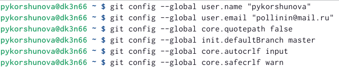
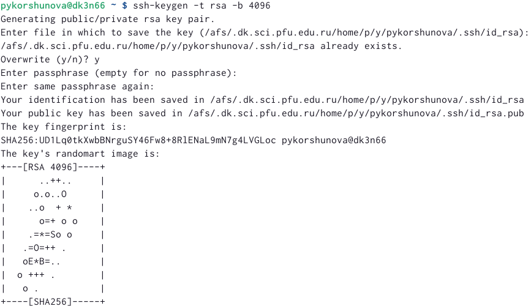
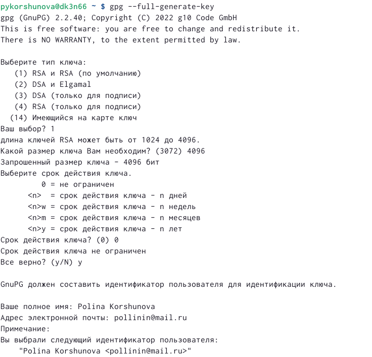
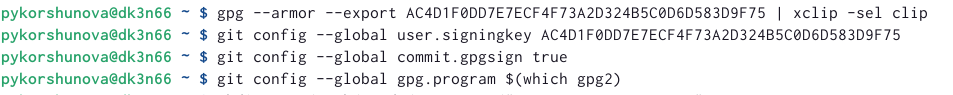
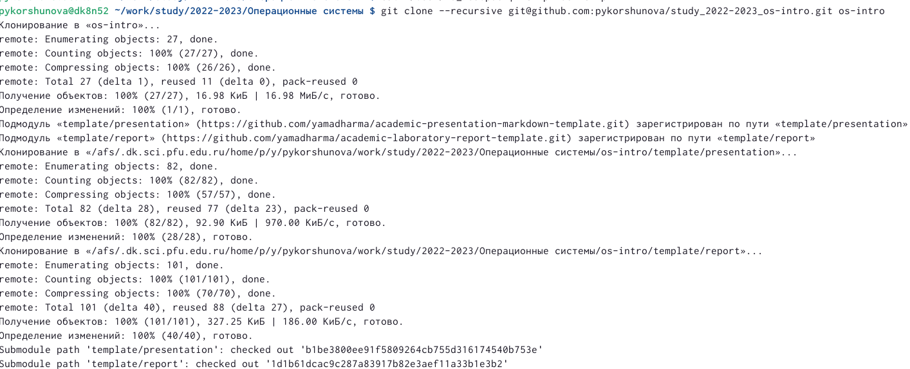
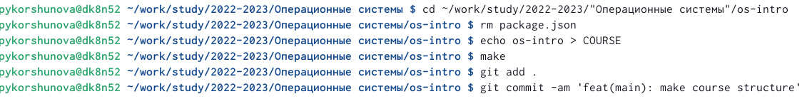
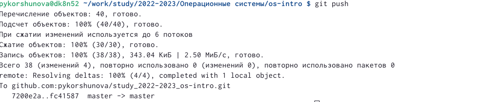

---
## Front matter
lang: ru-RU
title: Отчёт по лабораторной работе №2
subtitle: Система контроля версий git
author:
  - Коршунова Полина Юрьевна
institute:
  - Российский университет дружбы народов, Москва, Россия
 
date: 18 февраля 2023

## i18n babel
babel-lang: russian
babel-otherlangs: english

## Formatting pdf
toc: false
toc-title: Содержание
slide_level: 2
aspectratio: 169
section-titles: true
theme: metropolis
header-includes:
 - \metroset{progressbar=frametitle,sectionpage=progressbar,numbering=fraction}
 - '\makeatletter'
 - '\beamer@ignorenonframefalse'
 - '\makeatother'
---

# Вводная часть

## Цель работы

- Цель данной лабораторной работы состоит в изучении применения средств контроля версий и приобретении практических умений по работе с системой git. В ходе выполнения работы будет создан репозиторий, который можно найти по адресу https://github.com/pykorshunova/study_2022-2023_os-intro

#Основная часть

##Настройка git

- Прежде чем создать репозиторий, необходимо настроить git

## Создание ключей SSH и GPG 

- Создаем ssh и png ключи

## Настройка автоматических подписей git 

- настраиваем автоматические подписи git

## Дальнейшая настройка репозитория

- Продолжаем настройку git 

## Клонирование созданный репозиторий

## Создание неоходимые каталоги

##Отправка файлов на сервер

# Заключение

## Вовод

В результате выполнения лабораторной и самостоятельной работ были получены прикладные навыки работы с системой контроля версий git, а значит, цель работы была достигнута.

