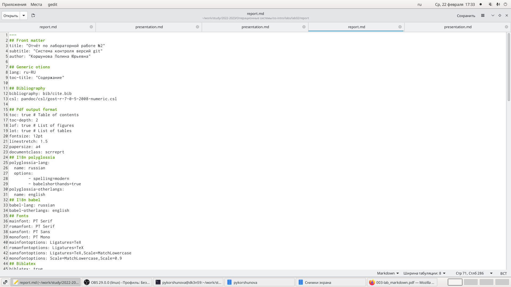
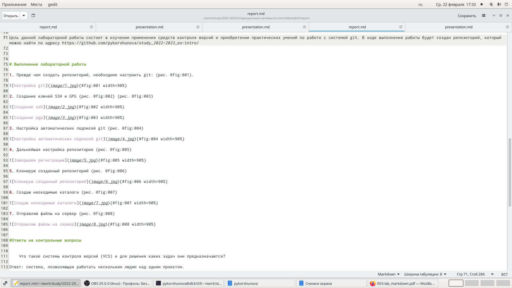

---
## Front matter
lang: ru-RU
title: Отчёт по лабораторной работе №3
subtitle: Markdown
author:
  - Коршунова Полина Юрьевна
institute:
  - Российский университет дружбы народов, Москва, Россия
 
date: 22 февраля 2023

## i18n babel
babel-lang: russian
babel-otherlangs: english

## Formatting pdf
toc: false
toc-title: Содержание
slide_level: 2
aspectratio: 169
section-titles: true
theme: metropolis
header-includes:
 - \metroset{progressbar=frametitle,sectionpage=progressbar,numbering=fraction}
 - '\makeatletter'
 - '\beamer@ignorenonframefalse'
 - '\makeatother'
---

# Вводная часть

## Цель работы

- Научиться оформлять отчёты с помощью легковесного языка разметки Markdown.

#Основная часть

##Открываю файл. Вписываю основные

- Заполнение основных данных

## Вставляю картинки

- Вставляю картинки

# Заключение

## Вывод

- В ходе данной лабораторной работы я научилась оформлять отчеты с помощью легковесного языка разметки Markdown.

