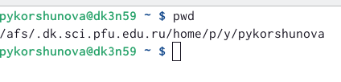
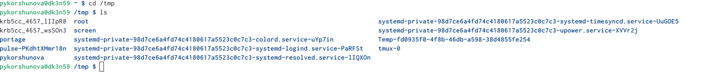
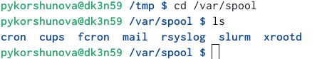
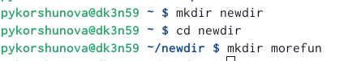
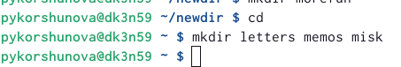
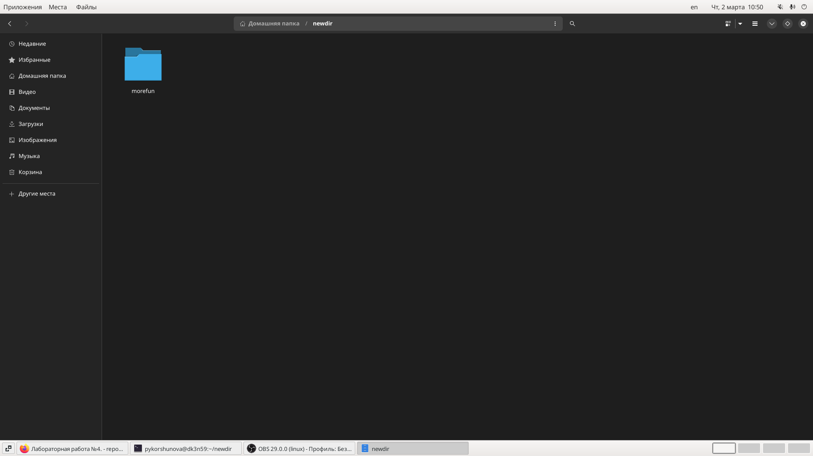
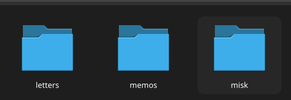
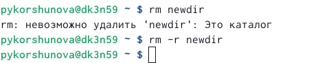

---
## Front matter
lang: ru-RU
title: Лабораторная работа №4
subtitle: Основы интерфейса взаимодействия пользователя с системой Unix на уровне командной строки
author:
  - КОРШУНОВА ПОЛИНА
institute:
  - Российский университет дружбы народов, Москва, Россия
date: 2 марта 2023

## i18n babel
babel-lang: russian
babel-otherlangs: english

## Formatting pdf
toc: false
toc-title: Содержание
slide_level: 2
aspectratio: 169
section-titles: true
theme: metropolis
header-includes:
 - \metroset{progressbar=frametitle,sectionpage=progressbar,numbering=fraction}
 - '\makeatletter'
 - '\beamer@ignorenonframefalse'
 - '\makeatother'
---

# Вводная часть

## Цель работы

- Приобретение практических навыков взаимодействия пользователя с системой посредством командной строки.

# Основная часть

## Определяю полное имя моего домашнего каталога и опции 

## Перехожу в каталог /tmp, вывожу на экран содержимое каталога /tmp. Для этого использую команду ls 

## Определяю, есть ли в каталоге /var/spool подкаталог с именем cron 

## В домашнем каталоге создаю новый каталог с именем newdir. В каталоге ~/newdir создаю новый каталог с именем morefun.

## В домашнем каталоге создаю одной командой три новых каталога с именами letters, memos, misk. Удаляю их одной командой rm -r 

## Удаляю ранее созданный каталог ~/newdir командой rm(не получается); удаляю грамотно(получилось)

## Используя информацию, полученную при помощи команды history, выполняю модификацию и исполнение нескольких команд из буфера команд

# Заключение

## Вовод

В ходе выполнения данной лабораторной работы я постигла основы интерфейса взаимодействия пользователя с системой Unix на уровне командной строки.

