---
## Front matter
lang: ru-RU
title: Лабораторная работа 5
subtitle: Анализ файловой структуры UNIX. Команды для работы с файлами и каталогами
author: Korshunova P.Y.
institute: |
	RUDN University, Moscow, Russian Federation
date: 2023, 9 March

## Formatting
toc: false
slide_level: 2
theme: metropolis
header-includes: 
 - \metroset{progressbar=frametitle,sectionpage=progressbar,numbering=fraction}
 - '\makeatletter'
 - '\beamer@ignorenonframefalse'
 - '\makeatother'
aspectratio: 43
section-titles: true
---

## Цель работы

Ознакомление с файловой системой Linux, её структурой, именами и содержанием каталогов. Приобретение практических навыков по применению команд для работы с файлами и каталогами, по управлению процессами (и работами), по проверке использования диска и обслуживанию файловой системы.

## Задание

1. Выполните все примеры, приведённые в первой части описания лабораторной работы.

2. Выполните следующие действия, зафиксировав в отчёте по лабораторной работе используемые при этом команды и результаты их выполнения:

2.1. Скопируйте файл /usr/include/sys/io.h в домашний каталог и назовите его equipment. Если файла io.h нет, то используйте любой другой файл в каталоге /usr/include/sys/ вместо него.     

2.2. В домашнем каталоге создайте директорию ~/ski.plases.  
   
2.3. Переместите файл equipment в каталог ~/ski.plases.  

## Задание
  
2.4. Переименуйте файл ~/ski.plases/equipment в ~/ski.plases/equiplist.

2.5. Создайте в домашнем каталоге файл abc1 и скопируйте его в каталог ~/ski.plases, назовите его equiplist2.

2.6. Создайте каталог с именем equipment в каталоге ~/ski.plases. 
    
2.7. Переместите файлы ~/ski.plases/equiplist и equiplist2 в каталог ~/ski.plases/equipment. 
      
2.8. Создайте и переместите каталог ~/newdir в каталог ~/ski.plases и назовите его plans.

## Задание

3. Определите опции команды chmod, необходимые для того, чтобы присвоить перечисленным ниже файлам выделенные права доступа, считая, что в начале таких прав нет:

3.1. drwxr--r-- ... australia

3.2. drwx--x--x ... play

3.3. -r-xr--r-- ... my_os

3.4. -rw-rw-r-- ... feathers

При необходимости создайте нужные файлы.

## Задание

4. Проделайте приведённые ниже упражнения, записывая в отчёт по лабораторной работе используемые при этом команды:

4.1. Просмотрите содержимое файла /etc/password.

4.2. Скопируйте файл ~/feathers в файл ~/file.old.

4.3. Переместите файл ~/file.old в каталог ~/play.

4.4. Скопируйте каталог ~/play в каталог ~/fun.

4.5. Переместите каталог ~/fun в каталог ~/play и назовите его games.

4.6. Лишите владельца файла ~/feathers права на чтение.

## Задание

4.7. Что произойдёт, если вы попытаетесь просмотреть файл ~/feathers командой cat?

4.8. Что произойдёт, если вы попытаетесь скопировать файл ~/feathers?

4.9. Дайте владельцу файла ~/feathers право на чтение.

4.10. Лишите владельца каталога ~/play права на выполнение.

4.11. Перейдите в каталог ~/play. Что произошло?

4.12. Дайте владельцу каталога ~/play право на выполнение.
 
5. Прочитайте man по командам mount, fsck, mkfs, kill и кратко их охарактеризуйте, приведя примеры.

## Теоретическое введение

Файловая система (англ. file system) — порядок, определяющий способ организации, хранения и именования данных на носителях информации в компьютерах.

touch имя_файла – создание текстового файла.

cp [-опции] исходный_файл целевой_файл – копирование файла или каталога.

mv [-опции] старый_файл новый_файл – перемещение и переименование файлов каталогов.

chmod режим имя_файла – предоставление определенных прав доступа.

## Выполнение лабораторной работы

1. Выполняю все примеры из первой части лабораторной работы:

1.1. Копирование файла в текущем каталоге. Копирую файл ~/abc1 в файл april и в файл may:

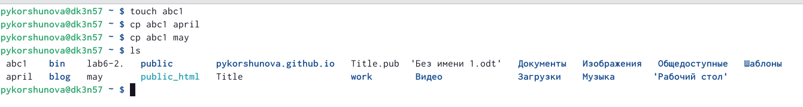{ #fig:001 width=90% }

## Выполнение лабораторной работы

1.2. Копирование нескольких файлов в каталог. Копирую файлы april и may в каталог monthly:

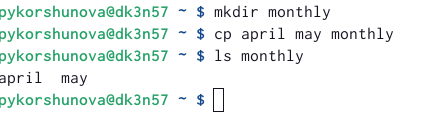{ #fig:002 width=90% }

## Выполнение лабораторной работы 

1.3. Копирование файлов в произвольном каталоге. Копирую файл monthly/may в файл с именем june:

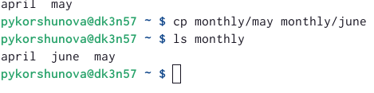{ #fig:003 width=90% }

## Выполнение лабораторной работы 

1.4. Копирование каталогов в текущем каталоге. Копирую каталог monthly в каталог monthly.00:

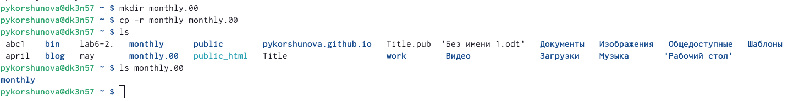{ #fig:004 width=90% }

## Выполнение лабораторной работы

1.5. Копирование каталогов в произвольном каталоге. Копирую каталог monthly.00 в каталог /tmp:

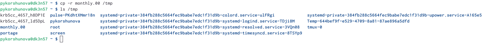{ #fig:005 width=90% }
 
## Выполнение лабораторной работы 

1.6. Переименование файлов в текущем каталоге. Изменяю название файла april на july в домашнем каталоге: 

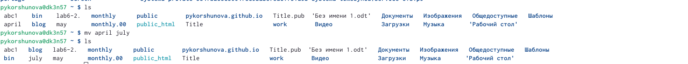{ #fig:006 width=90% }

## Выполнение лабораторной работы

1.7. Перемещение файлов в другой каталог. Перемещаю файл july в каталог monthly.00: 

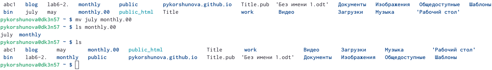{ #fig:007 width=90% }

## Выполнение лабораторной работы

1.8. Переименование каталогов в текущем каталоге. Переименовываю каталог monthly.00 в monthly.01:

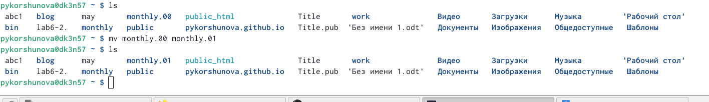{ #fig:008 width=90% }

## Выполнение лабораторной работы 

1.9. Перемещение каталога в другой каталог. Перемещаю каталог monthly.01 в каталог reports:
 
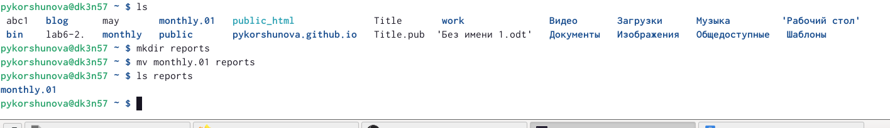{ #fig:009 width=90% }

## Выполнение лабораторной работы 

1.10. Переименование каталога, не являющегося текущим. Переименовываю каталог reports/monthly.01 в reports/monthly:

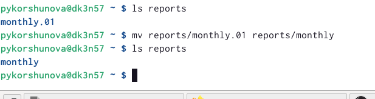{ #fig:010 width=90% }

## Выполнение лабораторной работы 

1.11. Создаю файл ~/may с правом выполнения для владельца:

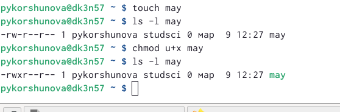{ #fig:011 width=75% }

1.12. Лишаю владельца файла ~/may права на выполнение: 

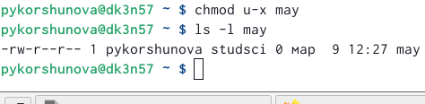{ #fig:012 width=75% }

## Выполнение лабораторной работы 

1.13. Создаю каталог monthly с запретом на чтение для членов группы и всех остальных пользователей:
 
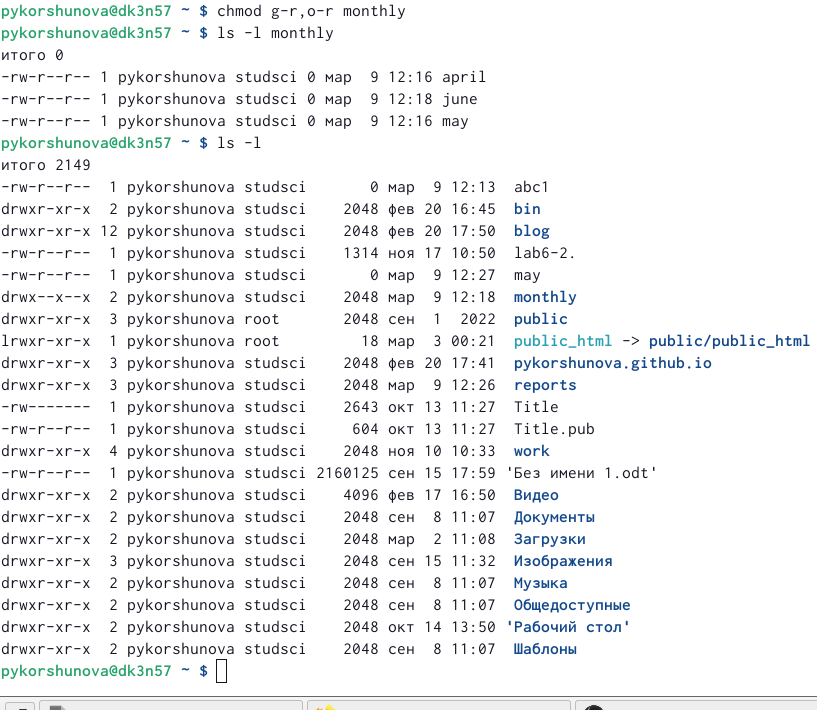{ #fig:013 width=70% }

## Выполнение лабораторной работы 

1.14. Создаю файл ~/abc1 с правом записи для членов группы:
 
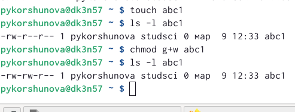{ #fig:014 width=90% }

## Выполнение лабораторной работы 

1.15. С помощью команды fsck проверяю целостность файловой системы: 

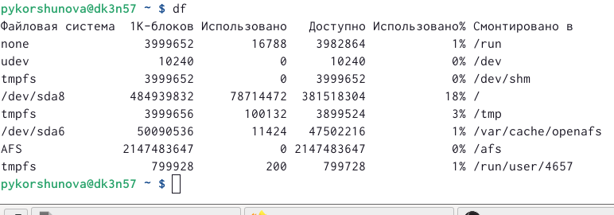{ #fig:015 width=90% }

## Выполнение лабораторной работы 

2. Выполняю следующие действия:

2.1. С помощью команды cp копирую файл /usr/include/sys/io.h в домашний каталог и называю его equipment:

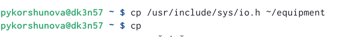{ #fig:016 width=90% }

## Выполнение лабораторной работы 

2.2. В домашнем каталоге создаю директорию ~/ski.plases, используя команду mkdir:

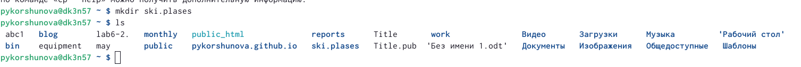{ #fig:017 width=80% }

2.3. Перемещаю файл equipment в каталог ~/ski.plases с помощью команды mv:

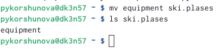{ #fig:018 width=80% }

## Выполнение лабораторной работы 

2.4. Используя команду mv, переименовываю файл ~/ski.plases/equipment в ~/ski.plases/equiplist:

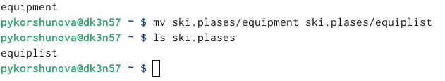{ #fig:019 width=90% }

## Выполнение лабораторной работы 

2.5. Создаю в домашнем каталоге файл abc1, используя команду touch, а затем при помощи команды cp копирую его в каталог ~/ski.plases, называю его equiplist2:

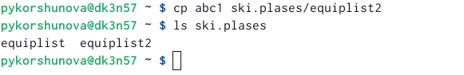{ #fig:020 width=90% }

## Выполнение лабораторной работы 

2.6. Создаю каталог с именем equipment в каталоге ~/ski.plases, воспользовавшись командой mkdir:

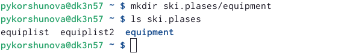{ #fig:021 width=90% }

## Выполнение лабораторной работы 

2.7. Перемещаю файлы ~/ski.plases/equiplist и equiplist2 в каталог
~/ski.plases/equipment с помощью команды mv:

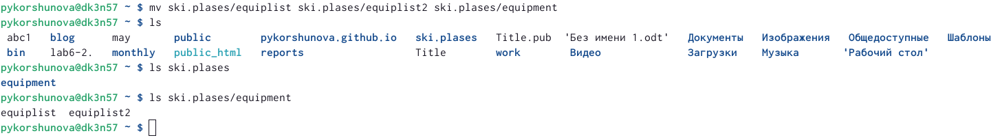{ #fig:022 width=90% }

## Выполнение лабораторной работы 

2.8. С помощью команды mkdir создаю каталог ~/newdir и, воспользовавшись командой mv перемещаю его в каталог ~/ski.plases, называю его plans:

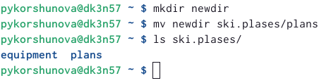{ #fig:023 width=90% }

## Выполнение лабораторной работы 

3. Создаю необходимые файлы и директории. Предоставляю определённые права доступа к файлам с помощью команды chmod:

3.1. Задаю необходимые права доступа для директории australia, используя команду chmod:
 
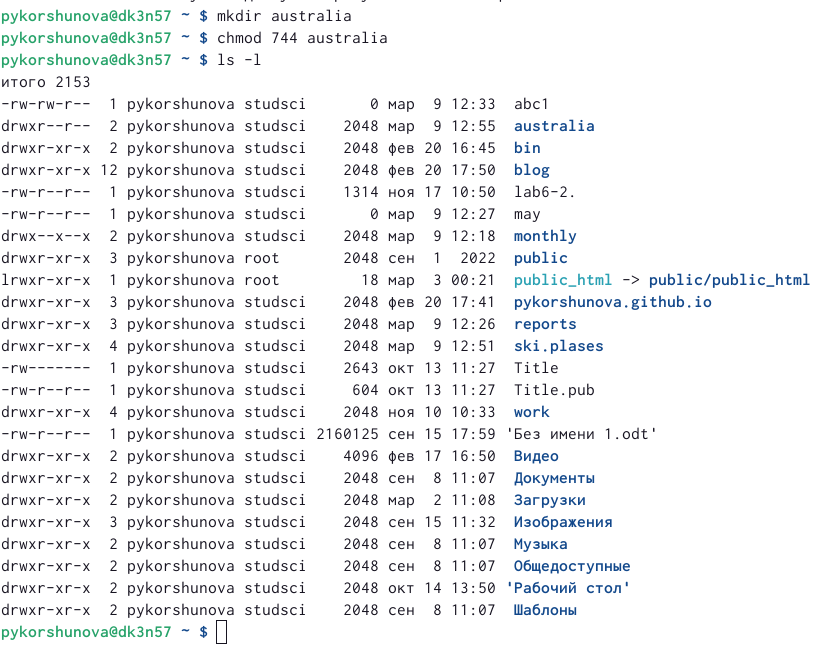{ #fig:024 width=50% }

## Выполнение лабораторной работы 

3.2. Задаю необходимые права доступа директории play, используя команду chmod:

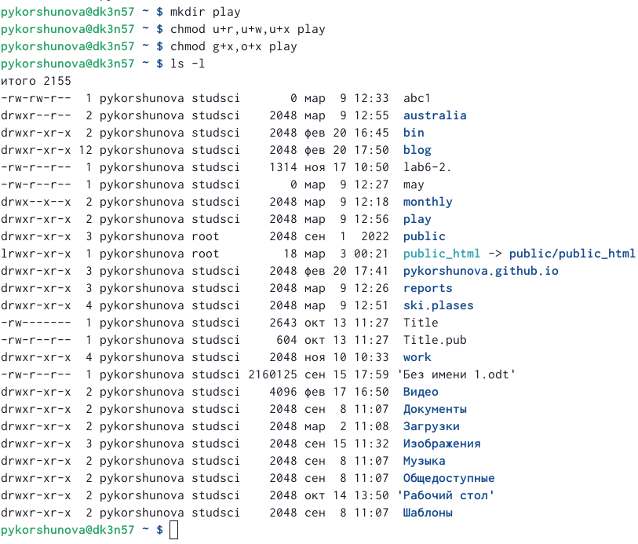{ #fig:025 width=70% }

## Выполнение лабораторной работы 

3.3. Задаю необходимые права доступа файла my_os, используя команду chmod:

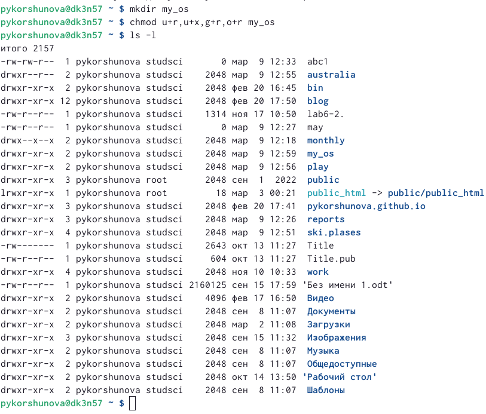{ #fig:026 width=70% }

## Выполнение лабораторной работы 

3.4. Задаю необходимые права доступа файла feathers, используя команду chmod:

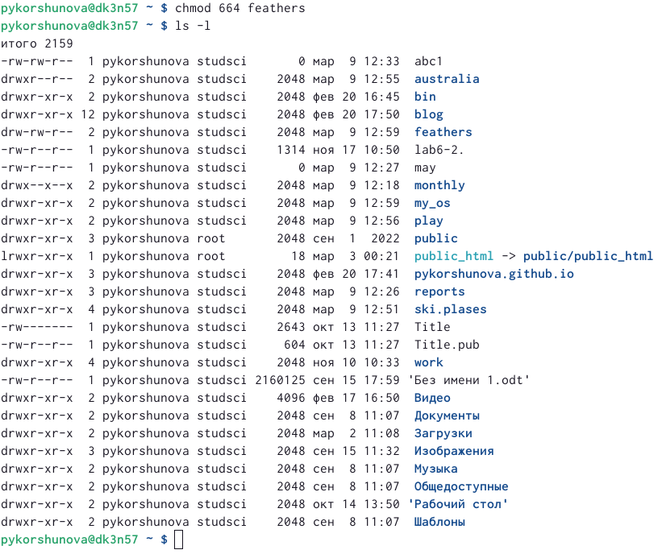{ #fig:027 width=70% }

## Выполнение лабораторной работы 

4. Проделываю следующие действия:

4.1. Пытаюсь просмотреть содержимое файла /etc/password с помощью команды cat, однако такого файла я не обнаружила. Тогда, используя команду cat я просмотрела содержимое файла /etc/passwd:

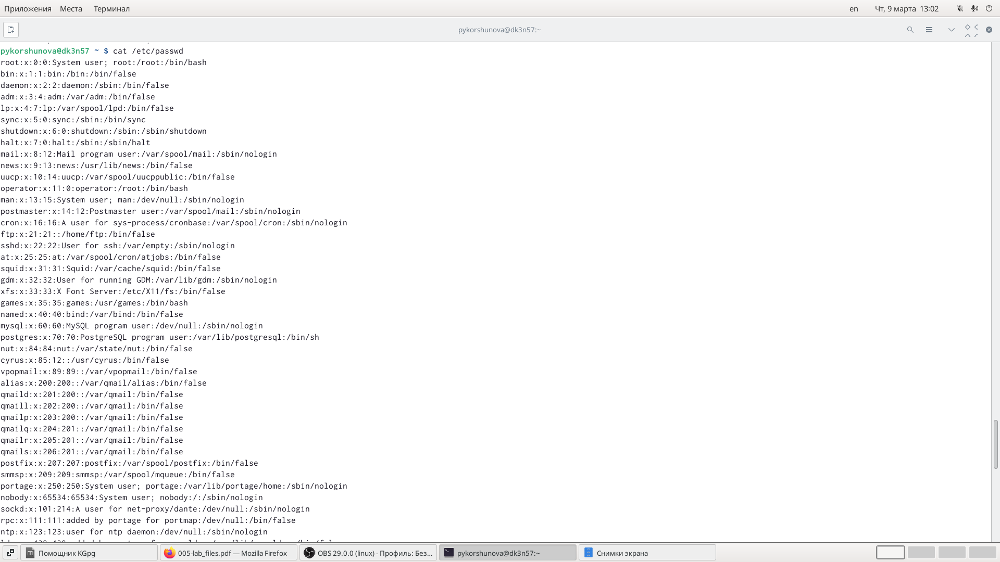{ #fig:028 width=65% }

## Выполнение лабораторной работы 

4.2. С помощью команды cp копирую файл ~/feathers в файл ~/file.old. 

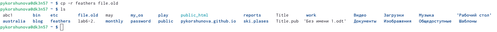{ #fig:029 width=90% }

## Выполнение лабораторной работы 

4.3. Перемещаю файл ~/file.old в каталог ~/play, воспользовавшись командой mv: 

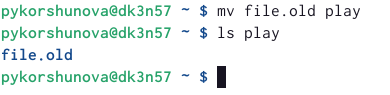{ #fig:030 width=90% }

## Выполнение лабораторной работы 

4.4. Копирую каталог ~/play в каталог ~/fun с помощью команды cp:

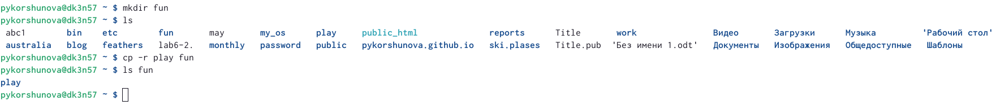{ #fig:031 width=70% }

4.5. Перемещаю каталог ~/fun в каталог ~/play, воспользовавшись командой mv, и называю его games: 

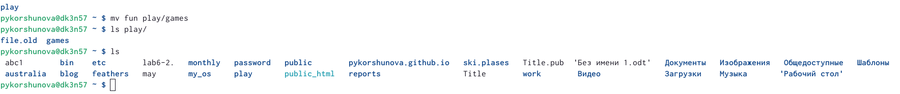{ #fig:032 width=70% }

## Выполнение лабораторной работы 

4.6. Лишаю владельца файла ~/feathers права на чтение, выполнив команду chmod с определенным режимом(u-r):

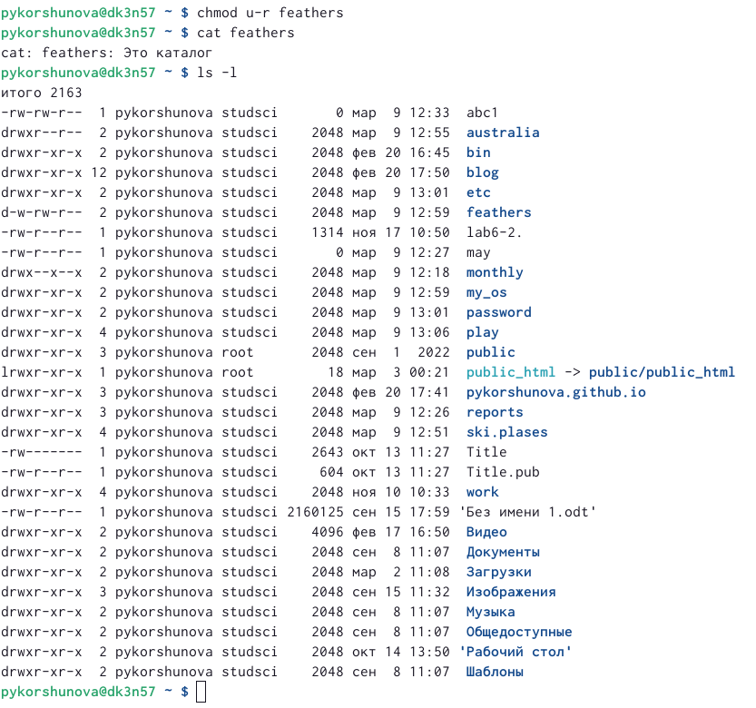{ #fig:033 width=90% }

## Выполнение лабораторной работы 

4.7. Пытаюсь просмотреть содержимое файла ~/feathers, с помощью команды cat. Появляется сообщение об отказе в доступе. Это произошло, поскольку в пункте 4.6. я запретила чтение этого файла. 

{ #fig:034 width=90% }

## Выполнение лабораторной работы 

4.8. Пытаюсь скопировать файл ~/feathers в ~/feathers1 с помощью команды cp. Появляется сообщение об отказе в доступе. Это произошло, поскольку в пункте 4.6. я запретила чтение этого файла, а копирование файла также входит в право на чтение. 

{ #fig:035 width=90% }

## Выполнение лабораторной работы 

4.9. Затем я возвращаю владельцу файла ~/feathers право на чтение, используя команду chmod. 

Скриншот выполненых в пункте 4.9. действий смотрите в пункте 4.8.

4.10. Лишаю владельца каталога ~/play права на выполнение с помощью команды chmod:

{ #fig:036 width=70% }

## Выполнение лабораторной работы 

4.11. Пытаюсь перейти в каталог ~/play. Появляется сообщение об отказе в доступе. Это произошло из-за того, что в пункте 4.10. я лишила владельца права выполнения. 

{ #fig:037 width=90% }

## Выполнение лабораторной работы 

4.12. Возвращаю владельцу каталога ~/play право на выполнение, с помощью команды chmod:

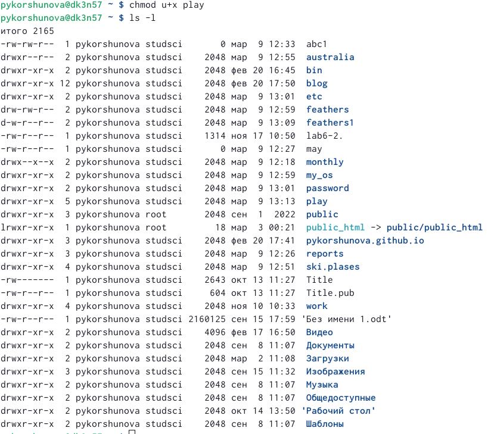{ #fig:038 width=90% }

## Выполнение лабораторной работы 

5. Выполняю команду man по командам mount, fsck, mkfs, kill.

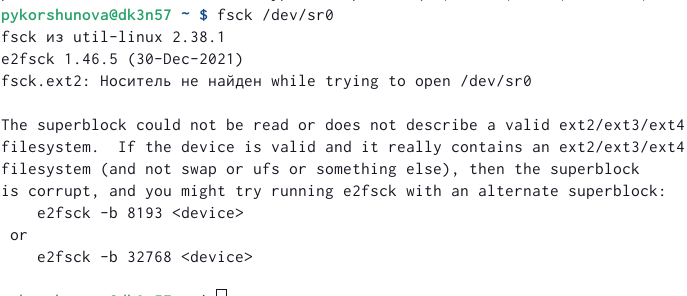{ #fig:041 width=90% }

mount - монтировать файловую систему.

fsck - проверка и восстановление файловой системы Linux.

mkfs - создание файловой системы Linux.

kill - завершить процесс.

## Вывод

В ходе лабораторной работы я ознакомилась с файловой системой Linux, её структурой, именами и содержанием каталогов, приобрела практических навыков по применению команд для работы с файлами и каталогами, по управлению процессами (и работами), по проверке использования диска и обслуживанию файловой системы.

