---
## Front matter
lang: ru-RU
title: Лабораторная работа 6
subtitle: Поиск файлов. Перенаправление ввода-вывода. Просмотр запущенных процессов
author: Korshunova Polina
institute: |
	RUDN University, Moscow, Russian Federation
date: 2023, 14 March

## Formatting
toc: false
slide_level: 2
theme: metropolis
header-includes: 
 - \metroset{progressbar=frametitle,sectionpage=progressbar,numbering=fraction}
 - '\makeatletter'
 - '\beamer@ignorenonframefalse'
 - '\makeatother'
aspectratio: 43
section-titles: true
---

## Цель работы 

Ознакомление с инструментами поиска файлов и фильтрации текстовых данных.
Приобретение практических навыков: по управлению процессами (и заданиями), по
проверке использования диска и обслуживанию файловых систем.

## Задание  

1. Осуществите вход в систему, используя соответствующее имя пользователя.

2. Запишите в файл file.txt названия файлов, содержащихся в каталоге /etc. Допишите в этот же файл названия файлов, содержащихся в вашем домашнем каталоге.

3. Выведите имена всех файлов из file.txt, имеющих расширение .conf, после чего запишите их в новый текстовой файл conf.txt.

4. Определите, какие файлы в вашем домашнем каталоге имеют имена, начинавшиеся с символа c? Предложите несколько вариантов, как это сделать.

## Задание  

5. Выведите на экран (по странично) имена файлов из каталога /etc, начинающиеся с символа h.

6. Запустите в фоновом режиме процесс, который будет записывать в файл ~/logfile файлы, имена которых начинаются с log.

7. Удалите файл ~/logfile.

8. Запустите из консоли в фоновом режиме редактор gedit.

## Задание

9. Определите идентификатор процесса gedit, используя команду ps, конвейер и фильтр grep. Как ещё можно определить идентификатор процесса?

10. Прочтите справку (man) команды kill, после чего используйте её для завершения процесса gedit.

11. Выполните команды df и du, предварительно получив более подробную информацию об этих командах, с помощью команды man.

12. Воспользовавшись справкой команды find, выведите имена всех директорий, имеющихся в вашем домашнем каталоге.

## Теоретическое введение

Перенаправление ввода-вывода — возможность командной оболочки ряда операционных систем перенаправлять стандартные потоки в определённое пользователем место.

Команда find используется для поиска и отображения на экран имён файлов, соответствующих заданной строке символов. Формат команды:  find путь [-опции]

Любой команде, выполняемой в системе, присваивается идентификатор процесса (process ID). Получить информацию о процессе и управлять им, пользуясь идентификатором процесса, можно из любого окна командного интерпретатора.

## Выполнение работы

1. Осуществляю вход в систему, используя соответствующее имя пользователя.

2. Записываю в файл file.txt названия файлов, содержащихся в каталоге /etc. Затем дописываю в этот же файл названия файлов, содержащихся в моем домашнем каталоге:

{ #fig:001 width=70% }

## Выполнение работы 

3. Вывожу имена всех файлов из file.txt, имеющих расширение .conf, и записываю их в новый текстовой файл conf.txt:

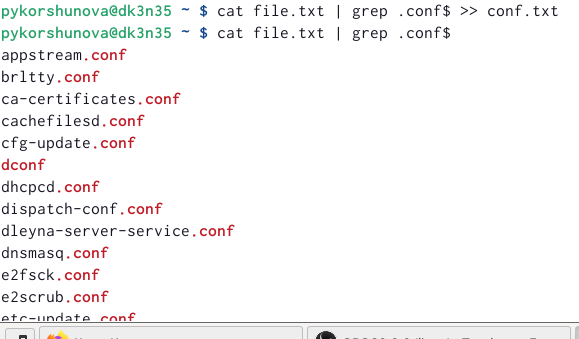{ #fig:002 width=90% }

## Выполнение работы 

4. Определяю, какие файлы в домашнем каталоге имеют имена, начинавшиеся с символа c, используя grep и find:

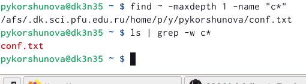{ #fig:003 width=90% }

## Выполнение работы 

5. Выведите на экран имена файлов из каталога /etc, начинающиеся с символа h, используя команду find: 

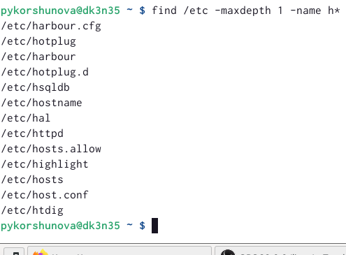{ #fig:004 width=90% }

## Выполнение работы 

6. Запускаю в фоновом режиме процесс, который будет записывать в файл ~/logfile файлы, имена которых начинаются с log, для этого в конце команды ставлю &: 

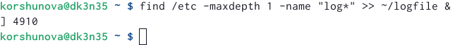{ #fig:005 width=90% }

## Выполнение работы 

7. Удаляю файл ~/logfile, используя команду rm:

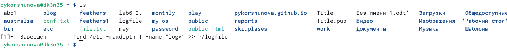{ #fig:006 width=90% }

## Выполнение работы 

8. Запускаю из консоли в фоновом режиме редактор gedit:

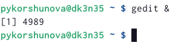{ #fig:007 width=70% }

## Выполнение работы 

9. Определяю идентификатор процесса gedit, используя команду ps, конвейер и фильтр
grep, также определяю идентефикаторы всех запущенных процессов с помощью команды ps:

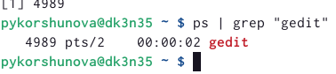{ #fig:008 width=45% }

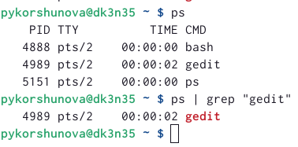{ #fig:009 width=45% }

## Выполнение работы 

10. Получаю справку команды kill с помощью команды man, после чего ипользую её для завершения процесса gedit:
 
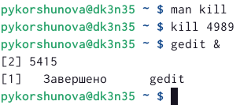{ #fig:010 width=70% }

## Выполнение работы 

11. Выполняю команду df, предварительно получив более подробную информацию о ней с помощью команды man:

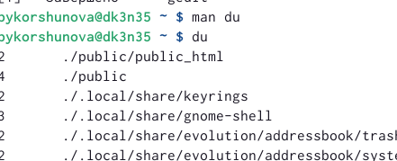{ #fig:011 width=55% }

Затем с помощью команды man получаю более подобную информацию о команде du и выполняю её.

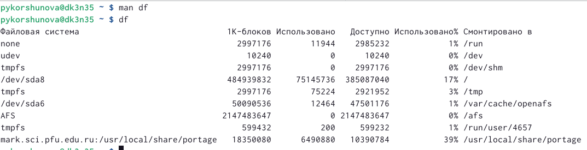{ #fig:012 width=55% }

## Выполнение работы 

12. Воспользовавшись справкой команды find, вывожу имена всех директорий, имеющихся в домашнем каталоге.

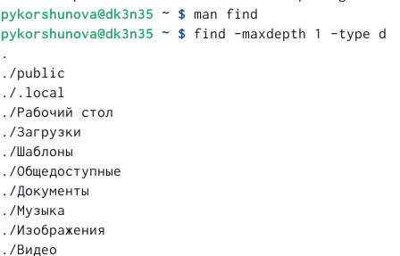{ #fig:013 width=70% }

## Вовод

Я ознакомилась с инструментами поиска файлов и фильтрации текстовых данных, а также приобрела практические навыки по управлению процессами (и заданиями), по проверке использования диска и обслуживанию файловых систем.
