---
# Front matter
lang: ru-RU
title: " Лабораторная работа 6"
subtitle: "Поиск файлов. Перенаправление ввода-вывода. Просмотр запущенных процессов "
author: "Коршунова Полина Юрьевна"

# Formatting
toc-title: "Содержание"
toc: true # Table of contents
toc_depth: 2
fontsize: 12pt
linestretch: 1.5
papersize: a4paper
documentclass: scrreprt
polyglossia-lang: russian
polyglossia-otherlangs: english
mainfont: PT Serif
romanfont: PT Serif
sansfont: PT Sans
monofont: PT Mono
mainfontoptions: Ligatures=TeX
romanfontoptions: Ligatures=TeX
sansfontoptions: Ligatures=TeX,Scale=MatchLowercase
monofontoptions: Scale=MatchLowercase
indent: true
pdf-engine: lualatex
header-includes:
  - \linepenalty=10 # the penalty added to the badness of each line within a paragraph (no associated penalty node) Increasing the value makes tex try to have fewer lines in the paragraph.
  - \interlinepenalty=0 # value of the penalty (node) added after each line of a paragraph.
  - \hyphenpenalty=50 # the penalty for line breaking at an automatically inserted hyphen
  - \exhyphenpenalty=50 # the penalty for line breaking at an explicit hyphen
  - \binoppenalty=700 # the penalty for breaking a line at a binary operator
  - \relpenalty=500 # the penalty for breaking a line at a relation
  - \clubpenalty=150 # extra penalty for breaking after first line of a paragraph
  - \widowpenalty=150 # extra penalty for breaking before last line of a paragraph
  - \displaywidowpenalty=50 # extra penalty for breaking before last line before a display math
  - \brokenpenalty=100 # extra penalty for page breaking after a hyphenated line
  - \predisplaypenalty=10000 # penalty for breaking before a display
  - \postdisplaypenalty=0 # penalty for breaking after a display
  - \floatingpenalty = 20000 # penalty for splitting an insertion (can only be split footnote in standard LaTeX)
  - \raggedbottom # or \flushbottom
  - \usepackage{float} # keep figures where there are in the text
  - \floatplacement{figure}{H} # keep figures where there are in the text
---

# Цель работы

Ознакомление с инструментами поиска файлов и фильтрации текстовых данных.
Приобретение практических навыков: по управлению процессами (и заданиями), по
проверке использования диска и обслуживанию файловых систем.

# Задание

1. Осуществите вход в систему, используя соответствующее имя пользователя.

2. Запишите в файл file.txt названия файлов, содержащихся в каталоге /etc. Допишите в этот же файл названия файлов, содержащихся в вашем домашнем каталоге.

3. Выведите имена всех файлов из file.txt, имеющих расширение .conf, после чего запишите их в новый текстовой файл conf.txt.

4. Определите, какие файлы в вашем домашнем каталоге имеют имена, начинавшиеся с символа c? Предложите несколько вариантов, как это сделать.

5. Выведите на экран (по странично) имена файлов из каталога /etc, начинающиеся с символа h.

6. Запустите в фоновом режиме процесс, который будет записывать в файл ~/logfile файлы, имена которых начинаются с log.

7. Удалите файл ~/logfile.

8. Запустите из консоли в фоновом режиме редактор gedit.

9. Определите идентификатор процесса gedit, используя команду ps, конвейер и фильтр grep. Как ещё можно определить идентификатор процесса?

10. Прочтите справку (man) команды kill, после чего используйте её для завершения процесса gedit.

11. Выполните команды df и du, предварительно получив более подробную информацию об этих командах, с помощью команды man.

12. Воспользовавшись справкой команды find, выведите имена всех директорий, имеющихся в вашем домашнем каталоге.

# Теоретическое введение

Перенаправление ввода-вывода — возможность командной оболочки ряда операционных систем перенаправлять стандартные потоки в определённое пользователем место.

Команда find используется для поиска и отображения на экран имён файлов, соответствующих заданной строке символов. Формат команды:  find путь [-опции]

Любой команде, выполняемой в системе, присваивается идентификатор процесса (process ID). Получить информацию о процессе и управлять им, пользуясь идентификатором процесса, можно из любого окна командного интерпретатора.

# Выполнение лабораторной работы
1. Осуществляю вход в систему, используя соответствующее имя пользователя.

2. Записываю в файл file.txt названия файлов, содержащихся в каталоге /etc. Затем дописываю в этот же файл названия файлов, содержащихся в моем домашнем каталоге:

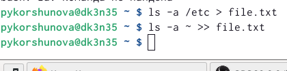{ #fig:001 width=70% }

3. Вывожу имена всех файлов из file.txt, имеющих расширение .conf, и записываю их в новый текстовой файл conf.txt:

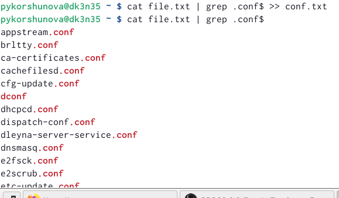{ #fig:002 width=70% }

4. Определяю, какие файлы в домашнем каталоге имеют имена, начинавшиеся с символа c, используя grep и find:

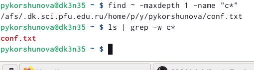{ #fig:003 width=70% }

5. Выведите на экран имена файлов из каталога /etc, начинающиеся с символа h, используя команду find: 

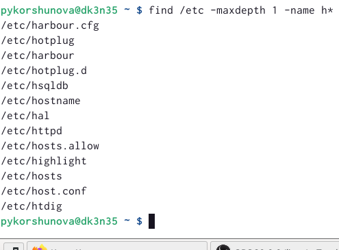{ #fig:004 width=70% }

6. Запускаю в фоновом режиме процесс, который будет записывать в файл ~/logfile файлы, имена которых начинаются с log, для этого в конце команды ставлю &: 

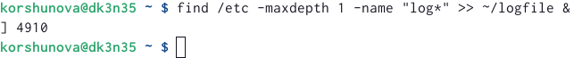{ #fig:005 width=70% }

7. Удаляю файл ~/logfile, используя команду rm:

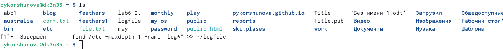{ #fig:006 width=70% }

8. Запускаю из консоли в фоновом режиме редактор gedit:

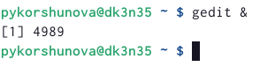{ #fig:007 width=70% }

9. Определяю идентификатор процесса gedit, используя команду ps, конвейер и фильтр
grep, также определяю идентефикаторы всех запущенных процессов с помощью команды ps:

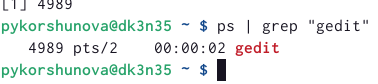{ #fig:008 width=70% }

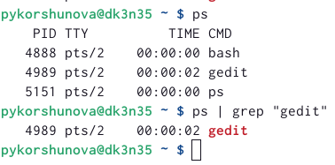{ #fig:009 width=70% }

10. Получаю справку команды kill с помощью команды man, после чего ипользую её для завершения процесса gedit:
 
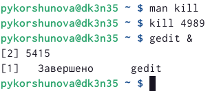{ #fig:010 width=70% }

11. Выполняю команду df, предварительно получив более подробную информацию о ней с помощью команды man:

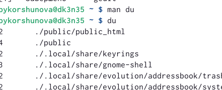{ #fig:011 width=70% }

Затем с помощью команды man получаю более подобную информацию о команде du и выполняю её.

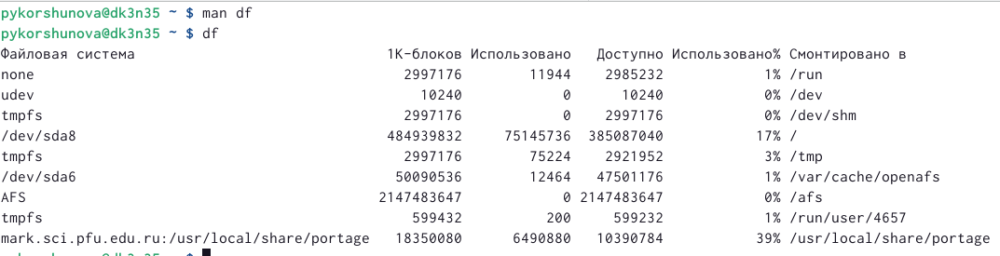{ #fig:012 width=70% }

12. Воспользовавшись справкой команды find, вывожу имена всех директорий, имеющихся в домашнем каталоге.

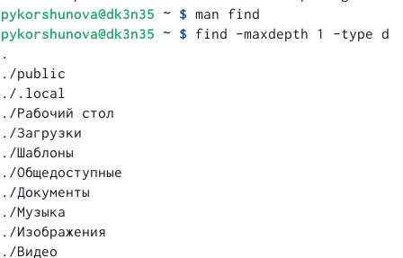{ #fig:013 width=70% }

# Вывод

Я ознакомилась с инструментами поиска файлов и фильтрации текстовых данных, а также приобрела практические навыки по управлению процессами (и заданиями), по проверке использования диска и обслуживанию файловых систем.

# Контрольные вопросы 

1. Какие потоки ввода вывода вы знаете?

– stdin — стандартный поток ввода (по умолчанию: клавиатура), файловый дескриптор 0;

– stdout — стандартный поток вывода (по умолчанию: консоль), файловый дескриптор 1;

– stderr — стандартный поток вывод сообщений об ошибках (по умолчанию: консоль), файловый дескриптор 2.

2. Объясните разницу между операцией > и >>.

“>” - это открывает файл на перезапись, когда “>>” открывает файл на дозапись.

3. Что такое конвейер?

Конвейер – это направление вывода на вход для следующей команды.

4. Что такое процесс? Чем это понятие отличается от программы?

Процесс - это исполняемая программа. Программа - это набор инструкций, которые выполняют определенную задачу при выполнении компьютером, в то время как процесс является экземпляром выполняемой компьютерной программы. Таким образом, в этом главное отличие программы и процесса.

5. Что такое PID и GID?

PID: это идентификатор процесса (PID) процесса, который вы вызываете.
GID: идентификатор группы. Все группы Linux определяются GID (идентификаторами групп). GID хранятся в файле / etc / groups.

6. Что такое задачи и какая команда позволяет ими управлять?

Любую выполняющуюся в консоли команду или внешнюю программу можно запустить в фоновом режиме. Для этого следует в конце имени команды указать знак амперсанда &. Например: gedit &

7. Найдите информацию об утилитах top и htop. Каковы их функции?

Top - отобразить запущенные процессы, используемые ими ресурсы и другую полезную информацию (с автоматическим обновлением данных).

Htop - показывает динамический список системных процессов, список обычно выравнивается по использованию ЦПУ. В отличие от top, htop показывает все процессы в системе. Также показывает время непрерывной работы, использование процессоров и памяти. Htop часто применяется в тех случаях, когда информации даваемой утилитой top недостаточно, например при поиске утечек памяти в процессах.

8. Назовите и дайте характеристику команде поиска файлов. Приведите примеры использования этой команды.

Команда find используется для поиска и отображения на экран имён файлов, соответствующих заданной строке символов. Формат команды: find путь [-опции]

{ #fig:004 width=70% }

9. Можно ли по контексту (содержанию) найти файл? Если да, то как?

Да, воспользовавшись командой grep. Формат команды: grep строка имя_файла.

10. Как определить объем свободной памяти на жёстком диске?

Для определения объёма свободного пространства на файловой системе можно воспользоваться командой df, которая выведет на экран список всех файловых систем в соответствии с именами устройств, с указанием размера и точки монтирования.

11. Как определить объем вашего домашнего каталога?

Команда du показывает число килобайт, используемое каждым файлом или каталогом.

12. Как удалить зависший процесс?

Команда kill служит для завершения процесса.
