---
## Front matter
lang: ru-RU
title: Лабораторная работа 7
subtitle: Командная оболочка Midnight Commander 
author: |
	Коршунова Полина Юрьевна
institute: |
	RUDN University, Moscow, Russian Federation
date: 2023, 20 April

## Formatting
toc: false
slide_level: 2
theme: metropolis
header-includes: 
 - \metroset{progressbar=frametitle,sectionpage=progressbar,numbering=fraction}
 - '\makeatletter'
 - '\beamer@ignorenonframefalse'
 - '\makeatother'
aspectratio: 43
section-titles: true
---

## Цель работы

Освоение основных возможностей командной оболочки Midnight Commander. Приобретение навыков практической работы по просмотру каталогов и файлов; манипуляций с ними.

## Задание

Задание по mc:

1. Изучите информацию о mc, вызвав в командной строке man mc.

2. Запустите из командной строки mc, изучите его структуру и меню.
       
3. Выполните несколько операций в mc, используя управляющие клавиши (операции с панелями; выделение/отмена выделения файлов, копирование/перемещение файлов, получение информации о размере и правах доступа на файлы и/или каталоги и т.п.)
       
## Задание

4. Выполните основные команды меню левой (или правой) панели. Оцените степень подробности вывода информации о файлах.

5. Используя возможности подменю «Файл», выполните:

- просмотр содержимого текстового файла;
       
- редактирование содержимого текстового файла (без сохранения результатов редактирования);

- создание каталога;

- копирование файлов в созданный каталог.

## Задание

6. С помощью соответствующих средств подменю «Команда» осуществите:

- поиск в файловой системе файла с заданными условиями (например, файла с расширением .c или .cpp, содержащего строку main);

- выбор и повторение одной из предыдущих команд;

- переход в домашний каталог;

- анализ файла меню и файла расширений.

7. Вызовите подменю Настройки. Освойте операции, определяющие структуру экрана mc (Full screen, Double Width, Show Hidden Files и т.д.)

## Задание

Задание по встроенному редактору mc:
       
1. Создайте текстовой файл text.txt.
       
2. Откройте этот файл с помощью встроенного в mc редактора.
       
3. Вставьте в открытый файл небольшой фрагмент текста, скопированный из любого другого файла или Интернета.

## Задание

4. Проделайте с текстом следующие манипуляции, используя горячие клавиши:
       
       4.1. Удалите строку текста.
       
       4.2. Выделите фрагмент текста и скопируйте его на 
новую строку.
       
       4.3. Выделите фрагмент текста и перенесите его на 
новую строку.
       
       4.4. Сохраните файл.

## Задание
       
       4.5. Отмените последнее действие.
       
       4.6. Перейдите в конец файла (нажав комбинацию клавиш)
и напишите некоторый текст.
       
       4.7. Перейдите в начало файла (нажав комбинацию клавиш)
и напишите некоторый текст.
       
       4.8. Сохраните и закройте файл.
       
## Задание

5. Откройте файл с исходным текстом на некотором языке программирования (например C или Java)
       
6. Используя меню редактора, включите подсветку
синтаксиса, если она не включена, или выключите, если она включена.

## Теоретические введение

Командная оболочка — интерфейс взаимодействия пользователя с операционной системой и программным обеспечением посредством команд.

Midnight Commander (или mc) — псевдографическая командная оболочка для UNIX/Linux систем. Для запуска mc необходимо в командной строке набрать mc и нажать Enter.

Встроенный в mc редактор вызывается с помощью функциональной клавиши F4. В нём удобно использовать различные комбинации клавиш при редактировании содержимого (как правило текстового) файла.

# ЗАДАНИЕ ПО mc:

## Выполнение лабораторной работы

1. Изучаю информацию о mc, вызвав в командной строке man mc.

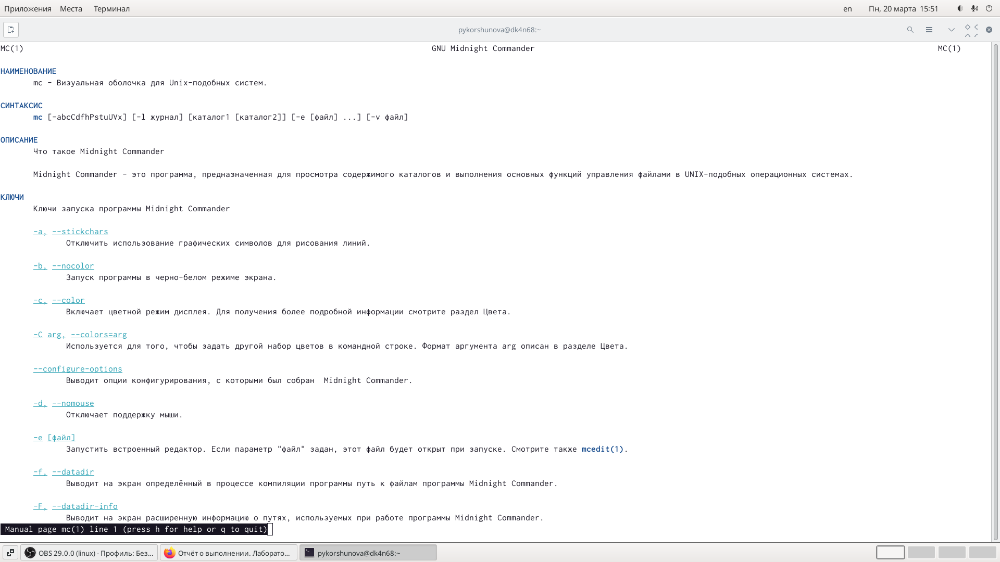{ #fig:001 width=70% }

## Выполнение лабораторной работы

2. Запускаю mc из командной строки и изучаю его меню и структуру.

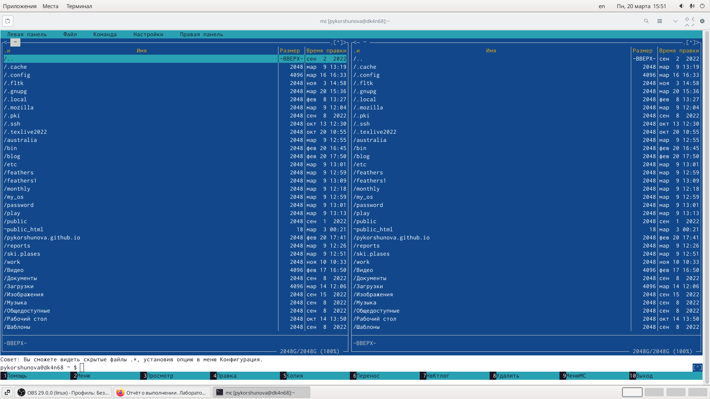{ #fig:002 width=60% }

## Выполнение лабораторной работы

3. Выполняю несколько операций в mc, используя управляющие клавиши. Например, выделение нескольких файлов с помощью Shift + стрелки и отмена выделения с помощью этой же комбинации клавиш:

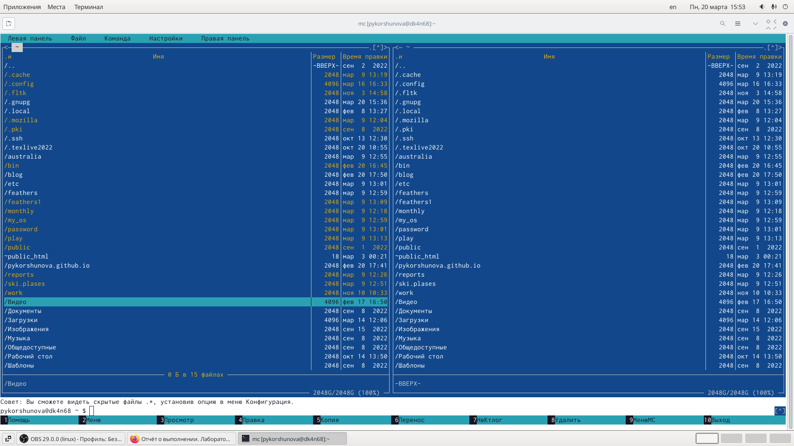{ #fig:003 width=55% }

## Выполнение лабораторной работы

Копирование (F5) и перемещение (F6) файлов:

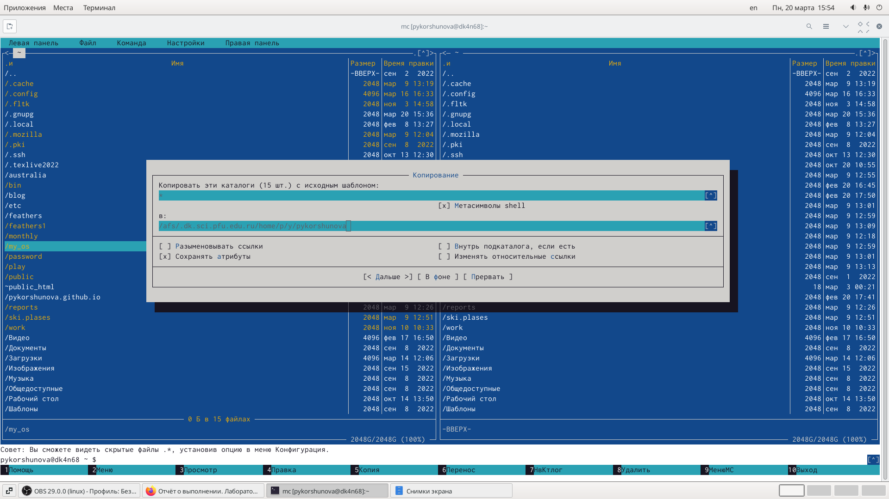{ #fig:004 width=60% }

## Выполнение работы

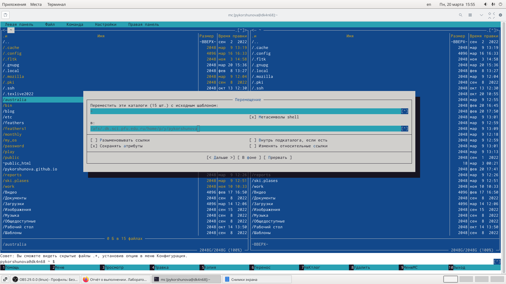{ #fig:005 width=70% }

## Выполнение лабораторной работы

А также получение информации о размере и правах доступа на файлы и каталоги:

{ #fig:006 width=60% }

## Выполнение лабораторной работы

4. Выполняю основные команды меню левой (или правой) панели. Просматриваю список файлов выбранного каталога, выполняю «быстрый просмотр» и просматриваю содержимое выбранного файла без возможности изменения, просматриваю дерево каталогов, а также просматриваю более подробную информацию о файлах с помощью «Информация».

## Выполнение лабораторной работы

5. Используя возможности подменю «Команда» выполняю следующие действия:
Просматриваю содержимое текстового файла (также это можно сделать с помощью клавиши F3):

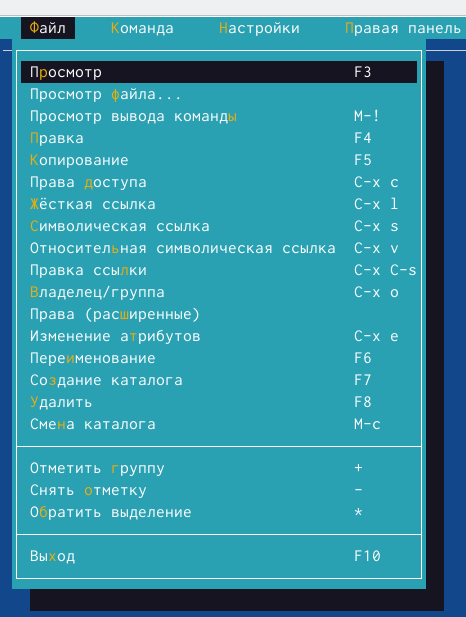{ #fig:007 width=45% }

## Выполнение лабораторной работы	

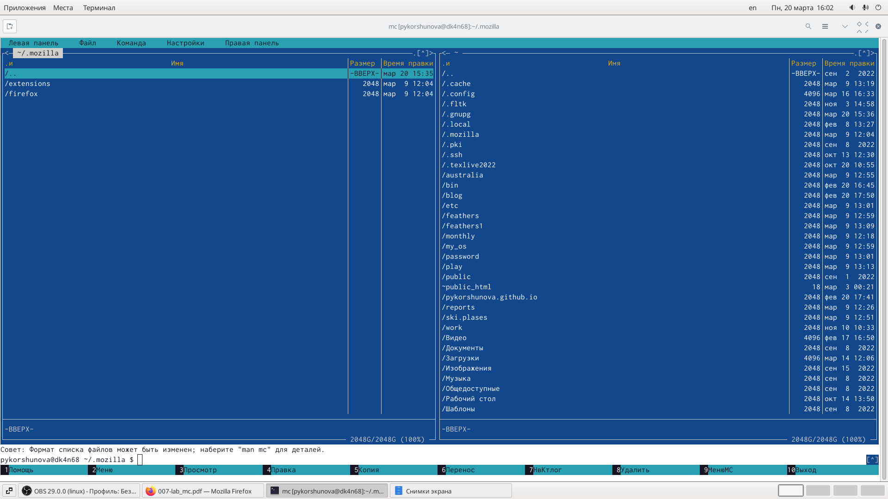{ #fig:008 width=70% }

## Выполнение лабораторной работы

Редактирую содержимое текстового файла (также это можно сделать с помощью клавиши F4):

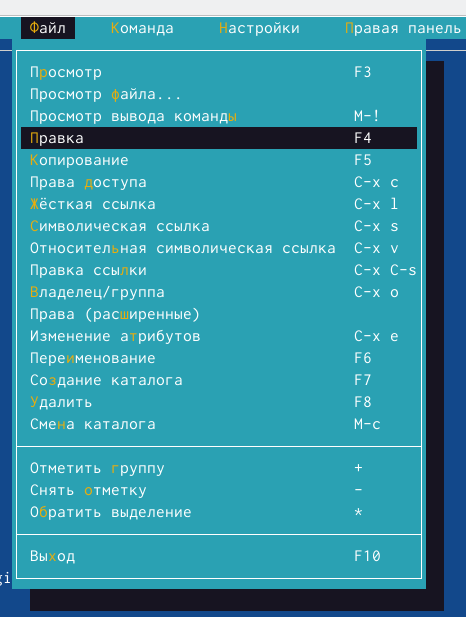{ #fig:009 width=50% }

## Выполнение лабораторной работы

Создаю каталог (также это можно сделать с помощью клавиши F7):

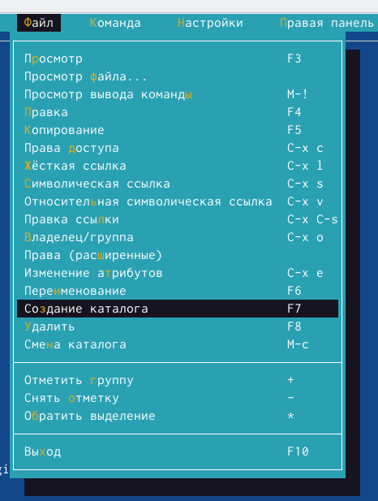{ #fig:010 width=55% }

## Выполнение лабораторной работы

Копирую файлы в созданный каталог (также это можно сделать с помощью клавиши F5):

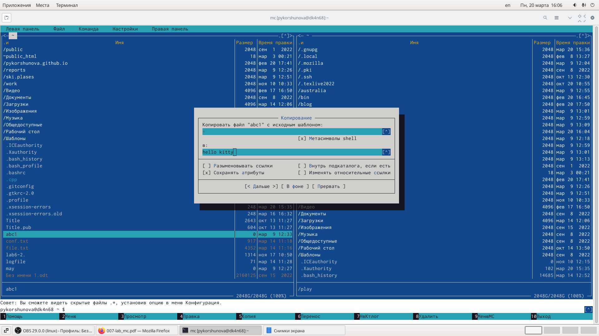{ #fig:011 width=60% }

## Выполнение лабораторной работы

6. С помощью соответствующих средств подменю «Команда» выполняю следующие действия:
	
Осуществляю поиск в файловой системе файла с заданными условиями, в моем случае файл с расширением .cpp и содержащие строку main):

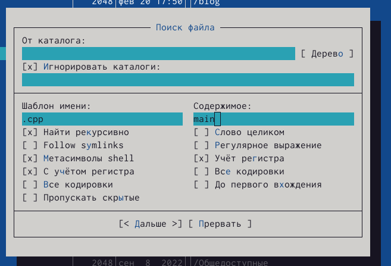{ #fig:012 width=55% }

## Выполнение лабораторной работы

Выбираю и повторяю одну из предыдущих команд:

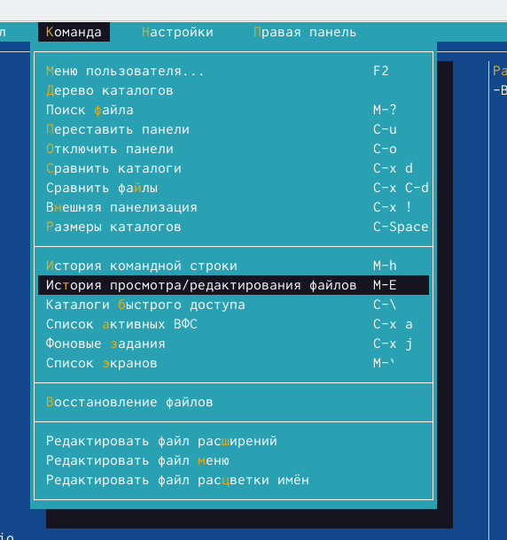{ #fig:013 width=60% }

## Выполнение лабораторной работы

Перехожу в домашний каталог, открыв дерево каталогов:

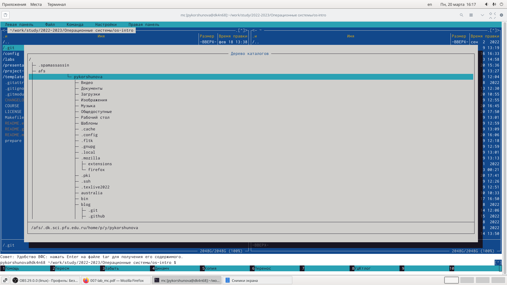{ #fig:014 width=60% }

## Выполнение лабораторной работы

Затем я добавила домашний каталог в каталоги быстрого доступа, что позволило мне быстро переходить в домашний каталог:

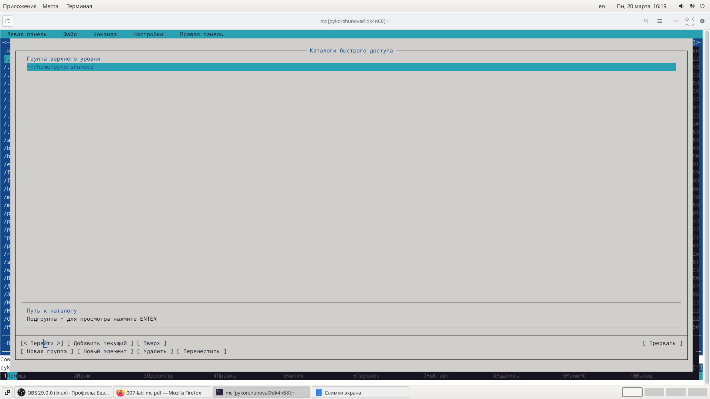{ #fig:015 width=50% }

## Выполнение лабораторной работы

Анализирую файл меню и файл расширений:

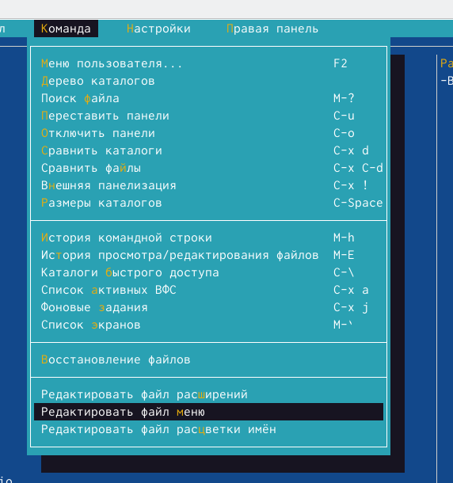{ #fig:016 width=55% }

## Выполнение лабораторной работы

7.Вызываю подменю «Настройки» и осваиваю операции, определяющие структуру экрана mc.(Full screen, Double Width, Show Hidden Files и другие):

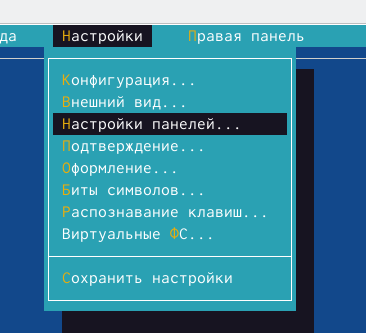{ #fig:017 width=45% }

# ЗАДАНИЕ ПО ВСТРОЕННОМУ РЕДАКТОРУ mc:

## Выполнение лабораторной работы

1. Создаю текстовый файл text.txt, используя команду touch.

2. Затем с помощью встроенного в mc редактора открываю text.txt.

3. Копирую некоторый текст из описания лабораторной работы и вставляю в файл text.txt, используя комбинацию клавиш Shift + Ins.

## Выполнение лабораторной работы

4. Проделываю следующие действия:

	- удаляю строку текста, используя комбинацию клавиш Ctrl + y;

	- выделяю фрагмент текста с помощью клавиши F3 и копирую его с помощью клавиши F5;

	- выделяю фрагмент текста с помощью клавиши F3 и перемещаю выделенный текст на другую строку с помощью клавиши F6;
   
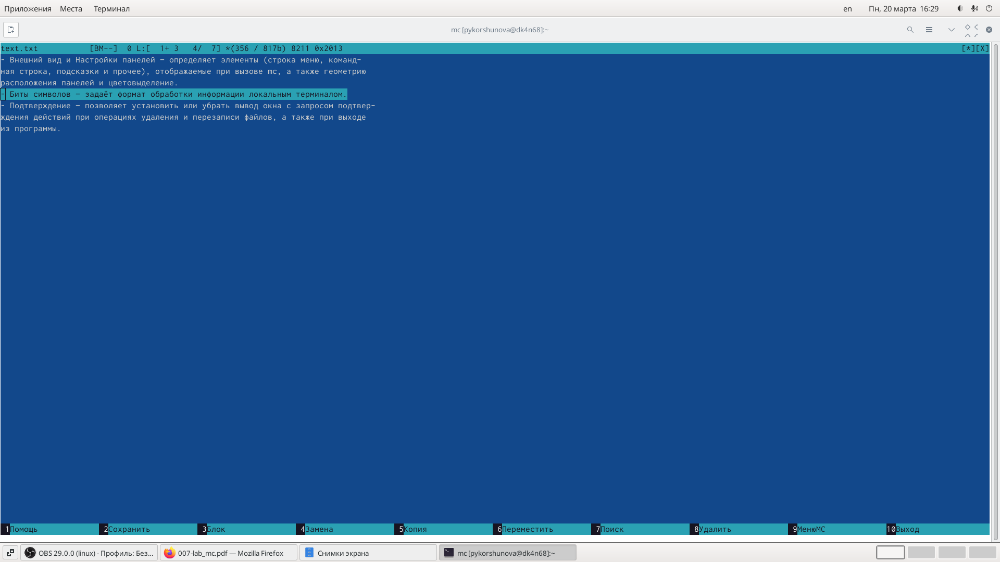{ #fig:018 width=70% }

## Выполнение лабораторной работы

- сохраняю файл, воспользовавшись клавишей F2;
 
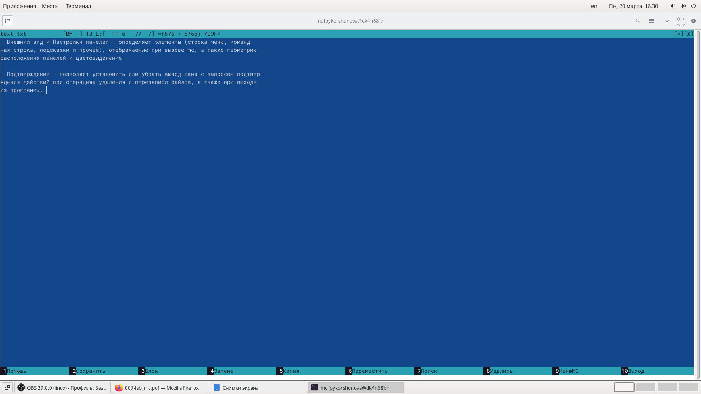{ #fig:019 width=70% }

## Выполнение лабораторной работы

- отменяю последнее действие с помощью комбинации клавиш Ctrl + u;

- Перехожу в конец файла и пишу некоторый текст;

- Перехожу в начало файла и пишу некоторый текст;

- Затем я сохраняю и закрываю файл.

## Выполнение лабораторной работы

5. Открываю файл с исходным текстом на языке программирования C++.

6. Используя меню редактора, включаю и выключаю подсветку синтаксиса, (также это можно сделать с помощью комбинации клавиш Ctrl + s).

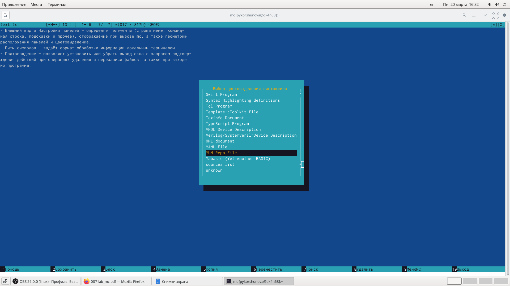{ #fig:020 width=50% }

## Вовод

В ходе лабораторный работы я освоила основные возможности командной оболочки Midnight Commander, а также приобрела навыки практической работы по просмотру каталогов и файлов, манипуляций с ними.

