---
# Front matter
lang: ru-RU
title: "Лабораторная работа 7"
subtitle: "Командная оболочка Midnight Commander"
author: "Коршунова Полина Юрьевна"

# Formatting
toc-title: "Содержание"
toc: true # Table of contents
toc_depth: 2
fontsize: 12pt
linestretch: 1.5
papersize: a4paper
documentclass: scrreprt
polyglossia-lang: russian
polyglossia-otherlangs: english
mainfont: PT Serif
romanfont: PT Serif
sansfont: PT Sans
monofont: PT Mono
mainfontoptions: Ligatures=TeX
romanfontoptions: Ligatures=TeX
sansfontoptions: Ligatures=TeX,Scale=MatchLowercase
monofontoptions: Scale=MatchLowercase
indent: true
pdf-engine: lualatex
header-includes:
  - \linepenalty=10 # the penalty added to the badness of each line within a paragraph (no associated penalty node) Increasing the value makes tex try to have fewer lines in the paragraph.
  - \interlinepenalty=0 # value of the penalty (node) added after each line of a paragraph.
  - \hyphenpenalty=50 # the penalty for line breaking at an automatically inserted hyphen
  - \exhyphenpenalty=50 # the penalty for line breaking at an explicit hyphen
  - \binoppenalty=700 # the penalty for breaking a line at a binary operator
  - \relpenalty=500 # the penalty for breaking a line at a relation
  - \clubpenalty=150 # extra penalty for breaking after first line of a paragraph
  - \widowpenalty=150 # extra penalty for breaking before last line of a paragraph
  - \displaywidowpenalty=50 # extra penalty for breaking before last line before a display math
  - \brokenpenalty=100 # extra penalty for page breaking after a hyphenated line
  - \predisplaypenalty=10000 # penalty for breaking before a display
  - \postdisplaypenalty=0 # penalty for breaking after a display
  - \floatingpenalty = 20000 # penalty for splitting an insertion (can only be split footnote in standard LaTeX)
  - \raggedbottom # or \flushbottom
  - \usepackage{float} # keep figures where there are in the text
  - \floatplacement{figure}{H} # keep figures where there are in the text
---

# Цель работы

Освоение основных возможностей командной оболочки Midnight Commander. Приобретение навыков практической работы по просмотру каталогов и файлов; манипуляций с ними.

# Задание

Задание по mc:

	1. Изучите информацию о mc, вызвав в командной строке man mc.

       2. Запустите из командной строки mc, изучите его структуру и меню.
       
       3. Выполните несколько операций в mc, используя управляющие клавиши (операции с панелями; 
       выделение/отмена выделения файлов, копирование/перемещение файлов,
       получение информации о размере и правах доступа на файлы и/или каталоги и т.п.)
       
       4. Выполните основные команды меню левой (или правой) панели. 
       Оцените степень подробности вывода информации о файлах.
       
       5. Используя возможности подменю «Файл», выполните:
       
- просмотр содержимого текстового файла;
       
- редактирование содержимого текстового файла (без сохранения результатов редактирования);
       
- создание каталога;
       
- копирование файлов в созданный каталог.
       
       6. С помощью соответствующих средств подменю «Команда» осуществите:

- поиск в файловой системе файла с заданными условиями 
       (например, файла с расширением .c или .cpp, содержащего строку main);
       
- выбор и повторение одной из предыдущих команд;
       
- переход в домашний каталог;
       
- анализ файла меню и файла расширений.
       
       7. Вызовите подменю Настройки. Освойте операции, определяющие структуру экрана mc 
       (Full screen, Double Width, Show Hidden Files и т.д.)
       
Задание по встроенному редактору mc:
       
1. Создайте текстовой файл text.txt.
       
2. Откройте этот файл с помощью встроенного в mc редактора.
       
3. Вставьте в открытый файл небольшой фрагмент текста, скопированный из любого другого файла или Интернета.
       
4. Проделайте с текстом следующие манипуляции, используя горячие клавиши:
       
       4.1. Удалите строку текста.
       
       4.2. Выделите фрагмент текста и скопируйте его на новую строку.
       
       4.3. Выделите фрагмент текста и перенесите его на новую строку.
       
       4.4. Сохраните файл.
       
       4.5. Отмените последнее действие.
       
       4.6. Перейдите в конец файла (нажав комбинацию клавиш) и напишите некоторый текст.
       
       4.7. Перейдите в начало файла (нажав комбинацию клавиш) и напишите некоторый текст.
       
       4.8. Сохраните и закройте файл.
       
       5. Откройте файл с исходным текстом на некотором языке программирования 
       (например C или Java)
       
       6. Используя меню редактора, включите подсветку синтаксиса, если она не включена,
       или выключите, если она включена.
       
# Теоретическое введение

Командная оболочка — интерфейс взаимодействия пользователя с операционной системой и программным обеспечением посредством команд.

Midnight Commander (или mc) — псевдографическая командная оболочка для UNIX/Linux систем. Для запуска mc необходимо в командной строке набрать mc и нажать Enter.

Встроенный в mc редактор вызывается с помощью функциональной клавиши F4. В нём удобно использовать различные комбинации клавиш при редактировании содержимого (как правило текстового) файла.

# Выполнение лабораторной работы

ЗАДАНИЕ ПО mc:

1. Изучаю информацию о mc, вызвав в командной строке man mc.

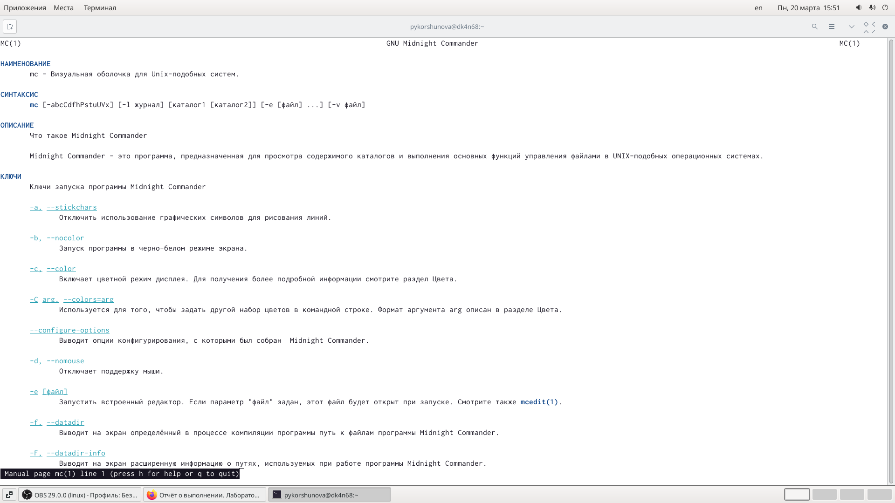{ #fig:001 width=70% }

2. Запускаю mc из командной строки и изучаю его меню и структуру.

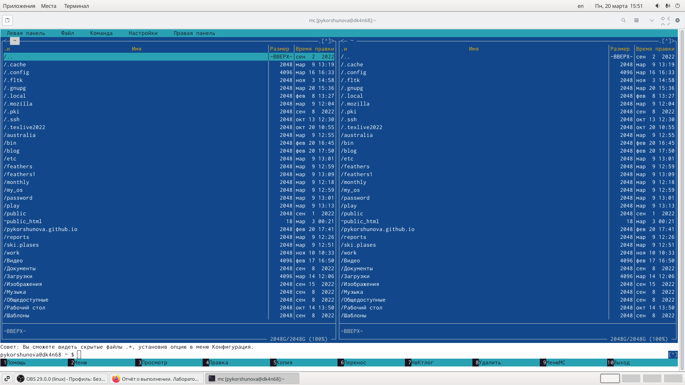{ #fig:002 width=70% }

3. Выполняю несколько операций в mc, используя управляющие клавиши. Например, 

Выделение нескольких файлов с помощью Shift + стрелки и отмена выделения с помощью этой же комбинации клавиш:

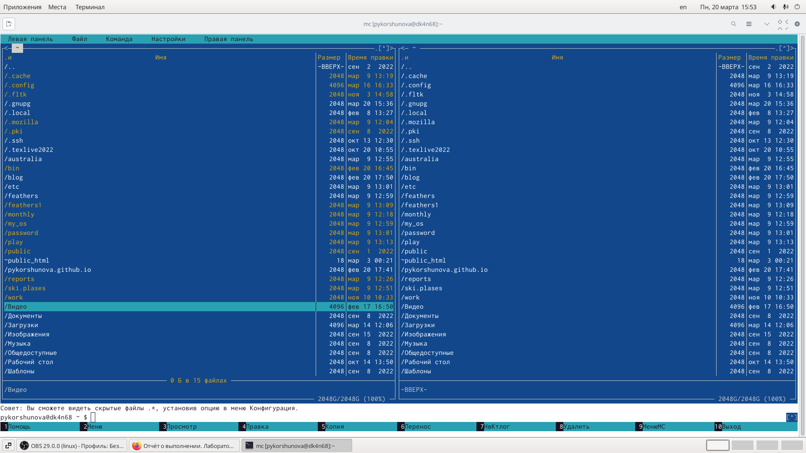{ #fig:003 width=70% }

Копирование (F5) и перемещение (F6) файлов:

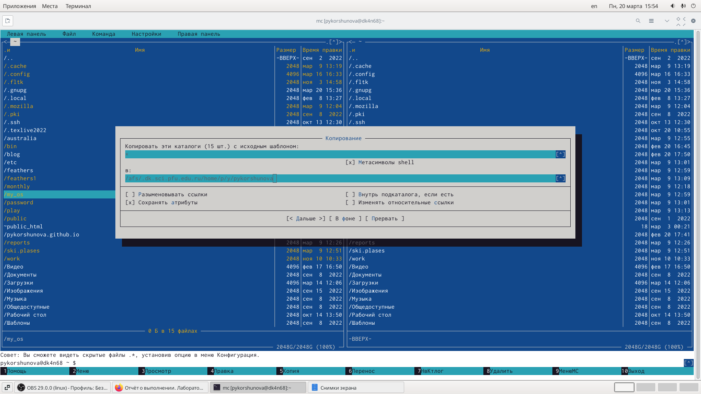{ #fig:004 width=70% }

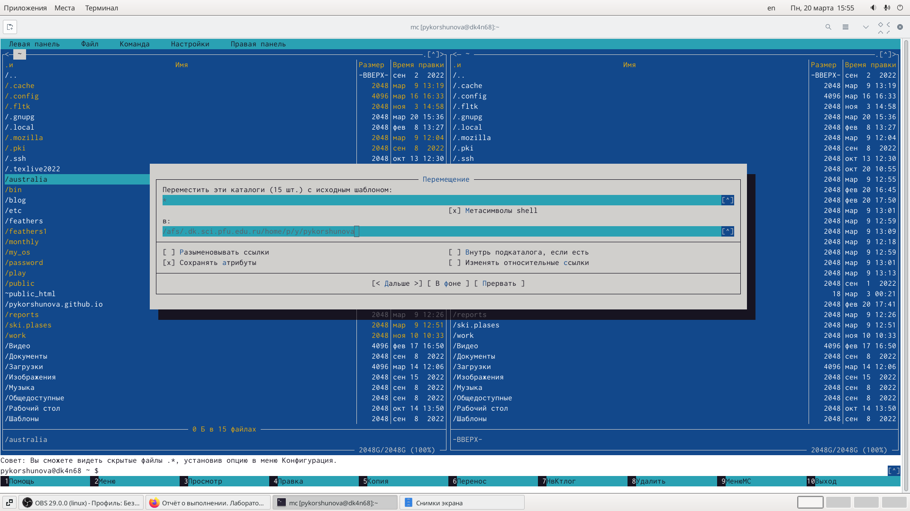{ #fig:005 width=70% }

А также получение информации о размере и правах доступа на файлы и каталоги:

{ #fig:006 width=70% }

4. Выполняю основные команды меню левой (или правой) панели. Просматриваю список файлов выбранного каталога, выполняю «быстрый просмотр» и просматриваю содержимое выбранного файла без возможности изменения, просматриваю дерево каталогов, а также просматриваю более подробную информацию о файлах с помощью «Информация».

5. Используя возможности подменю «Команда» выполняю следующие действия:

	- просматриваю содержимое текстового файла (также это можно сделать с помощью клавиши F3):

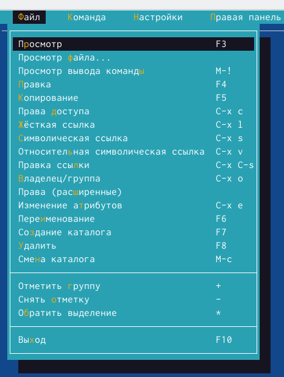{ #fig:007 width=70% }

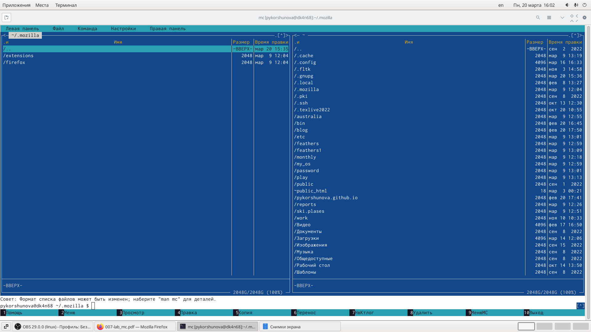{ #fig:008 width=70% }

	- редактирую содержимое текстового файла (также это можно сделать с помощью клавиши F4):

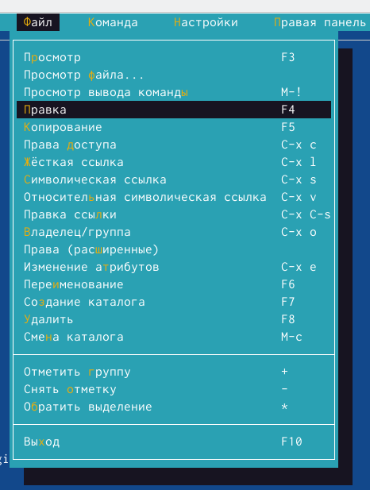{ #fig:009 width=70% }

	- создаю каталог (также это можно сделать с помощью клавиши F7):

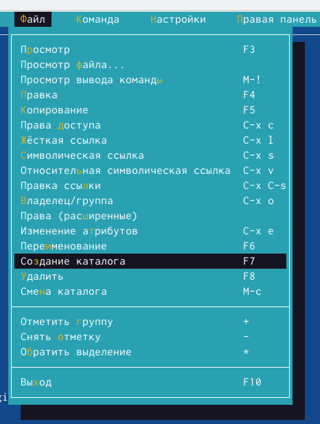{ #fig:010 width=70% }

	- копирую файлы в созданный каталог (также это можно сделать с помощью клавиши F5):

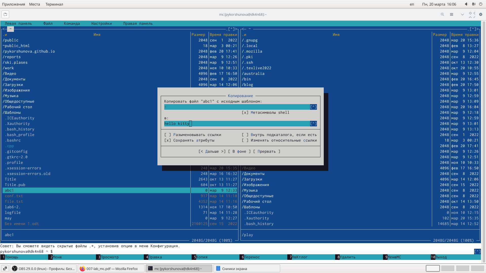{ #fig:011 width=70% }

6. С помощью соответствующих средств подменю «Команда» выполняю следующие действия:
	
	- осуществляю поиск в файловой системе файла с заданными условиями, в моем случае файл с расширением .cpp и содержащие строку main):

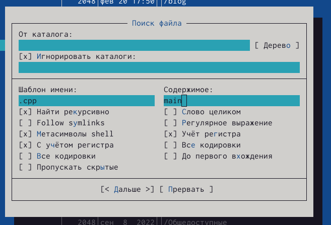{ #fig:012 width=70% }

	- выбираю и повторяю одну из предыдущих команд:

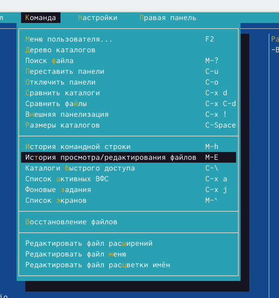{ #fig:013 width=70% }

	- перехожу в домашний каталог, открыв дерево каталогов:

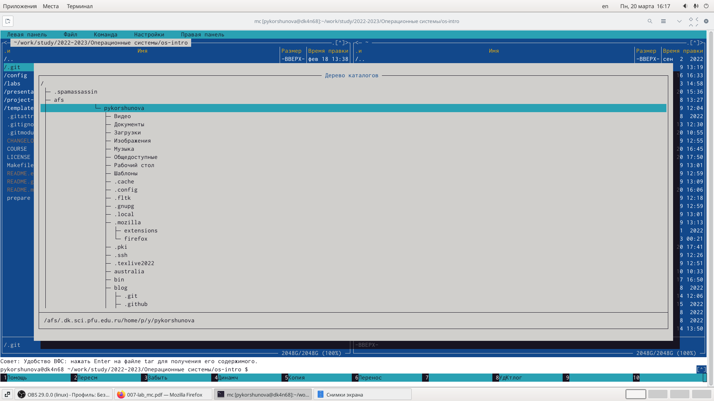{ #fig:014 width=70% }

	Затем я добавила домашний каталог в каталоги быстрого доступа, что позволило мне быстро переходить в домашний каталог:

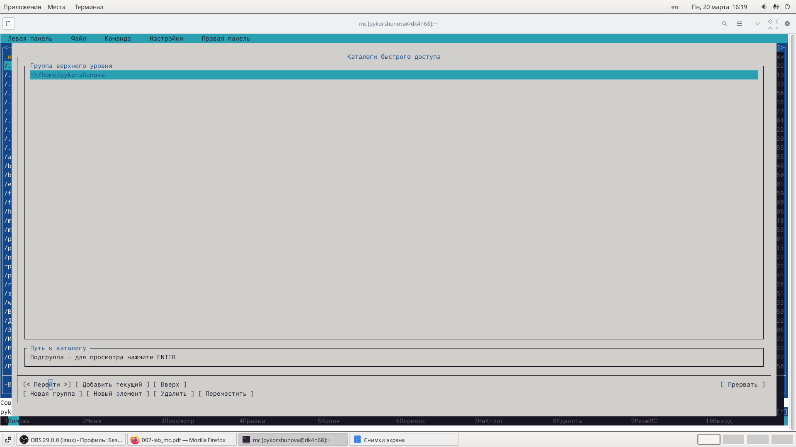{ #fig:015 width=70% }

	- анализирую файл меню и файл расширений:

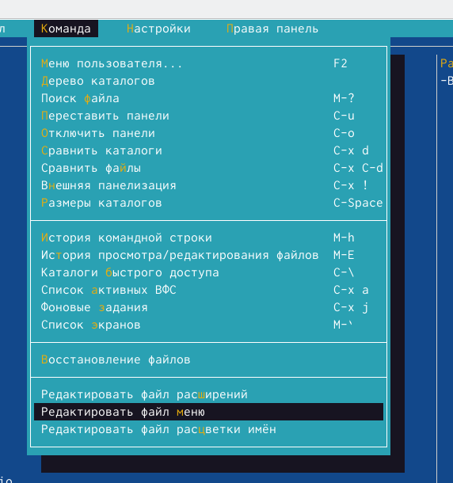{ #fig:016 width=70% }

7.Вызываю подменю «Настройки» и осваиваю операции, определяющие структуру экрана mc.(Full screen, Double Width, Show Hidden Files и другие):

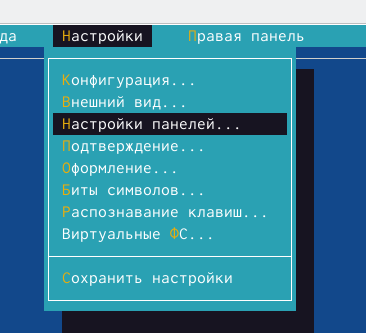{ #fig:017 width=70% }

ЗАДАНИЕ ПО ВСТРОЕННОМУ РЕДАКТОРУ mc:

1. Создаю текстовый файл text.txt, используя команду touch.

2. Затем с помощью встроенного в mc редактора открываю text.txt.

3. Копирую некоторый текст из описания лабораторной работы и вставляю в файл text.txt, используя комбинацию клавиш Shift + Ins.

4. Проделываю следующие действия:

	- удаляю строку текста, используя комбинацию клавиш Ctrl + y;

	- выделяю фрагмент текста с помощью клавиши F3 и копирую его с помощью клавиши F5;

       - выделяю фрагмент текста с помощью клавиши F3 и перемещаю выделенный текст на другую строку с помощью клавиши F6;
       
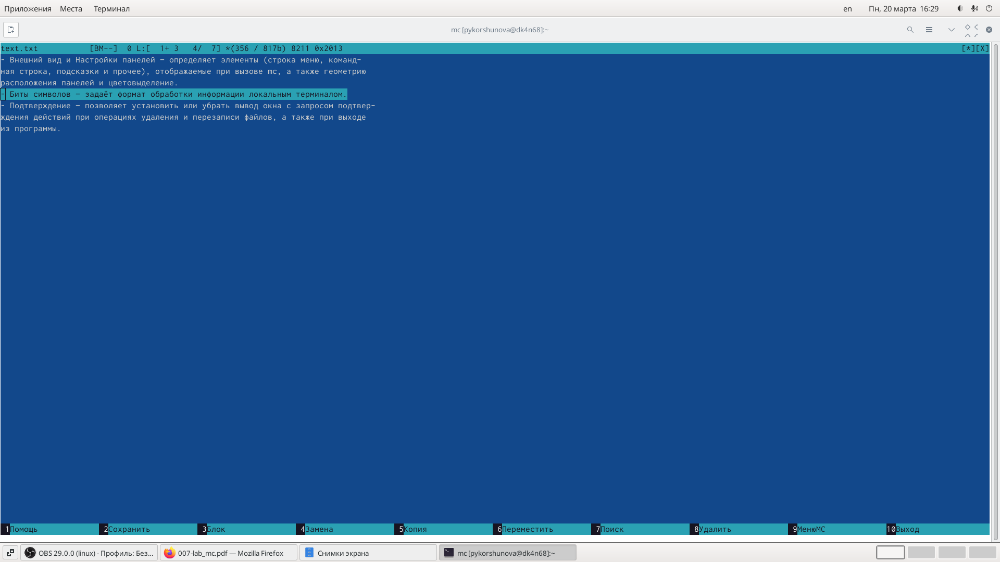{ #fig:018 width=70% }
       
- сохраняю файл, воспользовавшись клавишей F2;
- 
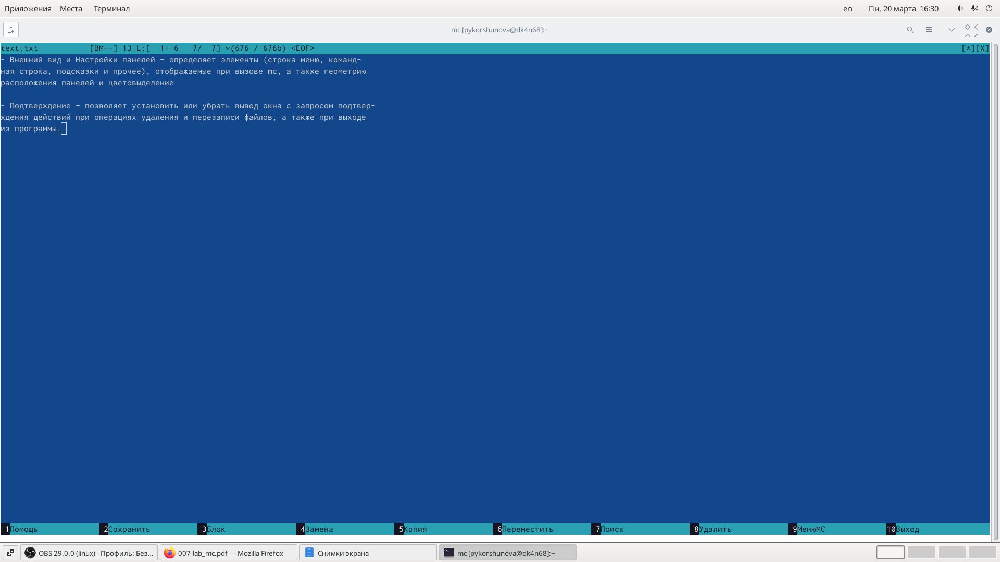{ #fig:019 width=70% }

- отменяю последнее действие с помощью комбинации клавиш Ctrl + u;

- Перехожу в конец файла и пишу некоторый текст;

- Перехожу в начало файла и пишу некоторый текст;

- Затем я сохраняю и закрываю файл.

5. Открываю файл с исходным текстом на языке программирования C++.

6. Используя меню редактора, включаю и выключаю подсветку синтаксиса, (также это можно сделать с помощью комбинации клавиш Ctrl + s).

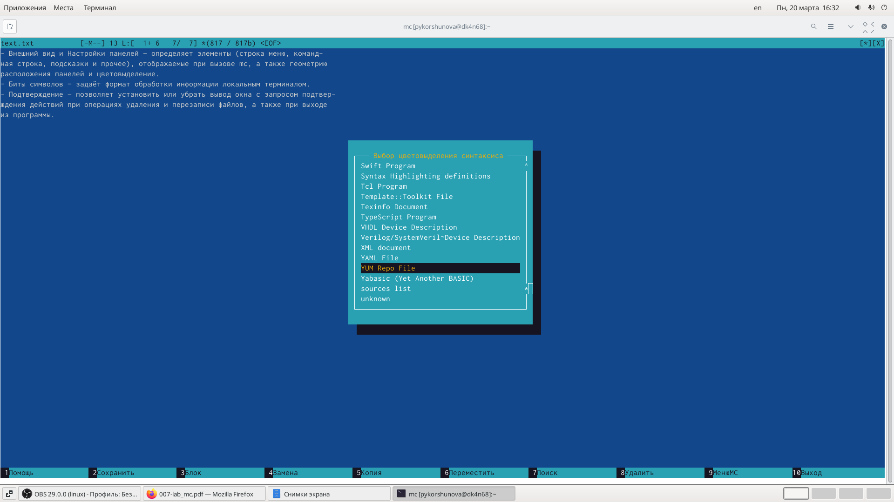{ #fig:020 width=70% }

# Вывод

В ходе лабораторный работы я освоила основные возможности командной оболочки Midnight Commander, а также приобрела навыки практической работы по просмотру каталогов и файлов, манипуляций с ними.

# Ответы на контрольные вопросы

1. Какие режимы работы есть в mc. Охарактеризуйте их.

mc - визуальная файловая оболочка для UNIX/Linux систем, аналог Far, Norton Commander, но оболочки в Linux несравненно богаче. На языке командной оболочки можно писать небольшие программы для выполнения ряда последовательных операций с файлами и содержащимися в них данными. 

Команда Переставить панели (Ctrl+U) меняет местами содержимое правой и левой панелей.  

По команде Сравнить каталоги (Ctrl-X,D) сравнивается содержимое каталогов, отображаемых на левой и правой панелях. 

Помимо того, что может задаваться формат вывода на панель списка файлов, любую панель можно перевести в один из следующих режимов Режим "Информация". В этом режиме на панель выводится информация о подсвеченном в другой панели файле и о текущей файловой системе. 

Режим "Дерево". В режиме отображения дерева каталогов в одной из панелей выводится графическое изображение структуры дерева каталогов. 

Меню «Левая панель» и «Правая панель» позволяют оперировать режимами отображения панелей. 

Формат списка бывает:  

Стандартный – вывод списка файлов и каталогов по умолчанию;  

Ускоренный – имена файла или каталогов;  Расширенный – атрибуты, владелец, группа и размер;  

Определённый пользователем – имя, размер и атрибуты; Быстрый просмотр – выполняет быстрый просмотр содержимого панели. 

Информация – выдает всю имеющуюся информацию о файле или каталоге. 

Порядок сортировки – бывает: без сортировки, по имени, расширенный, время правки, время правки, время доступа, время изменение атрибута, размер, узел.

2. Какие операции с файлами можно выполнить как с помощью команд shell, так и с помощью меню (комбинаций клавиш) mc? Приведите несколько примеров.

Командные интерпретатор Shell и оболочка Midnight Commander имеют похожую структуру и многие одинаковые команды можно выполнить в обоих оболочках: 

Например, Системная информация, Копирование, Поиск 
 
3. Опишите структура меню левой (или правой) панели mc, дайте характеристику командам.

Подпункты меню:
 
Список файлов показывает файлы в домашнем каталоге.  

Быстрый просмотр позволяет выполнить быстрый просмотр содержимого панели.  

Информация позволяет посмотреть информацию о файле или каталоге  

В меню каждой (левой или правой) панели можно выбрать 

Формат списка: стандартный, ускоренный, расширенный и определённый пользователем.  

Порядок сортировки позволяет задать критерии сортировки при выводе списка файлов и каталогов: без сортировки, по имени, расширенный, время правки, время доступа, время изменения атрибута, размер, узел.

4. Опишите структура меню Файл mc, дайте характеристику командам.

Просмотр (F3) позволяет посмотреть содержимое текущего файла без возможности редактирования.  

Просмотр вывода команды (М + !) функция запроса команды с параметрами.  

Правка (F4) открывает текущий (или выделенный) файл для его редактирования.  

Копирование (F5) осуществляет копирование одного или нескольких файлов или каталогов в указанное пользователем во всплывающем окне место.  

Права доступа (Ctrl-x c) позволяет изменить права доступа к одному или нескольким файлам или каталогам.  

Переименование (F6) позволяет переименовать один или несколько файлов или каталогов. 

Создание каталога (F7) позволяет создать каталог. 

Удалить (F8) позволяет удалить один или несколько файлов или каталогов.  
Выход (F10) завершает работу mc.

5. Опишите структура меню Команда mc, дайте характеристику командам.

Подпункты меню:  

Дерево каталогов отображает структуру каталогов системы.  

Поиск файла выполняет поиск файлов по заданным параметрам.  

Переставить панели меняет местами левую и правую панели.  

Сравнить каталоги ( Ctrl-x d ) сравнивает содержимое двух каталогов.  

Размеры каталогов отображает размер и время изменения каталога (по умол- чанию в mc размер каталога корректно не отображается).  

История командной строки выводит на экран список ранее выполненных в оболочке команд.  

Каталоги быстрого доступа ( Ctrl-\ ) при вызове выполняется быстрая смена текущего  каталога на один из заданного списка.  Восстановление файлов позволяет восстановить файлы на файловых систе- мах ext2 и ext3.  
Редактировать файл расширений позволяет задать с помощью определённого синтаксиса действия при запуске файлов с определённым расширением (напри- мер, какое программного обеспечение запускать для открытия или редактирова- ния файлов с расширением .c или .cpp). 

Редактировать файл меню позволяет отредактировать контекстное меню поль- зователя, вызываемое по клавише F2 .  Редактировать файл расцветки имён позволяет подобрать оптимальную для пользователя расцветку имён файлов в зависимости от их типа.

6. Опишите структура меню Настройки mc, дайте характеристику командам.

Подпункты меню:
  
Конфигурация позволяет скорректировать настройки работы с панелями.  

Внешний вид и Настройки панелей определяет элементы, отображаемые при вызове mc, а также цветовое выделение.  

Биты символов задаёт формат обработки информации локальным термина- лом.  

Подтверждение позволяет установить или убрать вывод окна с запросом подтверждения действий при операциях удаления и перезаписи файлов, а также при выходе из программы.  

7. Назовите и дайте характеристику встроенным командам mc.

F1 – Вызов контекстно-зависимой подсказки.  

F2 – Вызов пользовательского меню с возможностью создания and/or.  

F3 – dfgПросмотр содержимого файла, на который указывает подсветка в активной панели.  

F4 – Вызов встроенного в mc редактора для изменения содержания файла, на который  указывает подсветка в активной панели.  

F5 – Копирование одного или нескольких файлов, отмеченных в первой (активной) панели, в каталог, отображаемый на второй панели.  

F6 – Перенос одного или нескольких файлов, отмеченных в первой панели, в каталог, отображаемый на второй панели.  

F7 – Создание подкаталога в каталоге, отображаемом в активной панели.  

F8 – Удаление одного или нескольких файлов, отмеченных в первой панели файлов.  

F9 – Вызов меню mc.  

F10 – Выход из mc.

8. Назовите и дайте характеристику командам встроенного редактора mc.

Ctrl+y – удалить строку. 

Ctrl+u – отмена последней операции.  

Ins – вставка/замена.  

F7 – поиск.  

Shift+F7 – повтор последней операции поиска.  

F4 – замена файла.  

F3 – первое нажатие – начало выделения, второе – окончание выделения.  

F5 – копировать выделенный фрагмент 

F6 – переместить выделенный фрагмент.  

F8 – удалить выделенный фрагмент.  

F2 – записать изменения в файл.  

F10 – выйти из редактора.

9. Дайте характеристику средствам mc, которые позволяют создавать меню, определяемые пользователем.

Один из четырех форматов списка в Midnight Commander –пользовательский, определённый самим пользователем позволяет ему редактировать меню любого из двух списков. А меню пользователя – это меню, состоящее из команд, определенных пользователем. При вызове меню используется файл ~/.mc.menu. Если такого файла нет, то по умолчанию используется системный файл меню /usr/lib/mc/mc.menu. Все строки в этих файлах , начинающиеся с пробела или табуляции, являются командами, которые выполняются при выборе записи.

10. Дайте характеристику средствам mc, которые позволяют выполнять действия, определяемые пользователем, над текущим файлом.
Когда мы выделяем файл не являющегося исполняемым, Midnight Commander сравнивает расширение выбранного файла с расширениями, прописанными в «файле расширений» ~/ mc.ext. Если в файле расширений найдется подраздел, задающий процедуры обработки файлов с данным расширением, то обработка файла производится в соответствии с заданными в этом подразделе командами и файлами:  файл помощи для MC.

/usr/lib/mc.hlp  файл расширений, используемый по умолчанию. /usr/lib/mc/mc.ext  файл расширений, конфигурации редактора. $HOME/.mc.ext  системный инициализационный файл. /usr/lib/mc/mc.ini  фаил который содержит основные установки. /usr/lib/mc/mc.lib  инициализационный файл пользователя. Если он существует, то системный файл mc.ini игнорируется. $HOME/.mc.ini  этот файл содержит подсказки, отображаемые в нижней части экрана. /usr/lib/mc/mc.hint  системный файл меню MC, используемый по умолчанию. /usr/lib/mc/mc.menu  файл меню пользователя. Если он существует, то системный файл меню игнорируется. $HOME/.mc.menu  инициализационный файл пользователя. Если он существует, то системный файл mc.ini игнорируется. $HOME/.mc.tree

