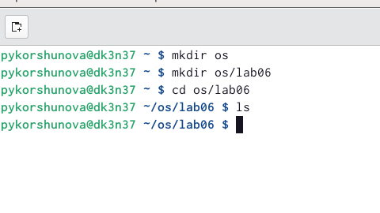
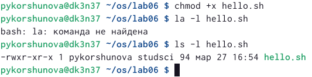
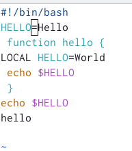
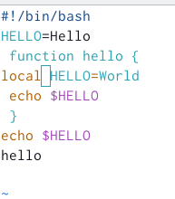
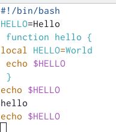
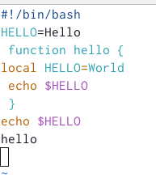
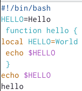

---
## Front matter
lang: ru-RU
title: Лабораторная работа 8
subtitle: Текстовой редактор vi 
author: |
	 Korshunova P. Y.
institute: |
	RUDN University, Moscow, Russian Federation
date: 2023, 27 March

## Formatting
toc: false
slide_level: 2
theme: metropolis
header-includes: 
 - \metroset{progressbar=frametitle,sectionpage=progressbar,numbering=fraction}
 - '\makeatletter'
 - '\beamer@ignorenonframefalse'
 - '\makeatother'
aspectratio: 43
section-titles: true
---

## Цель работы

Познакомиться с операционной системой Linux. Получить практические навыки работы с редактором vi, установленным по умолчанию практически во всех дистрибутивах.

## Задание 

Задание 1. Создание нового файла с использованием vi:

1. Создайте каталог с именем ~/work/os/lab06.

2. Перейдите во вновь созданный каталог.

3. Вызовите vi и создайте файл hello.sh
vi helo.sh

## Задание 

4. Нажмите клавишу i и вводите следующий текст.

#!/bin/bash

HELL=Hello

function hello {

LOCAL HELLO=World 

echo $HELLO  

}

echo $HELLO

hello

## Задание 

5. Нажмите клавишу Esc для перехода в командный режим после завершения ввода текста.

6. Нажмите : для перехода в режим последней строки и внизу вашего экрана появится приглашение в виде двоеточия.

7. Нажмите w (записать) и q (выйти), а затем нажмите клавишу Enter для сохранения вашего текста и завершения работы.

8. Сделайте файл исполняемым
chmod +x hello.sh 

## Задание 

Задание 2. Редактирование существующего файла:

1. Вызовите vi на редактирование файла
vi ~/work/os/lab06/hello.sh

2. Установите курсор в конец слова HELL второй строки.

3. Перейдите в режим вставки и замените на HELLO. Нажмите Esc для возврата в командный режим.

4. Установите курсор на четвертую строку и сотрите слово LOCAL.

5. Перейдите в режим вставки и наберите следующий текст: local, нажмите Esc для возврата в командный режим.

## Задание 

6. Установите курсор на последней строке файла. Вставьте после неё строку, содержащую следующий текст: echo $HELLO.

7. Нажмите Esc для перехода в командный режим.

8. Удалите последнюю строку.

9. Введите команду отмены изменений u для отмены последней команды.

10. Введите символ : для перехода в режим последней строки. Запишите произведённые изменения и выйдите из vi.

## Теоретическое введение

В большинстве дистрибутивов Linux в качестве текстового редактора по умолчанию устанавливается интерактивный экранный редактор vi (Visual display editor).

Редактор vi имеет три режима работы:

– командный режим — предназначен для ввода команд редактирования и навигации по редактируемому файлу;

– режим вставки — предназначен для ввода содержания редактируемого файла;

– режим последней (или командной) строки — используется для записи изменений в файл и выхода из редактора.

Для вызова редактора vi необходимо указать команду vi и имя редактируемого файла: vi имя_файла

## Выполнение работы

Задание 1:

1. Создаю каталог с именем ~/work/os/lab06.

2. Перехожу в созданный каталог.

{ #fig:001 width=70% }

3. Вызываю vi и создаю файл hello.sh.

{ #fig:002 width=70% }

## Выполнение работы

4. Нажимаю клавишу i для перехода в режим вставки и ввожу необходимый текст.

{ #fig:003 width=70% }

5. После завершения ввода текста нажимаю клавишу Esc для перехода в командный режим. 

## Выполнение работы

6. Затем нажимаю : для перехода в режим последней строки. Внизу экрана появляется приглашение на ввод в виде двоеточия.

7. Затем я сохраняю изменения и выхожу, введя wq в режиме последней строки.

{ #fig:004 width=70% }

## Выполнение работы

8. Добавляю права выполнения для файла hello.sh.

{ #fig:005 width=70% }

## Выполнение работы

Задание 2:

1. Вызываю vi на редактирование файла.

2. Устанавливаю курсор в конец слова HELL второй строки.

## Выполнение работы

3. Перехожу в режим вставки, нажав i, и заменяю на HELLO. Затем, нажав клавишу Esc, возвращаюсь в командный режим.

{ #fig:006 width=70% }

## Выполнение работы

4. Устанавливаю курсор на четвертую строку и стираю слово LOCAL.

5. Перехожу в режим вставки, нажав i, и набираю local, затем возвращаюсь в командный режим, нажав клавишу Esc.

{ #fig:007 width=70% }

## Выполнение работы

6. Устанавливаю курсор на последней строке файла, вставляю после нее строку, содержащую текст echo $HELLO. Для этого я копирую строку, содержащую этот текст, с помощью сочетания клавиш Y (Shift + y), а затем вставляю после последней строки, нажав клавишу p.

{ #fig:008 width=70% }

## Выполнение работы

7. Перехожу в командный режим, нажав Esc.

8. Удаляю последнюю строку с помощью двойного нажатия на d (dd).

{ #fig:009 width=70% }

## Выполнение работы

9. Отменяю последнюю команду, нажав u.

10. Ввожу символ : для перехода в режим последней строки. Затем, набрав wq сохраняю изменения и выхожу из vi.

## Вовод

В ходе лабораторной работы я познакомилась с операционной системой Linux, а также получила практические навыки работы с редактором vi, установленным по умолчанию практически во всех дистрибутивах.

