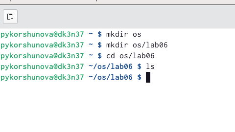
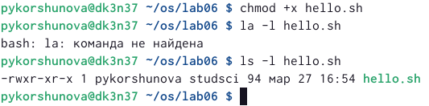
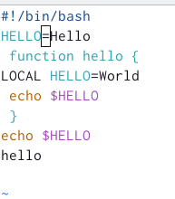
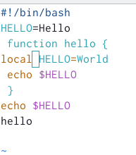
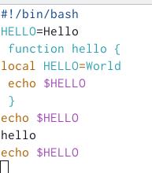
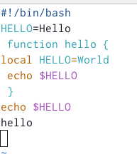
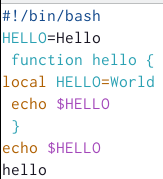

---
# Front matter
lang: ru-RU
title: "Лабораторная работа 8"
subtitle: "Текстовой редактор vi"
author: "Коршунова Полина Юрьевна"

# Formatting
toc-title: "Содержание"
toc: true # Table of contents
toc_depth: 2
fontsize: 12pt
linestretch: 1.5
papersize: a4paper
documentclass: scrreprt
polyglossia-lang: russian
polyglossia-otherlangs: english
mainfont: PT Serif
romanfont: PT Serif
sansfont: PT Sans
monofont: PT Mono
mainfontoptions: Ligatures=TeX
romanfontoptions: Ligatures=TeX
sansfontoptions: Ligatures=TeX,Scale=MatchLowercase
monofontoptions: Scale=MatchLowercase
indent: true
pdf-engine: lualatex
header-includes:
  - \linepenalty=10 # the penalty added to the badness of each line within a paragraph (no associated penalty node) Increasing the value makes tex try to have fewer lines in the paragraph.
  - \interlinepenalty=0 # value of the penalty (node) added after each line of a paragraph.
  - \hyphenpenalty=50 # the penalty for line breaking at an automatically inserted hyphen
  - \exhyphenpenalty=50 # the penalty for line breaking at an explicit hyphen
  - \binoppenalty=700 # the penalty for breaking a line at a binary operator
  - \relpenalty=500 # the penalty for breaking a line at a relation
  - \clubpenalty=150 # extra penalty for breaking after first line of a paragraph
  - \widowpenalty=150 # extra penalty for breaking before last line of a paragraph
  - \displaywidowpenalty=50 # extra penalty for breaking before last line before a display math
  - \brokenpenalty=100 # extra penalty for page breaking after a hyphenated line
  - \predisplaypenalty=10000 # penalty for breaking before a display
  - \postdisplaypenalty=0 # penalty for breaking after a display
  - \floatingpenalty = 20000 # penalty for splitting an insertion (can only be split footnote in standard LaTeX)
  - \raggedbottom # or \flushbottom
  - \usepackage{float} # keep figures where there are in the text
  - \floatplacement{figure}{H} # keep figures where there are in the text
---

# Цель работы

Познакомиться с операционной системой Linux. Получить практические навыки работы с редактором vi, установленным по умолчанию практически во всех дистрибутивах.

 
# Задание

Задание 1. Создание нового файла с использованием vi:

1. Создайте каталог с именем ~/work/os/lab06.

2. Перейдите во вновь созданный каталог.

3. Вызовите vi и создайте файл hello.sh
vi helo.sh

4. Нажмите клавишу i и вводите следующий текст.

#!/bin/bash

HELL=Hello

function hello {

LOCAL HELLO=World 

echo $HELLO  

}

echo $HELLO

hello

5. Нажмите клавишу Esc для перехода в командный режим после завершения ввода текста.

6. Нажмите : для перехода в режим последней строки и внизу вашего экрана появится приглашение в виде двоеточия.

7. Нажмите w (записать) и q (выйти), а затем нажмите клавишу Enter для сохранения вашего текста и завершения работы.

8. Сделайте файл исполняемым
chmod +x hello.sh 

Задание 2. Редактирование существующего файла:

1. Вызовите vi на редактирование файла
vi ~/work/os/lab06/hello.sh

2. Установите курсор в конец слова HELL второй строки.

3. Перейдите в режим вставки и замените на HELLO. Нажмите Esc для возврата в командный режим.

4. Установите курсор на четвертую строку и сотрите слово LOCAL.

5. Перейдите в режим вставки и наберите следующий текст: local, нажмите Esc для возврата в командный режим.

6. Установите курсор на последней строке файла. Вставьте после неё строку, содержащую следующий текст: echo $HELLO.

7. Нажмите Esc для перехода в командный режим.

8. Удалите последнюю строку.

9. Введите команду отмены изменений u для отмены последней команды.

10. Введите символ : для перехода в режим последней строки. Запишите произведённые изменения и выйдите из vi.
 
# Теоретическое введение

В большинстве дистрибутивов Linux в качестве текстового редактора по умолчанию устанавливается интерактивный экранный редактор vi (Visual display editor).

Редактор vi имеет три режима работы:

– командный режим — предназначен для ввода команд редактирования и навигации по редактируемому файлу;

– режим вставки — предназначен для ввода содержания редактируемого файла;

– режим последней (или командной) строки — используется для записи изменений в файл и выхода из редактора.

Для вызова редактора vi необходимо указать команду vi и имя редактируемого файла: vi <имя_файла>
 
# Выполнение лабораторной работы

Задание 1:

1. Создаю каталог с именем ~/work/os/lab06.

2. Перехожу в созданный каталог.

{ #fig:001 width=70% }

3. Вызываю vi и создаю файл hello.sh.

{ #fig:002 width=70% }

4. Нажимаю клавишу i для перехода в режим вставки и ввожу необходимый текст.

{ #fig:003 width=70% }

5. После завершения ввода текста нажимаю клавишу Esc для перехода в командный режим. 

6. Затем нажимаю : для перехода в режим последней строки. Внизу экрана появляется приглашение на ввод в виде двоеточия.

7. Затем я сохраняю изменения и выхожу, введя wq в режиме последней строки.

{ #fig:004 width=70% }

8. Добавляю права выполнения для файла hello.sh.

{ #fig:005 width=70% }

Задание 2:

1. Вызываю vi на редактирование файла.

2. Устанавливаю курсор в конец слова HELL второй строки.

3. Перехожу в режим вставки, нажав i, и заменяю на HELLO. Затем, нажав клавишу Esc, возвращаюсь в командный режим.

{ #fig:006 width=70% }

4. Устанавливаю курсор на четвертую строку и стираю слово LOCAL.

5. Перехожу в режим вставки, нажав i, и набираю local, затем возвращаюсь в командный режим, нажав клавишу Esc.

{ #fig:007 width=70% }

6. Устанавливаю курсор на последней строке файла, вставляю после нее строку, содержащую текст echo $HELLO. Для этого я копирую строку, содержащую этот текст, с помощью сочетания клавиш Y (Shift + y), а затем вставляю после последней строки, нажав клавишу p.

{ #fig:008 width=70% }

7. Перехожу в командный режим, нажав Esc.

8. Удаляю последнюю строку с помощью двойного нажатия на d (dd).

{ #fig:009 width=70% }

9. Отменяю последнюю команду, нажав u.

10. Ввожу символ : для перехода в режим последней строки. Затем, набрав wq сохраняю изменения и выхожу из vi.

# Вывод

В ходе лабораторной работы я познакомилась с операционной системой Linux, а также получила практические навыки работы с редактором vi, установленным по умолчанию практически во всех дистрибутивах.

# Контрольные вопросы

1.	Дайте краткую характеристику режимам работы редактора vi.

Редактор vi имеет три режима работы:

       – командный режим - предназначен для ввода команд редактирования и навигации по редактируемому файлу;
       
       – режим вставки - предназначен для ввода содержания редактируемого файла;
       
       – режим последней (или командной) строки - используется для записи изменений в файл и выхода из редактора.
       
2.	Как выйти из редактора, не сохраняя произведённые изменения?

Для того, чтобы выйти из редактора, не сохраняя произведенные изменения в режиме последней строки нужно ввести q! 

3.	Назовите и дайте краткую характеристику командам позиционирования.

0 (ноль) - перейти в начало строки; 

$ - перейти в конец строки; 

G - перейти в конец файла; 

nG - перейти на строку номер n.

4.	Что для редактора vi является словом?

Для редактора vi слово - это строка символов, которая может включать в себя буквы, цифры и символы подчеркивания.

5.	Каким образом из любого места редактируемого файла перейти в начало (конец) файла?

0 (ноль) - переход в начало строки; 

$ - переход в конец строки; 

G - переход в конец файла; 

n G - переход на строку с номером n.

6.	Назовите и дайте краткую характеристику основным группам команд редактирования.

Вставка текста:

а - вставить текст после курсора;

А - вставить текст в конец строки;

i - вставить текст перед курсором;

ni - вставить текст n раз;

I - вставить текст в начало строки.

Вставка строки:

о - вставить строку под курсором;

О - вставить строку над курсором.

Удаление текста:

x - удалить один символ в буфер;

dw - удалить одно слово в буфер;

d$ - удалить в буфер текст от курсора до конца строки;

d0 - удалить в буфер текст от начала строки до позиции курсора;

dd - удалить в буфер одну строку;

ndd - удалить в буфер n строк.

Отмена и повтор произведённых изменений:

u - отменить последнее изменение;

. - повторить последнее изменение.

Копирование текста в буфер:

Y - скопировать строку в буфер;

nY - скопировать n строк в буфер;

yw - скопировать слово в буфер.

Вставка текста из буфера:

p - вставить текст из буфера после курсора;

P - вставить текст из буфера перед курсором.

Замена текста:

cw - заменить слово;

ncw - заменить n слов;

c$ - заменить текст от курсора до конца строки;

r - заменить слово;

R - заменить текст. 

Поиск текста

/ текст - произвести поиск вперёд по тексту указанной строки символов 
текст;

? текст - произвести поиск назад по тексту указанной строки символов 
текст. 

7.	Необходимо заполнить строку символами $. Каковы ваши действия?

c$ — заменить текст от курсора до конца строки

8.	Как отменить некорректное действие, связанное с процессом редактирования?

u - отмена последнего действия

9.	Назовите и дайте характеристику основным группам команд режима последней строки.

Копирование и перемещение текста:

: n, m d - удалить строки с n по m;

: i,j m k - переместить строки с i по j, начиная со строки k;

: i,j t k - копировать строки с i по j в строку k;

: i,j w имя-файла - записать строки с i по j в файл с именем имя-файла.

Запись в файл и выход из редактора:

: w - записать изменённый текст в файл, не выходя из vi;

: w имя-файла - записать изменённый текст в новый файл с именем имя-файла;

: w! имя-файла - записать изменённый текст в файл с именем имя файла;

: wq - записать изменения в файл и выйти из vi;

: q - выйти из редактора vi;

: q! - выйти из редактора без записи;

: e! - вернуться в командный режим, отменив все изменения, произведённые со времени последней записи.

10.	Как определить, не перемещая курсора, позицию, в которой заканчивается строка?

$ - быстро перемещает курсор в конец строки.

11.	Выполните анализ опций редактора vi (сколько их, как узнать их назначение и т.д.).

Опции редактора Vi позволяют настроить рабочую среду.
 
Для задания опций используется команда set (в режиме последней строки): 

: set all - вывести полный список опций; 

: set nu - вывести номера строк; 

: set list - вывести невидимые символы; 

: set ic - не учитывать при поиске, является ли символ прописным или строчным.

12.	Как определить режим работы редактора vi?

В режиме вставки внизу окна отображется слово «insert» или «вставка», в режиме последней строки - двоеточие, а в командном режиме не отображается ничего.

13.	Постройте граф взаимосвязи режимов работы редактора vi.

{ #fig:010 width=70% }

