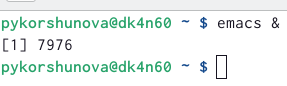
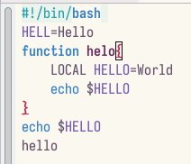
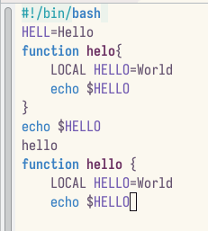
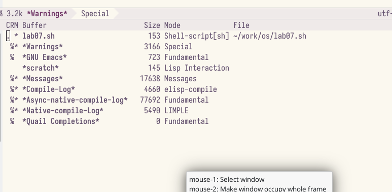
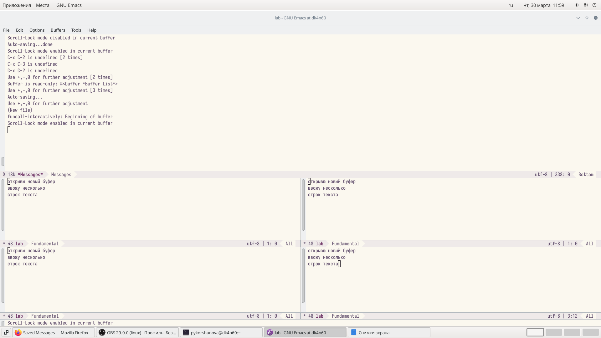
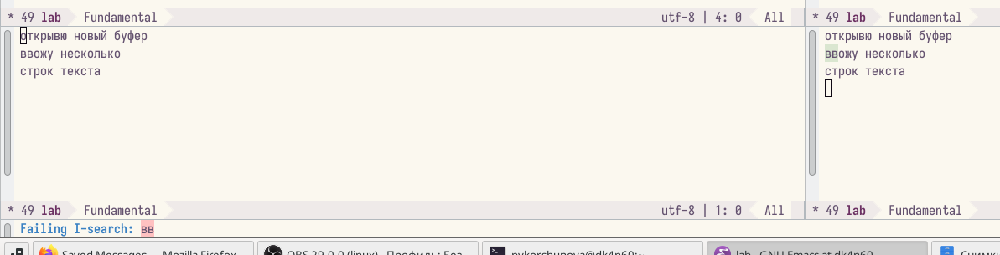
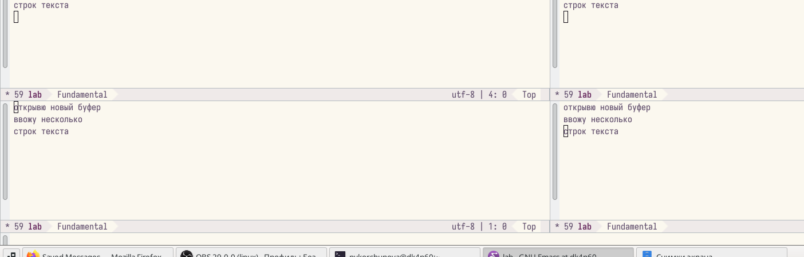
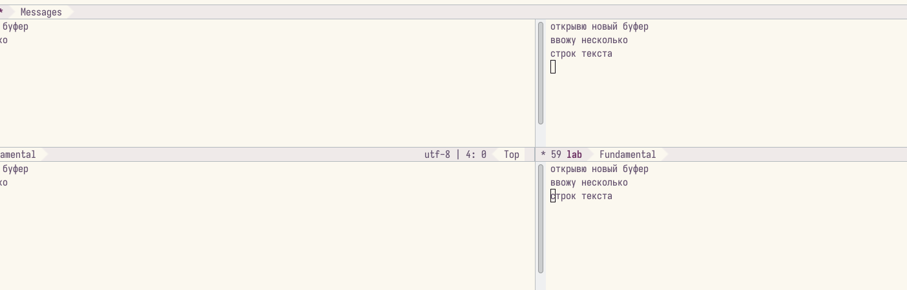

---
# Front matter
lang: ru-RU
title: "Лабораторная работа 9"
subtitle: "Текстовый редактор emacs"
author: "Коршунова Полина Юрьевна"

# Formatting
toc-title: "Содержание"
toc: true # Table of contents
toc_depth: 2
fontsize: 12pt
linestretch: 1.5
papersize: a4paper
documentclass: scrreprt
polyglossia-lang: russian
polyglossia-otherlangs: english
mainfont: PT Serif
romanfont: PT Serif
sansfont: PT Sans
monofont: PT Mono
mainfontoptions: Ligatures=TeX
romanfontoptions: Ligatures=TeX
sansfontoptions: Ligatures=TeX,Scale=MatchLowercase
monofontoptions: Scale=MatchLowercase
indent: true
pdf-engine: lualatex
header-includes:
  - \linepenalty=10 # the penalty added to the badness of each line within a paragraph (no associated penalty node) Increasing the value makes tex try to have fewer lines in the paragraph.
  - \interlinepenalty=0 # value of the penalty (node) added after each line of a paragraph.
  - \hyphenpenalty=50 # the penalty for line breaking at an automatically inserted hyphen
  - \exhyphenpenalty=50 # the penalty for line breaking at an explicit hyphen
  - \binoppenalty=700 # the penalty for breaking a line at a binary operator
  - \relpenalty=500 # the penalty for breaking a line at a relation
  - \clubpenalty=150 # extra penalty for breaking after first line of a paragraph
  - \widowpenalty=150 # extra penalty for breaking before last line of a paragraph
  - \displaywidowpenalty=50 # extra penalty for breaking before last line before a display math
  - \brokenpenalty=100 # extra penalty for page breaking after a hyphenated line
  - \predisplaypenalty=10000 # penalty for breaking before a display
  - \postdisplaypenalty=0 # penalty for breaking after a display
  - \floatingpenalty = 20000 # penalty for splitting an insertion (can only be split footnote in standard LaTeX)
  - \raggedbottom # or \flushbottom
  - \usepackage{float} # keep figures where there are in the text
  - \floatplacement{figure}{H} # keep figures where there are in the text
---

# Цель работы

Познакомиться с операционной системой Linux. Получить практические навыки работы с редактором Emacs.

# Задание

1. Открыть emacs.

2. Создать файл lab07.sh с помощью комбинации Ctrl-x Ctrl-f (C-x C-f).

3. Наберите заданный текст:

4. Сохранить файл с помощью комбинации Ctrl-x Ctrl-s (C-x C-s).

5. Проделать с текстом стандартные процедуры редактирования, каждое действие должно осуществляться комбинацией клавиш.

       5.1. Вырезать одной командой целую строку (С-k).
       
       5.2. Вставить эту строку в конец файла (C-y).
       
       5.3. Выделить область текста (C-space).

       5.4. Скопировать область в буфер обмена (M-w).

       5.5. Вставить область в конец файла.

       5.6. Вновь выделить эту область и на этот раз вырезать её (C-w).

       5.7. Отмените последнее действие (C-/).

6. Научитесь использовать команды по перемещению курсора.

       6.1. Переместите курсор в начало строки (C-a).

       6.2. Переместите курсор в конец строки (C-e).

       6.3. Переместите курсор в начало буфера (M-<).

       6.4. Переместите курсор в конец буфера (M->).

7. Управление буферами.
       
       7.1. Вывести список активных буферов на экран (C-x C-b).

       7.2. Переместитесь во вновь открытое окно (C-x) o со списком открытых буферов
и переключитесь на другой буфер.

       7.3. Закройте это окно (C-x 0).

       7.4. Теперь вновь переключайтесь между буферами, но уже без вывода их списка на
экран (C-x b).

8. Управление окнами.

       8.1. Поделите фрейм на 4 части: разделите фрейм на два окна по вертикали (C-x 3),
а затем каждое из этих окон на две части по горизонтали (C-x 2) (см. рис. 9.1).

8.2. В каждом из четырёх созданных окон откройте новый буфер (файл) и введите
несколько строк текста.

9. Режим поиска

       9.1. Переключитесь в режим поиска (C-s) и найдите несколько слов, присутствующих
в тексте.

       9.2. Переключайтесь между результатами поиска, нажимая C-s.

       9.3. Выйдите из режима поиска, нажав C-g.

       9.4. Перейдите в режим поиска и замены (M-%), введите текст, который следует найти
и заменить, нажмите Enter , затем введите текст для замены. После того как будут
подсвечены результаты поиска, нажмите ! для подтверждения замены.

       9.5. Испробуйте другой режим поиска, нажав M-s o. Объясните, чем он отличается от
обычного режима?

# Теоретическое введение

Буфер — объект, представляющий какой-либо текст.

Буфер может содержать что угодно, например, результаты компиляции программы или встроенные подсказки. Практически всё взаимодействие с пользователем, в том числе интерактивное, происходит посредством буферов.

Фрейм соответствует окну в обычном понимании этого слова. Каждый
фрейм содержит область вывода и одно или несколько окон Emacs.

Окно — прямоугольная область фрейма, отображающая один из буферов.

Каждое окно имеет свою строку состояния, в которой выводится следующая информация: название буфера, его основной режим, изменялся ли текст буфера и как далеко вниз
по буферу расположен курсор. Каждый буфер находится только в одном из возможных
основных режимов. Существующие основные режимы включают режим Fundamental
(наименее специализированный), режим Text, режим Lisp, режим С, режим Texinfo и другие. Под второстепенными режимами понимается список режимов, которые включены в данный момент в буфере выбранного окна.

Область вывода — одна или несколько строк внизу фрейма, в которой
Emacs выводит различные сообщения, а также запрашивает подтверждения и дополнительную информацию от пользователя.

Минибуфер используется для ввода дополнительной информации и всегда отображается в области вывода.

Точка вставки — место вставки (удаления) данных в буфере.

# Выполнение лабораторной работы

1. Открываю emacs: 

{ #fig:001 width=70% }

2. Создаю файл lab07.sh, воспользовавшись комбинацией клавиш C+x, C+f. 
Далее я буду использовать следующие сокращения: C – Ctrl, S – Shift, M – Meta, X – Shift+x (S+x), % - Shift+x (S+x) и т.д.

3. Набираю текст, представленный в задании:

{ #fig:002 width=70% }

4. Сохраняю файл, применив комбинацию клавиш C+x C+s.

5. С помощью различных комбинаций клавиш выполняю стандартные процедуры редактирования текста:
	
	Вырезаю целую строку (C+k);

	Вставляю эту строку в конец файла (C+y);
	
	Выделяю область текста (C+space);

	Копирую область в буфер обмена(M+w);

	Вставляю скопированную область в конец файла(C+y);

	Вновь выделяю эту область (C+space) и вырезаю ее (C+w);

	Отменяю последнее действие (C+/).

{ #fig:003 width=70% }

6. Использую команды по перемещению курсора:

	Перемещаю курсор в начало строки (C+a);

	Перемещаю курсор в конец строки (C+e);

	Перемещаю курсор в начало буфера (M+<);

	Перемещаю курсор в конец буфера (M+>).

7. Управляю буферами: 

	Вывожу список активных буферов на экран с помощью сочетания клавиш C+x C+b:

{ #fig:004 width=70% }

	Перемещаюсь во вновь открытое окно со списком открытых буферов с помощью сочетания клавиш C+x o, а затем переключаюсь на другой буфер.

	Закрываю это окно сочетанием клавиш C+x 0.

	Вновь переключаюсь между буферами, но уже не выводя их на экран с помощью сочетания клавиш C+x b.

8. Управляю окнами:

	Делю фрейм на 4 части с мощью сочетаний клавиш C+x 2 (разделить по горизонтали) и C+x 3 (разделить по вертикали).

	В каждом из 4 окон открываю новый файл(буфер) и ввожу там некоторый текст:

{ #fig:005 width=70% }

9. Выполняю поиск:

	Переключаюсь в режим поиска, нажимая C+s и выполняю поиск нескольких слов в тексте файла.

	Переключаюсь между результатами с помощью сочетания клавиш C+s:

{ #fig:006 width=70% }

	Выхожу из режима поиска, нажав C+g.

	Перехожу в режим поиска и замены, воспользовавшись сочетанием клавиш M+%, ввожу текст, который следует заменить, затем ввожу текст для замены и подтверждаю замену, нажав !. 

{ #fig:007 width=70% }

	Нажав сочетание клавиш M+s o пробую другой режим поиска.
Можно увидеть, как отличается этот режим поиска от используемого в выше: информация о найденных элементах появилась в другом окне, отобразилась информация о количестве найденных элементов и о строках, в которых они располагаются. 

{ #fig:008 width=70% }

# Вовод
В ходе выполнения лабораторной работы я познакомилась с операционной системой Linux, а также получила практические навыки работы с редактором Emacs.

# Ответы на контрольные вопросы

1.	Кратко охарактеризуйте редактор emacs.

Emacs это мощный экранный редактор текста, написанный на языке высокого уровня Elisp.

2.	Какие особенности данного редактора могут сделать его сложным для освоения новичком?

Сложности могут возникнуть в запоминании большого количества сложный комбинаций клавиш, используемых emacs, а также на клавиатуре для IBM PC совместимых ПК клавиши Meta нет, но вместо неё можно использовать Alt или Esc.

3.	Своими словами опишите, что такое буфер и окно в терминологии emacs’а.

Буфер — объект, представляющий какой-либо текст.

Окно — прямоугольная область фрейма, отображающая один из буферов.

4.	Можно ли открыть больше 10 буферов в одном окне?

Да, можно.

5.	Какие буферы создаются по умолчанию при запуске emacs?

По умолчанию при открытии Emacs создает два буфера — scratch и Messages.

6.	Какие клавиши вы нажмёте, чтобы ввести следующую комбинацию C-c | и C-c C-|?

Ctrl+C Shift+\ и Ctrl+C Ctrl+Shift+\.

7.	Как поделить текущее окно на две части?

Ctrl+2 разделить по горизонтали.
Ctrl+3 разделить по вертикали.

8.	В каком файле хранятся настройки редактора emacs?

В файле .emacs хранятся настройки редактора emacs

9.	Какую функцию выполняет клавиша <– и можно ли её переназначить?

Backspace – стереть символ. Ее можно переобозначить.

10.	Какой редактор вам показался удобнее в работе vi или emacs? Поясните почему.

Для работы с маленькими файлами вполне удобно использовать vi, однако emacs несколько удобнее и имеет более расширенный функционал.
