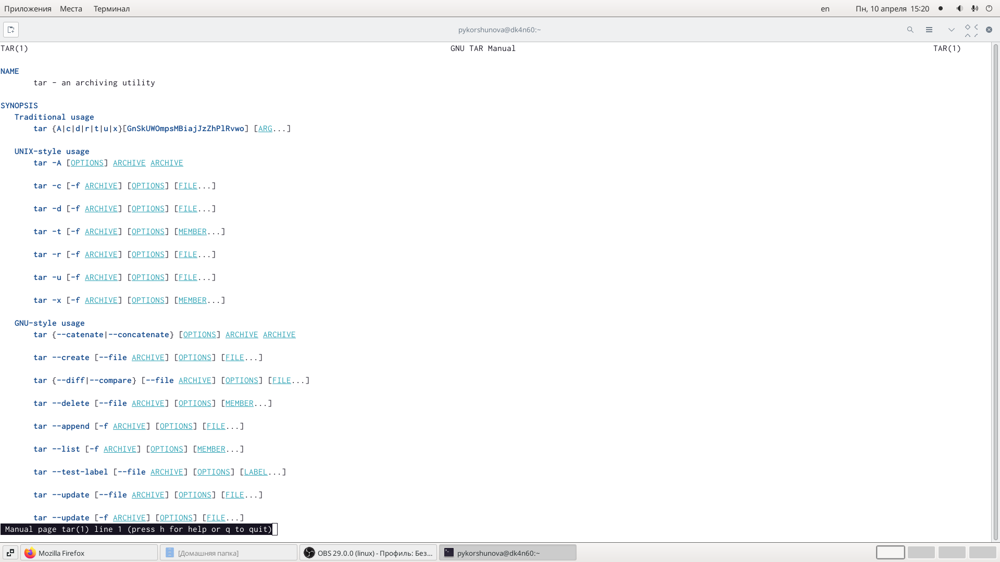
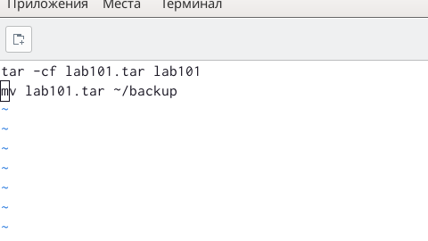
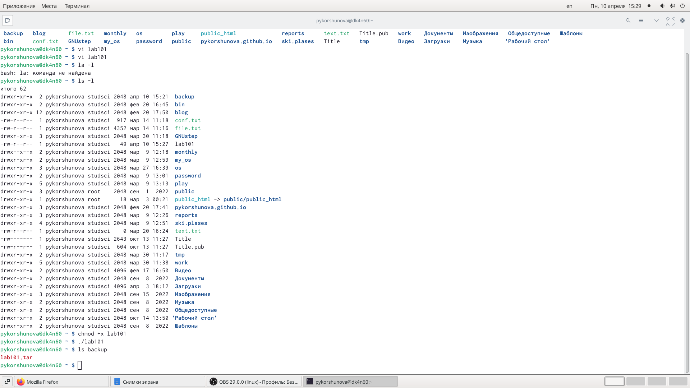
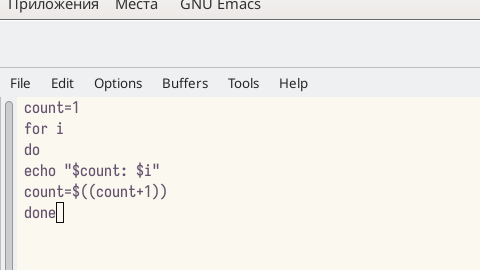
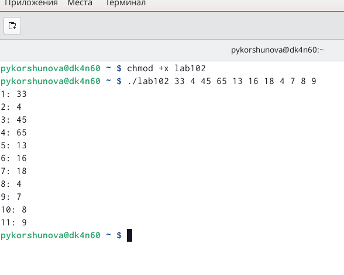
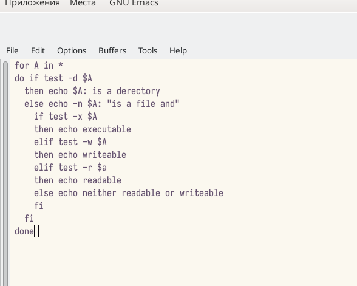
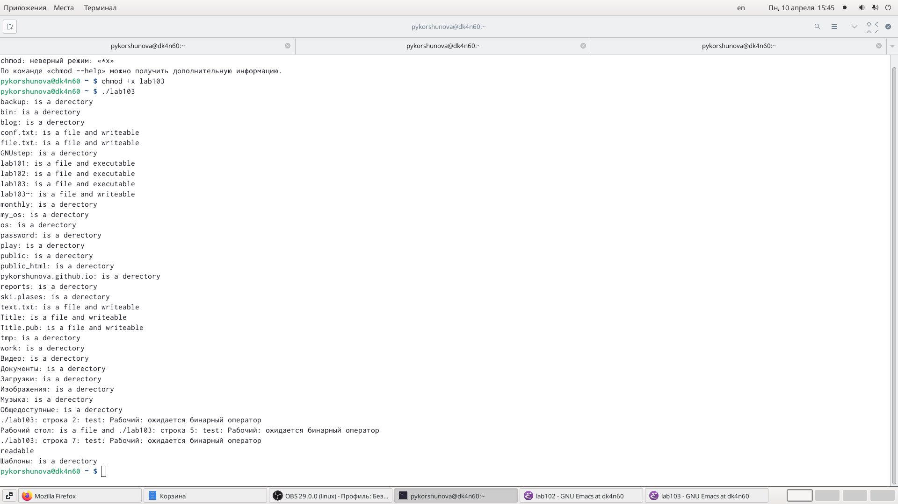
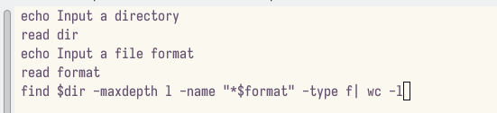
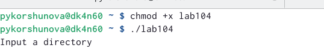

---
## Front matter
lang: ru-RU
title: Лабораторная работа 10
subtitle: Программирование в командном процессоре ОС UNIX. Командные файлы 
author: Korshunova Polina 
institute: |
	RUDN University, Moscow, Russian Federation
date: 2023, 10 April

## Formatting
toc: false
slide_level: 2
theme: metropolis
header-includes: 
 - \metroset{progressbar=frametitle,sectionpage=progressbar,numbering=fraction}
 - '\makeatletter'
 - '\beamer@ignorenonframefalse'
 - '\makeatother'
aspectratio: 43
section-titles: true
---

## Цель работы

Изучить основы программирования в оболочке ОС UNIX/Linux. Научиться писать небольшие командные файлы.

## Задание 

1. Написать скрипт, который при запуске будет делать резервную копию самого себя (то есть файла, в котором содержится его исходный код) в другую директорию backup
в вашем домашнем каталоге. При этом файл должен архивироваться одним из архиваторов на выбор zip, bzip2 или tar. Способ использования команд архивации необходимо узнать, изучив справку.

2. Написать пример командного файла, обрабатывающего любое произвольное число
аргументов командной строки, в том числе превышающее десять. Например, скрипт
может последовательно распечатывать значения всех переданных аргументов.

## Задание 

3. Написать командный файл - аналог команды ls (без использования самой этой команды и команды dir). Требуется, чтобы он выдавал информацию о нужном каталоге и выводил информацию о возможностях доступа к файлам этого каталога.

4. Написать командный файл, который получает в качестве аргумента командной строки формат файла (.txt, .doc, .jpg, .pdf и т.д.) и вычисляет количество таких файлов
в указанной директории. Путь к директории также передаётся в виде аргумента командной строки.

## Теоретическое введение

Командный процессор (командная оболочка, интерпретатор команд shell) - это программа, позволяющая пользователю взаимодействовать с операционной системой компьютера. В операционных системах типа UNIX/Linux наиболее часто используются следующие реализации командных оболочек:

- оболочка Борна (Bourne shell или sh) - стандартная командная оболочка UNIX/Linux, содержащая базовый, но при этом полный набор функций;

- С-оболочка (или csh) - надстройка над оболочкой Борна, использующая С-подобный синтаксис команд с возможностью сохранения истории выполнения команд;

## Теоретическое введение

- оболочка Корна (или ksh) - напоминает оболочку С, но операторы управления программой совместимы с операторами оболочки Борна;

- BASH - сокращение от Bourne Again Shell (опять оболочка Борна), в основе своей совмещает свойства оболочек С и Корна (разработка компании Free Software Foundation).

- POSIX (Portable Operating System Interface for Computer Environments) - набор стандартов описания интерфейсов взаимодействия операционной системы и прикладных программ.

## Выполнение работы

1. Просматриваю справку tar. Создаю директорию backup.

{ #fig:001 width=70% }

## Выполнение работы

Пишу скрипт, который при запуске будет делать резервную копию самого себя в резервную директорию backup, созданную в домашнем каталоге заранее. При этом архивирую файл архиватором tar 

{ #fig:002 width=70% }

Добавляю право на исполнения файла, выполняю его и проверяю корректность выполнения.

## Выполнение работы

{ #fig:003 width=50% }

## Выполнение работы

2. Пишу скрипт, обрабатывающий произвольное число аргументов командной строки. В моем случае скрипт последовательно выводит все значения переданных аргументов.

{ #fig:004 width=50% }

## Выполнение работы

Добавляю права на исполенние файла, выполняю его и проверяю корректность выполнения.

{ #fig:005 width=70% }

## Выполнение работы

3. Пишу командный файл, аналог команды ls, который выводит информацию о нужном каталоге: о правах доступа к файлам этого каталога. Скрипт определяет подкаталог или файл и выводит сообщение о правах доступа к файлам.

{ #fig:006 width=60% }

## Выполнение работы

Добавляю право на исполнения файла, выполняю его и проверяю корректность выполнения.

{ #fig:007 width=60% }

## Выполнение работы

4.Пишу скрипт, который считывает тип файлов ((.txt, .doc, .jpg, .pdf и т.д.), а также путь к некоторой директории. И определяет количество файлов данного типа в заданной директории. Я указываю опцию -maxdepth 1, чтобы файлы необходимого типа искались только в заданном каталоге, а в его подкаталогах нет.

{ #fig:008 width=70% }

## Выполнение работы

Добавляю право на исполнения файла, выполняю его и проверяю корректность выполнения.

{ #fig:009 width=70% }

## Вывод

В ходе лабораторной работы я изучила основы программирования в оболочке ОС Linux, а также научилась писать небольшие командные файлы.

