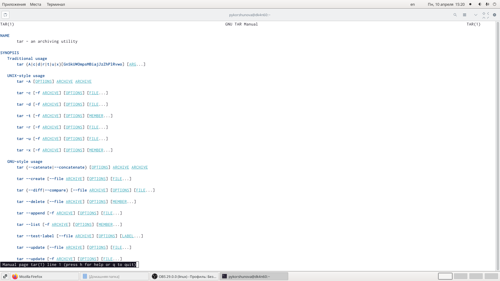
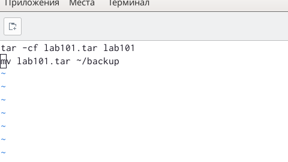
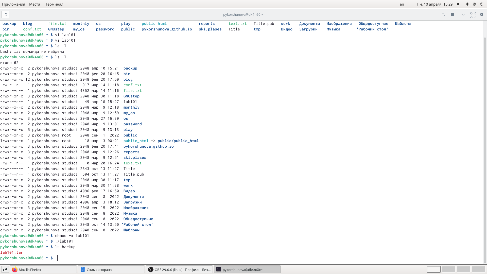

---
# Front matter
lang: ru-RU
title: "Лабораторная работа 10"
subtitle: "Программирование в командном процессоре ОС UNIX. Командные файлы"
author: "Коршунова Полина"

# Formatting
toc-title: "Содержание"
toc: true # Table of contents
toc_depth: 2
fontsize: 12pt
linestretch: 1.5
papersize: a4paper
documentclass: scrreprt
polyglossia-lang: russian
polyglossia-otherlangs: english
mainfont: PT Serif
romanfont: PT Serif
sansfont: PT Sans
monofont: PT Mono
mainfontoptions: Ligatures=TeX
romanfontoptions: Ligatures=TeX
sansfontoptions: Ligatures=TeX,Scale=MatchLowercase
monofontoptions: Scale=MatchLowercase
indent: true
pdf-engine: lualatex
header-includes:
  - \linepenalty=10 # the penalty added to the badness of each line within a paragraph (no associated penalty node) Increasing the value makes tex try to have fewer lines in the paragraph.
  - \interlinepenalty=0 # value of the penalty (node) added after each line of a paragraph.
  - \hyphenpenalty=50 # the penalty for line breaking at an automatically inserted hyphen
  - \exhyphenpenalty=50 # the penalty for line breaking at an explicit hyphen
  - \binoppenalty=700 # the penalty for breaking a line at a binary operator
  - \relpenalty=500 # the penalty for breaking a line at a relation
  - \clubpenalty=150 # extra penalty for breaking after first line of a paragraph
  - \widowpenalty=150 # extra penalty for breaking before last line of a paragraph
  - \displaywidowpenalty=50 # extra penalty for breaking before last line before a display math
  - \brokenpenalty=100 # extra penalty for page breaking after a hyphenated line
  - \predisplaypenalty=10000 # penalty for breaking before a display
  - \postdisplaypenalty=0 # penalty for breaking after a display
  - \floatingpenalty = 20000 # penalty for splitting an insertion (can only be split footnote in standard LaTeX)
  - \raggedbottom # or \flushbottom
  - \usepackage{float} # keep figures where there are in the text
  - \floatplacement{figure}{H} # keep figures where there are in the text
---

# Цель работы

Изучить основы программирования в оболочке ОС UNIX/Linux. Научиться писать небольшие командные файлы.

# Задание

1. Написать скрипт, который при запуске будет делать резервную копию самого себя (то есть файла, в котором содержится его исходный код) в другую директорию backup
в вашем домашнем каталоге. При этом файл должен архивироваться одним из архиваторов на выбор zip, bzip2 или tar. Способ использования команд архивации необходимо узнать, изучив справку.

2. Написать пример командного файла, обрабатывающего любое произвольное число
аргументов командной строки, в том числе превышающее десять. Например, скрипт
может последовательно распечатывать значения всех переданных аргументов.

3. Написать командный файл - аналог команды ls (без использования самой этой команды и команды dir). Требуется, чтобы он выдавал информацию о нужном каталоге и выводил информацию о возможностях доступа к файлам этого каталога.

4. Написать командный файл, который получает в качестве аргумента командной строки формат файла (.txt, .doc, .jpg, .pdf и т.д.) и вычисляет количество таких файлов
в указанной директории. Путь к директории также передаётся в виде аргумента командной строки.

# Теоретическое введение

Командный процессор (командная оболочка, интерпретатор команд shell) - это программа, позволяющая пользователю взаимодействовать с операционной системой

компьютера. В операционных системах типа UNIX/Linux наиболее часто используются следующие реализации командных оболочек:

- оболочка Борна (Bourne shell или sh) - стандартная командная оболочка UNIX/Linux, содержащая базовый, но при этом полный набор функций;

- С-оболочка (или csh) - надстройка над оболочкой Борна, использующая С-подобный синтаксис команд с возможностью сохранения истории выполнения команд;

- оболочка Корна (или ksh) - напоминает оболочку С, но операторы управления программой совместимы с операторами оболочки Борна;

- BASH - сокращение от Bourne Again Shell (опять оболочка Борна), в основе своей совмещает свойства оболочек С и Корна (разработка компании Free Software Foundation).

- POSIX (Portable Operating System Interface for Computer Environments) - набор стандартов описания интерфейсов взаимодействия операционной системы и прикладных программ

# Выполнение лабораторной работы

1. Просматриваю справку tar. Создаю директорию backup.

{ #fig:001 width=70% }

Пишу скрипт, который при запуске будет делать резервную копию самого себя в резервную директорию backup, созданную в домашнем каталоге заранее. При этом архивирую файл архиватором tar 

{ #fig:002 width=70% }

Добавляю право на исполнения файла, выполняю его и проверяю корректность выполнения.

{ #fig:003 width=70% }

2. Пишу скрипт, обрабатывающий произвольное число аргументов командной строки. В моем случае скрипт последовательно выводит все значения переданных аргументов.

{ #fig:004 width=70% }

Добавляю права на исполенние файла, выполняю его и проверяю корректность выполнения.

{ #fig:005 width=70% }

3. Пишу командный файл, аналог команды ls, который выводит информацию о нужном каталоге: о правах доступа к файлам этого каталога. Скрипт определяет подкаталог или файл и выводит сообщение о правах доступа к файлам.

{ #fig:006 width=70% }

Добавляю право на исполнения файла, выполняю его и проверяю корректность выполнения.

{ #fig:007 width=70% }

4.Пишу скрипт, который считывает тип файлов ((.txt, .doc, .jpg, .pdf и т.д.), а также путь к некоторой директории. И определяет количество файлов данного типа в заданной директории. Я указываю опцию -maxdepth 1, чтобы файлы необходимого типа искались только в заданном каталоге, а в его подкаталогах нет.

{ #fig:008 width=70% }

Добавляю право на исполнения файла, выполняю его и проверяю корректность выполнения.

{ #fig:009 width=70% }

# Вывод

В ходе лабораторной работы я изучила основы программирования в оболочке ОС Linux, а также научилась писать небольшие командные файлы.

# Ответы на контрольные вопросы

1.	Объясните понятие командной оболочки. Приведите примеры командных оболочек. Чем они отличаются?

Командные процессоры или оболочки - это программы, позволяющие пользователю взаимодействовать с компьютером. Их можно рассматривать как настоящие интерпретируемые языки, которые воспринимают команды пользователя и обрабатывают их. Поэтому командные процессоры также называют интерпретаторами команд. На языках оболочек можно писать программы и выполнять их подобно любым другим программам. UNIX обладает большим количеством оболочек. Наиболее популярными являются следующие четыре оболочки: -оболочка Борна (Bourne) - первоначальная командная оболочка UNIX: базовый, но полный набор функций; -С-оболочка - добавка университета Беркли к коллекции оболочек: она надстраивается над оболочкой Борна, используя Сподобный синтаксис команд, и сохраняет историю выполненных команд; -оболочка Корна - напоминает оболочку С, но операторы управления программой совместимы с операторами оболочки Борна; -BASH - сокращение от Bourne Again Shell (опять оболочка Борна), в основе своей совмещает свойства оболочек С и Корна (разработка компании Free Software Foundation).

2.	Что такое POSIX?

POSIX (Portable Operating System Interface for Computer Environments)- интерфейс переносимой операционной системы для компьютерных сред. Представляет собой набор стандартов, подготовленных институтом инженеров по электронике и радиотехники (IEEE), который определяет различные аспекты построения операционной системы. 

3.	Как определяются переменные и массивы в языке программирования bash?

Kомандный процессор bash обеспечивает возможность использования переменных типа строка символов. Имена переменных могут быть выбраны пользователем. Пользователь имеет возможность присвоить переменной значение некоторой строки символов. Например, команда mark=/usr/andy/bin присваивает значение строки символов /usr/andy/bin переменной mark типа строка символов. 

Значение, присвоенное некоторой переменной, может быть впоследствии использовано. Для этого в соответствующем месте командной строки должно быть употреблено имя этой переменной, которому предшествует метасимвол $. Например, команда mv afile $mark переместит файл afile из текущего каталога в каталог с абсолютным полным именем /usr/andy/bin. Использование значения, присвоенного некоторой переменной, называется подстановкой. 

Для того, чтобы имя переменной не сливалось с символами, которые могут следовать за ним в командной строке, при подстановке в общем случае используется следующая форма записи: ${имя переменной} например, использование команд b=/tmp/andy-ls -l myfile

> ${b}ls приведет к переназначению стандартного вывода команды ls с терминала на файл /tmp/andy-ls , а использование команды ls 

-l>$bls приведет к подстановке в командную строку значения переменной bls. Если переменной bls не было предварительно присвоено никакого значения, то ее значением является символ пробел. Оболочка bash позволяет создание массивов. Для создания массива используется команда set с флагом -A. За флагом следует имя переменной, а затем список значений, разделенных пробелом. Например,set -A states Delaware Michigan "New Jersey" Далее можно сделать добавление в массив, например, states[49]=Alaska. Индексация массивов начинается с нулевого элемента.

4.	Каково назначение операторов let и read?

Команда let является показателем того, что последующие аргументы представляют собой выражение, подлежащее вычислению. Простейшее выражение - это единичный терм (term), обычно целочисленный. Целые числа можно записывать как последовательность цифр или в любом базовом формате. Этот формат - radix#number, где radix (основание системы счисления) - любое число не более 26. Для большинства команд основания систем счисления это - 2 (двоичная), 8 (восьме- ричная) и 16 (шестнадцатеричная). Простейшими математическими выражениями являются сложение (+), вычитание (-), умножение (*), целочисленное деление (/) и целочисленный остаток (%). Команда let берет два операнда и присваивает их переменной.

5.	Какие арифметические операции можно применять в языке программирования bash? 

Скриптовой язык bash умеет выполнять сложение, вычитание, умножение, целочисленное деление и получение остатка от деления.

6.	Что означает операция (( ))?

Условия оболочки bash, в двойные скобки -(( )).

7.	Какие стандартные имена переменных Вам известны?

Имя переменной (идентификатор) - это строка символов, которая отличает эту переменную от других объектов программы (идентифицирует переменную в программе). При задании имен переменным нужно соблюдать следующие правила: -

первым символом имени должна быть буква. 

остальные символы - буквы и цифры (прописные и строчные буквы различаются). 

можно использовать символ «_»;

в имени нельзя использовать символ «.»;

число символов в имени не должно превышать 255;

имя переменной не должно совпадать с зарезервированными (служебными) словами языка. Var1, PATH, trash, mon, day, PS1, PS2 

8.	Что такое метасимволы?

Такие символы, как ’ < > * ? | \ " & являются метасимволами и имеют для командного процессора специальный смысл.

9.	Как экранировать метасимволы?

Снятие специального смысла с метасимвола называется экранированием метасимвола. Экранирование может быть осуществлено с помощью предшествующего метасимволу символа \, который, в свою очередь, является метасимволом. Для экранирования группы метасимволов, ее нужно заключить в одинарные кавычки. Строка, заключенная в двойные кавычки, экранирует все метасимволы, кроме $, ’ , \, ".

10.	Как создавать и запускать командные файлы?
Последовательность команд может быть помещена в текстовый файл. Такой файл называется командным. 

Далее этот файл можно выполнить по команде bash командный_файл [аргументы] Чтобы не вводить каждый раз последовательности символов bash, необходимо изменить код защиты этого командного файла, обеспечив доступ к этому файлу по выполнению. Это может быть сделано с помощью команды chmod +x имяфайла 

Теперь можно вызывать свой командный файл на выполнение просто, вводя его имя с терминала так, как будто он является выполняемой программой. Командный процессор распознает, что в Вашем файле на самом деле хранится не выполняемая программа, а программа, написанная на языке программирования оболочки, и осуществит ее интерпретацию.

11.	. Как определяются функции в языке программирования bash?

Группу команд можно объединить в функцию. Для этого существует ключевое слово function, после которого следует имя функции и список команд, заключенных в фигурные скобки. 

Удалить функцию можно с помощью команды unset c флагом-f. Команда typeset имеет четыре опции для работы с функциями: -f - перечисляет определенные на текущий момент функции; --ft- при последующем вызове функции инициирует ее трассировку; --fx- экспортирует все перечисленные функции в любые дочерние программы оболочек; --fu- обозначает указанные функции как автоматически загружаемые. Автоматически загружаемые функции хранятся в командных файлах, а при их вызове оболочка просматривает переменную FPATH, отыскивая файл с одноименными именами функций, загружает его и вызывает эти функции.

12.	. Каким образом можно выяснить, является файл каталогом или обычным файлом?

 С помощью команды ls –F можно узнать формат каждого элемента содержимого каталога. 

13.	Каково назначение команд set, typeset и unset?

Используется команда set с флагом -A. За флагом следует имя переменной, а затем список значений, разделенных пробелом. Например, set -A states Delaware Michigan "New Jersey" Далее можно сделать добавление в массив, например, states[49]=Alaska . Индексация массивов начинается с нулевого элемента. В командном процессоре Си имеется еще несколько стандартных переменных. Значение всех переменных можно просмотреть с помощью команды set. Наиболее распространенным является сокращение, избавляющееся от слова let в программах оболочек. Если объявить переменные целыми значениями, любое присвоение автоматически трактуется как арифметическое. Используйте typeset -i для объявления и присвоения переменной, и при последующем использовании она становится целой. Или можете использовать ключевое слово integer (псевдоним для typeset -l) и объявлять переменные целыми. Таким образом, выражения типа х=y+z воспринимаются как арифметические.
 
Группу команд можно объединить в функцию. Для этого существует ключевое слово function , после которого следует имя функции и список команд, заключенных в фигурные скобки. Удалить функцию можно с помощью команды unset c флагом -f. Команда typeset имеет четыре опции для работы с функциями: - -f - перечисляет определенные на текущий момент функции; - -ft - при последующем вызове функции инициирует ее трассировку; - -fx - экспортирует все перечисленные функции в любые дочерние программы оболочек; - -fu - обозначает указанные функции как автоматически загружаемые. Автоматически загружаемые функции хранятся в командных файлах, а при их вызове оболочка просматривает переменную FPATH , отыскивая файл с одноименными именами функций, загружает его и вызывает эти функции. В переменные mon и day будут считаны соответствующие значения, введенные с клавиатуры, а переменная trash нужна для того, чтобы отобрать всю избыточно введенную информацию и игнорировать ее. Изъять переменную из программы можно с помощью команды unset.

14.	Как передаются параметры в командные файлы?

Символ $ является метасимволом командного процессора. Он используется, в частности, для ссылки на параметры, точнее, для получения их значений в командном файле. В командный файл можно передать до девяти параметров. При использовании где-либо в команд- ном файле комбинации символов $i, где 0 < i < 10, вместо нее будет осуществлена подстановка значения параметра с порядковым номером i, т.е. аргумента командного файла с порядковым номером i. Использование комбинации символов $0 приводит к подстановке вместо нее имени данного командного файла. Рассмотрим это на примере. Пусть к командному файлу where имеется доступ по выполнению и этот командный файл содержит следующий конвейер: who | grep $1 Если Вы введете с терминала команду: where andy, то в случае, если пользователь, зарегистрированный в ОС UNIX под именем andy, в данный момент работает в ОС UNIX, на терминал будет выведена строка, содержащая номер
терминала, используемого указанным пользователем. Если же в данный момент этот пользователь не работает в ОС UNIX, то на терминал не будет выведено ничего. Команда grep производит контекстный поиск в тексте, поступающем со стандартного ввода, для нахождения в этом тексте строк, содержащих последовательности символов, переданные ей в качестве аргументов, и выводит результаты своей работы на стандартный вывод. В этом примере команда grep используется как фильтр, обеспечивающий ввод со стандартного ввода и вывод всех строк, содержащих последовательность символов andy, на стандартный вывод. В ходе интерпретации этого файла командным процессором вместо комбинации символов $1 осуществляется подстановка значения первого и единственного параметра andy. Если предположить, что пользователь, зарегистрированный в ОС UNIX под именем andy, в данный момент работает в ОС UNIX, то на терминале Вы увидите примерно следующее: $ where andy andy ttyG Jan 14 09:12 $ Определим функцию, которая изменяет каталог и печатает список файлов: $ function clist { > cd $1 > ls > }. Теперь при вызове команды clist каталог будет изменен каталог и выведено его содержимое.

15.	. Назовите специальные переменные языка bash и их назначение.

- $* - отображается вся командная строка или параметры оболочки; - $? - код завершения последней выполненной команды; - $$ - уникальный идентификатор процесса, в рамках которого выполняется командный процессор; 

- $! - номер процесса, в рамках которого выполняется последняя вызванная на выполнение в командном режиме команда; - $- - значение флагов командного процессора;

- ${#} - возвращает целое число - количество слов, которые были результатом $;

- ${#name} - возвращает целое значение длины строки в переменной name; 

- ${name[n]} - обращение к n-ному элементу массива; - ${name[]} - перечисляет все элементы массива, разделенные про- белом; 

- ${name[@]} - то же самое, но позволяет учитывать символы про- белы в самих переменных;

- ${name:-value} - если значение переменной name не определено, то оно будет заменено на указанное value;

- ${name:value} - проверяется факт существования переменной;

- ${name=value} - если name не определено, то ему присваивается значение value; 

- ${name?value} - останавливает выполнение, если имя переменной не определено, и выводит value, как сообщение об ошибке; 

- ${name+value} - это выражение работает противоположно 

${name-value}. Если переменная определена, то подставляется value; 

- ${name#pattern} - представляет значение переменной name с удаленным самым коротким левым образцом (pattern); 

- ${#name[]} и ${#name[@]} - эти выражения возвращают количество элементов в массиве name.

- $# вместо нее будет осуществлена подстановка числа параметров, указанных в командной строке при вызове данного командного файла на выполнение
