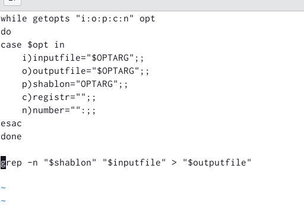
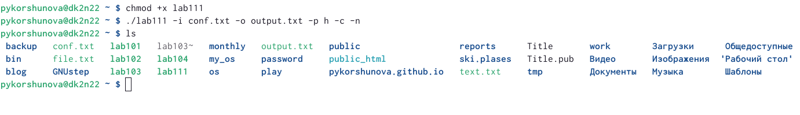
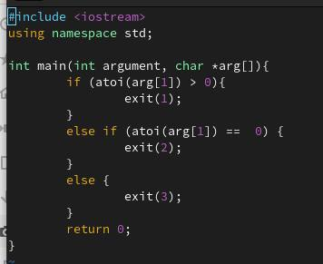
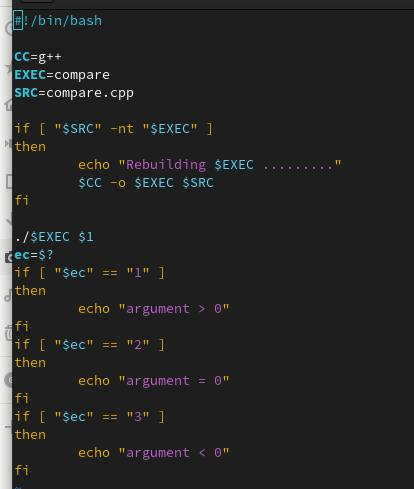
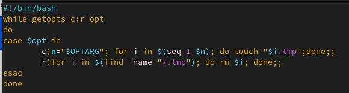
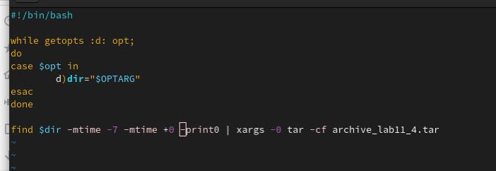

---
## Front matter
lang: ru-RU
title: Лабораторная работа 11
subtitle: Программирование в командном процессоре ОС UNIX. Ветвления и циклы
author: |
	Korshunova Polina
institute: |
	RUDN University, Moscow, Russian Federation
date: 2023, 13 апреля

## Formatting
toc: false
slide_level: 2
theme: metropolis
header-includes: 
 - \metroset{progressbar=frametitle,sectionpage=progressbar,numbering=fraction}
 - '\makeatletter'
 - '\beamer@ignorenonframefalse'
 - '\makeatother'
aspectratio: 43
section-titles: true
---

## Цель работы 

Изучить основы программирования в оболочке ОС UNIX. Научится писать более
сложные командные файлы с использованием логических управляющих конструкций и циклов.

## Задание 

1. Используя команды getopts grep, написать командный файл, который анализирует командную строку с ключами:
	
	– -I inputfile — прочитать данные из указанного файла;
	
	– -o outputfile — вывести данные в указанный файл;
	
	– -p шаблон — указать шаблон для поиска;
	
	– -C — различать большие и малые буквы;
	
	– -n — выдавать номера строк.

а затем ищет в указанном файле нужные строки, определяемые ключом -p.

## Задание 

2. Написать на языке Си программу, которая вводит число и определяет, является ли оно
больше нуля, меньше нуля или равно нулю. Затем программа завершается с помощью функции exit(n), передавая информацию в о коде завершения в оболочку. Командный файл должен вызывать эту программу и, проанализировав с помощью команды
$?, выдать сообщение о том, какое число было введено.

## Задание 

3. Написать командный файл, создающий указанное число файлов, пронумерованных последовательно от 1 до N (например 1.tmp, 2.tmp, 3.tmp,4.tmp и т.д.). Число файлов, которые необходимо создать, передаётся в аргументы командной строки. Этот же командный файл должен уметь удалять все созданные им файлы (если они существуют).

4. Написать командный файл, который с помощью команды tar запаковывает в архив все файлы в указанной директории. Модифицировать его так, чтобы запаковывались только те файлы, которые были изменены менее недели тому назад (использовать команду find).

## Теоретическое введение

Команда getopts осуществляет синтаксический анализ командной строки, выделяя флаги, и используется для объявления переменных. Синтаксис команды следующий: getopts option-string variable [arg ... ]

## Теоретическое введение

Флаги – это опции командной строки, обычно помеченные знаком минус; Например, -F является флагом для команды ls -F. Иногда эти флаги имеют аргументы, связанные с ними. Программы интерпретируют эти флаги, соответствующим образом изменяя свое поведение. Строка опций option-string — это список возможных букв и чисел соответствующего флага. Если ожидается, что некоторый флаг будет сопровождаться некоторым аргументом, то за этой буквой должно следовать двоеточие. Соответствующей переменной присваивается буква данной опции. Если команда getopts может распознать аргумент, она возвращает истину. Принято включать getopts в цикл while и анализировать введенные данные с помощью оператора case.

## Выполнение лабораторной работы

1. Используя команды getopts и grep я написала первый командный файл, который анализирует командную строку с несколькими ключами, а затем в указанном файле ищет нужные строки, определяемые также ключом и выводит их в указанный файл.

{ #fig:001 width=70% }

## Выполнение лабораторной работы

Затем я добавила права на выполнение файла и выполнила его, указав необходимые опции и аргументы. 

{ #fig:002 width=90% }

## Выполнение лабораторной работы

2. На языке программирования C++ я написала вспомогательную программу, которая вводит число и определяет, является оно большим/меньшим/равным нулю. Затем программа завершается, передавая информацию о коде завершения в оболочку, с помощью функции exit(n), где n – код.

## Выполнение лабораторной работы

{ #fig:003 width=70% }

## Выполнение лабораторной работы

Далее я написала командный файл, который вызывает эту программу и, проанализировав с помощью команды $?, выдает сообщение о том, какое число было введено(большее/меньшее/равное нулю).

## Выполнение лабораторной работы

{ #fig:004 width=55% }

## Выполнение лабораторной работы

Затем я добавила права на выполнение файла и выполнила его, указав необходимые опции и аргументы. 

## Выполнение лабораторной работы

3. Я создала командный файл, который создает n файлов последовательно пронумерованных (1.tmp, 2.tmp, 3.tmp, 4.tmp и т.д. до n), где n задается как аргумент командной строки. Также этот файл умеет удалять все подобные файлы, если они имеются. Для этого нужно указать другую опцию.

{ #fig:005 width=70% }

## Выполнение лабораторной работы

Затем я добавила права на выполнение файла и выполнила его, указав необходимые опции и аргументы. 

## Выполнение лабораторной работы

4. Я создала командный файл, который с помощью команды tar запаковывает в архив все файлы в указанной директории, модифицировала его так, чтобы он запаковывал только те файлы, который изменялись менее недели тому назад, используя команду find.

{ #fig:006 width=70% }

## Выполнение лабораторной работы

Затем я добавила права на выполнение файла и выполнила его, указав необходимые опции и аргументы. 

## Вовод 

В ходе выполнения лабораторной работы я изучила основы программирования в командной оболочке OC UNIX, а также научилась писать более сложные командные файлы с использованием логических управляющих конструкций и циклов.

