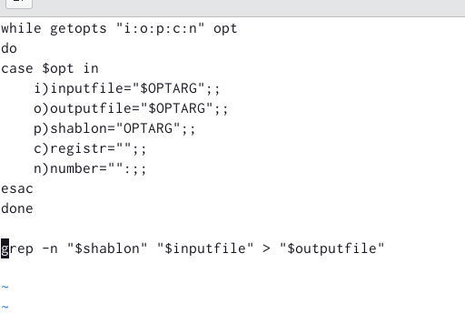
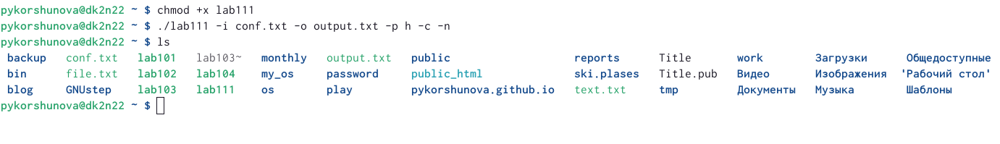
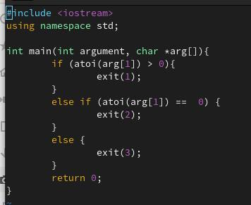
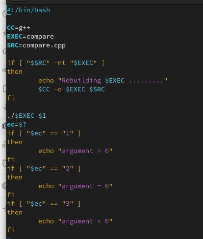
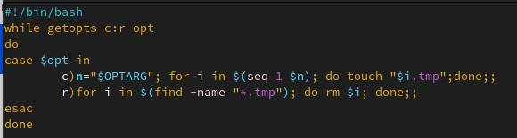
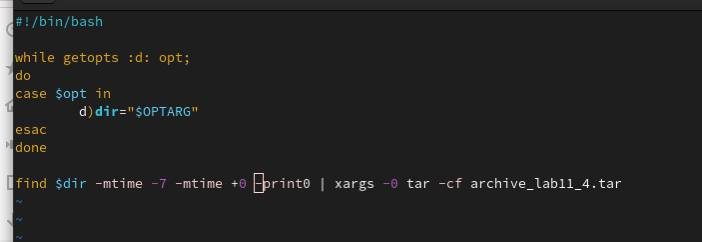

---
# Front matter
lang: ru-RU
title: "Лабораторная работа 11"
subtitle: "Программирование в командном процессоре ОС UNIX. Ветвления и циклы"
author: "Коршунова Полина"

# Formatting
toc-title: "Содержание"
toc: true # Table of contents
toc_depth: 2
fontsize: 12pt
linestretch: 1.5
papersize: a4paper
documentclass: scrreprt
polyglossia-lang: russian
polyglossia-otherlangs: english
mainfont: PT Serif
romanfont: PT Serif
sansfont: PT Sans
monofont: PT Mono
mainfontoptions: Ligatures=TeX
romanfontoptions: Ligatures=TeX
sansfontoptions: Ligatures=TeX,Scale=MatchLowercase
monofontoptions: Scale=MatchLowercase
indent: true
pdf-engine: lualatex
header-includes:
  - \linepenalty=10 # the penalty added to the badness of each line within a paragraph (no associated penalty node) Increasing the value makes tex try to have fewer lines in the paragraph.
  - \interlinepenalty=0 # value of the penalty (node) added after each line of a paragraph.
  - \hyphenpenalty=50 # the penalty for line breaking at an automatically inserted hyphen
  - \exhyphenpenalty=50 # the penalty for line breaking at an explicit hyphen
  - \binoppenalty=700 # the penalty for breaking a line at a binary operator
  - \relpenalty=500 # the penalty for breaking a line at a relation
  - \clubpenalty=150 # extra penalty for breaking after first line of a paragraph
  - \widowpenalty=150 # extra penalty for breaking before last line of a paragraph
  - \displaywidowpenalty=50 # extra penalty for breaking before last line before a display math
  - \brokenpenalty=100 # extra penalty for page breaking after a hyphenated line
  - \predisplaypenalty=10000 # penalty for breaking before a display
  - \postdisplaypenalty=0 # penalty for breaking after a display
  - \floatingpenalty = 20000 # penalty for splitting an insertion (can only be split footnote in standard LaTeX)
  - \raggedbottom # or \flushbottom
  - \usepackage{float} # keep figures where there are in the text
  - \floatplacement{figure}{H} # keep figures where there are in the text
---

# Цель работы

Изучить основы программирования в оболочке ОС UNIX. Научится писать более
сложные командные файлы с использованием логических управляющих конструкций
и циклов.

# Задание

1. Используя команды getopts grep, написать командный файл, который анализирует командную строку с ключами:
	
	– -I inputfile — прочитать данные из указанного файла;
	
	– -o outputfile — вывести данные в указанный файл;
	
	– -p шаблон — указать шаблон для поиска;
	
	– -C — различать большие и малые буквы;
	
	– -n — выдавать номера строк.

а затем ищет в указанном файле нужные строки, определяемые ключом -p.

2. Написать на языке Си программу, которая вводит число и определяет, является ли оно
больше нуля, меньше нуля или равно нулю. Затем программа завершается с помощью функции exit(n), передавая информацию в о коде завершения в оболочку. Командный файл должен вызывать эту программу и, проанализировав с помощью команды
$?, выдать сообщение о том, какое число было введено.

3. Написать командный файл, создающий указанное число файлов, пронумерованных последовательно от 1 до N (например 1.tmp, 2.tmp, 3.tmp,4.tmp и т.д.). Число файлов, которые необходимо создать, передаётся в аргументы командной строки. Этот же командный файл должен уметь удалять все созданные им файлы (если они существуют).

4. Написать командный файл, который с помощью команды tar запаковывает в архив все файлы в указанной директории. Модифицировать его так, чтобы запаковывались только те файлы, которые были изменены менее недели тому назад (использовать команду find).

# Теоретическое введение

Команда getopts осуществляет синтаксический анализ командной строки, выделяя флаги, и используется для объявления переменных. Синтаксис команды следующий: getopts option-string variable [arg ... ]

Флаги – это опции командной строки, обычно помеченные знаком минус; Например, -F является флагом для команды ls -F. Иногда эти флаги имеют аргументы, связанные с ними. Программы интерпретируют эти флаги, соответствующим образом изменяя свое поведение. Строка опций option-string — это список возможных букв и чисел соответствующего флага. Если ожидается, что некоторый флаг будет сопровождаться некоторым аргументом, то за этой буквой должно следовать двоеточие. Соответствующей переменной присваивается буква данной опции. Если команда getopts может распознать аргумент, она возвращает истину. Принято включать getopts в цикл while и анализировать введенные данные с помощью оператора case.

# Выполнение лабораторной работы

1. Используя команды getopts и grep я написала первый командный файл, который анализирует командную строку с несколькими ключами, а затем в указанном файле ищет нужные строки, определяемые также ключом и выводит их в указанный файл.

{ #fig:001 width=70% }

Затем я добавила права на выполнение файла и выполнила его, указав необходимые опции и аргументы. 

{ #fig:002 width=70% }

2. На языке программирования C++ я написала вспомогательную программу, которая вводит число и определяет, является оно большим/меньшим/равным нулю. Затем программа завершается, передавая информацию о коде завершения в оболочку, с помощью функции exit(n), где n – код.

{ #fig:003 width=70% }

Далее я написала командный файл, который вызывает эту программу и, проанализировав с помощью команды $?, выдает сообщение о том, какое число было введено(большее/меньшее/равное нулю).

{ #fig:004 width=70% }

Затем я добавила права на выполнение файла и выполнила его, указав необходимые опции и аргументы. 

3. Я создала командный файл, который создает n файлов последовательно пронумерованных (1.tmp, 2.tmp, 3.tmp, 4.tmp и т.д. до n), где n задается как аргумент командной строки. Также этот файл умеет удалять все подобные файлы, если они имеются. Для этого нужно указать другую опцию.

{ #fig:005 width=70% }

Затем я добавила права на выполнение файла и выполнила его, указав необходимые опции и аргументы. 

4. Я создала командный файл, который с помощью команды tar запаковывает в архив все файлы в указанной директории, модифицировала его так, чтобы он запаковывал только те файлы, который изменялись менее недели тому назад, используя команду find.

{ #fig:006 width=70% }

Затем я добавила права на выполнение файла и выполнила его, указав необходимые опции и аргументы. 

# Вовод

В ходе выполнения лабораторной работы я изучила основы программирования в командной оболочке OC UNIX, а также научилась писать более сложные командные файлы с использованием логических управляющих конструкций и циклов.

# Контрольные вопросы

1.	Каково предназначение команды getopts?

Команда getopts осуществляет синтаксический анализ командной строки, выделяя флаги, и используется для объявления переменных. Синтаксис команды следующий: getopts option-string variable [arg ... ]

Флаги – это опции командной строки, обычно помеченные знаком минус; Например, -F является флагом для команды ls -F. Иногда эти флаги имеют аргументы, связанные с ними. Программы интерпретируют эти флаги, соответствующим образом изменяя свое поведение. Строка опций option-string — это список возможных букв и чисел соответствующего флага. Если ожидается, что некоторый флаг будет сопровождаться некоторым аргументом, то за этой буквой должно следовать двоеточие. Соответствующей переменной присваивается буква данной опции. Если команда getopts может распознать аргумент, она возвращает истину. Принято включать getopts в цикл while и анализировать введенные данные с помощью оператора case.

2.	Какое отношение метасимволы имеют к генерации имён файлов?

При перечислении имен файлов текущего каталога можно использовать следующие символы:

- * — соответствует произвольной, в том числе и пустой строке;

- ? — соответствует любому одному символу;

- [c1-c1] — соответствует любому символу, лексикографически на ходящемуся между символами c1 и с2;

- echo * — выведет имена всех файлов текущего каталога, что представляет собой простейший аналог команды ls;

- ls .c — выведет все файлы с последними двумя символами, равными .c;

- echo prog.? — выдаст все файлы, состоящие из пяти или шести символов, первыми пятью символами которых являются prog;

- [a-z] — соответствует произвольному имени файла в текущем каталоге, начинающемуся с любой строчной буквы латинского алфавита.

3.	Какие операторы управления действиями вы знаете?

- Точка с запятой (;) Вы можете разместить две и более команд в одной и той же строке, разделив эти команды с помощью символа точки с запятой ;.

- Амперсанд (&) В том случае, если строка команды оканчивается символом амперсанда &, командная оболочка не будет ожидать завершения исполнения этой команды. Сразу же после ввода команды будет выведено новое приглашение командной оболочки, а сама команда будет исполняться в фоновом режиме. В момент завершения исполнения команды в фоновом режиме вы получите соответствующее сообщение.

- Cимвол доллара со знаком вопроса ($?) Код завершения предыдущей команды сохраняется в переменной командной оболочки с именем $?.

- Двойной амперсанд (&&) Командная оболочка будет интерпретировать последовательность символов && как логический оператор "И". При использовании оператора && вторая команда будет исполняться только в том случае, если исполнение первой команды успешно завершится (будет возвращен нулевой код завершения).

- Двойная вертикальная черта (||) Оператор || представляет логическую операцию "ИЛИ". Вторая команда исполняется только тогда, когда исполнение первой команды заканчивается неудачей (возвращается ненулевой код завершения).

- Комбинирование операторов && и || Вы можете использовать описанные логические операторы "И" и "ИЛИ" для создания структур условных переходов в рамках строк команд.

- Знак фунта (#) Все написанное после символа фунта (#) игнорируется командной оболочкой. Это обстоятельство оказывается полезным при возникновении необходимости в написании комментариев в сценариях командной оболочки, причем комментарии ни коим образом не будут влиять на процесс исполнения команд или процесс раскрытия команд командной оболочкой.

- Экранирование специальных символов (\) Символ обратного слэша \ позволяет использовать управляющие символы без их интерпретации командной оболочкой; процедура добавления данного символа перед управляющими символами называется экранированием символов.

4.	Какие операторы используются для прерывания цикла?

Для управления ходом выполнения цикла служат команды break и continue [1] и точно соответствуют своим аналогам в других языках программирования. Команда break прерывает исполнение цикла, в то время как continue
передает управление в начало цикло, минуя все последующие команды в теле цикла.

5.	Для чего нужны команды false и true?

Команда true всегда возвращает ноль в качестве выходного статуса для индикации успеха.

Команда false всегда возвращает не-ноль в качестве выходного статуса для индикации неудачи.

6.	Что означает строка if test -f man$s/$i.$s, встреченная в командном файле?

Веденная строка означает условие существования файла man$s/$i.$s

7.	Объясните различия между конструкциями while и until.

Разница между циклом while (пока) и until (пока не) – это условие проверки. Пока ВЫПОЛНЯЕТСЯ условие проверки, цикл while будет продолжать работать. Однако цикл until будет выполняться только пока условие ЛОЖНО.

