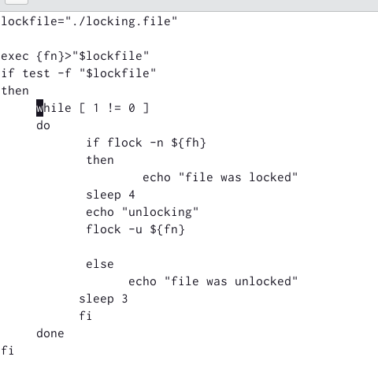
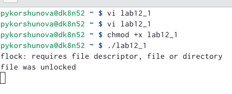
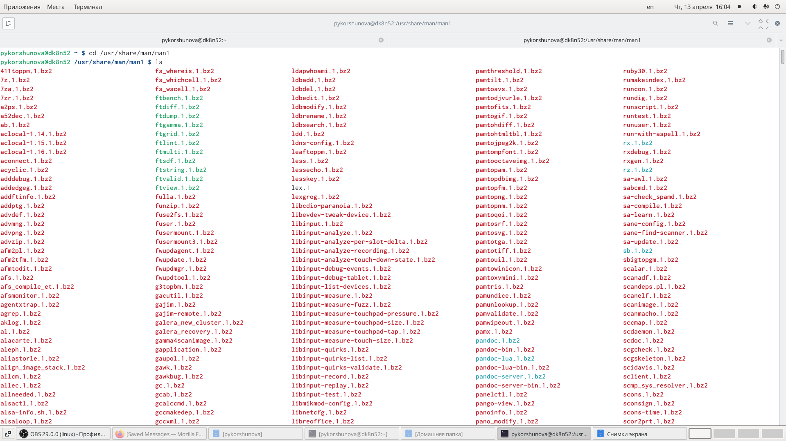
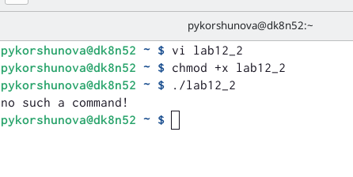
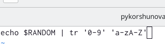
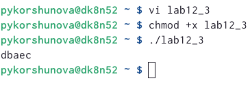

---
## Front matter
lang: ru-RU
title: Лабораторная работа 12
subtitle: Программирование в командном процессоре ОС UNIX. Расширенное программирование
author: |
	Korshunova Polina
institute: |
	RUDN University, Moscow, Russian Federation
date: 2022, 28 May 2022

## Formatting
toc: false
slide_level: 2
theme: metropolis
header-includes: 
 - \metroset{progressbar=frametitle,sectionpage=progressbar,numbering=fraction}
 - '\makeatletter'
 - '\beamer@ignorenonframefalse'
 - '\makeatother'
aspectratio: 43
section-titles: true
---

## Цель работы 

Изучить основы программирования в оболочке ОС UNIX. Научиться писать более сложные командные файлы с использованием логических управляющих конструкций и циклов.

## Задание 

1. Написать командный файл, реализующий упрощённый механизм семафоров. Командный файл должен в течение некоторого времени t1 дожидаться освобождения ресурса, выдавая об этом сообщение, а дождавшись его освобождения, использовать его в течение некоторого времени t2<>t1, также выдавая информацию о том, что ресурс используется соответствующим командным файлом (процессом). Запустить командный файл в одном виртуальном терминале в фоновом режиме, перенаправив его вывод в другой, в котором также запущен этот файл, но не фоновом, а в привилегированном режиме. Доработать программу так, чтобы имелась возможность взаимодействия трёх и более процессов.

## Задание 
2. Реализовать команду man с помощью командного файла. Изучите содержимое каталога /usr/share/man/man1. В нем находятся архивы текстовых файлов, содержащих справку по большинству установленных в системе программ и команд. Каждый архив можно открыть командой less сразу же просмотрев содержимое справки. Командный файл должен получать в виде аргумента командной строки название команды и в виде результата выдавать справку об этой команде или сообщение об отсутствии справки, если соответствующего файла нет в каталоге man1.

## Задание

3. Используя встроенную переменную $RANDOM, напишите командный файл, генерирующий случайную последовательность букв латинского алфавита. Учтите, что $RANDOM выдаёт псевдослучайные числа в диапазоне от 0 до 32767.

## Теоретическое введение

Преимущества и недостатки Bash:

Многие языки программирования намного удобнее и понятнее для пользователя. Например, Python более быстр, так как компилируется байтами. Однако главное преимущество Bash – его повсеместное распространение. Более того, Bash позволяет очень легко работать с файловой системой без лишних конструкций (в отличие от других языков программирования). Но относительно таких bash очень сжат. То есть, например, C имеет гораздо более широкие возможности для разработчика.

## Выполнение лабораторной работы

1. Я написала командный файл, реализующий упрощенный механизм семафоров. 

{ #fig:001 width=65% }

## Выполнение лабораторной работы

Затем я добавила право на исполнение файла и выполнила его.

{ #fig:002 width=80% }

## Выполнение лабораторной работы

2. Я просмотрела содержимое каталога /usr/share/man/man1.

{ #fig:003 width=70% }

## Выполнение лабораторной работы

Я написала командный файл, позволяющий реализовать команду man с помощью команды less, которая выдает содержимое справки по команде.

{ #fig:004 width=70% }

## Выполнение лабораторной работы

Затем я добавила право на исполнение файла и выполнила его.

{ #fig:005 width=80% }

## Выполнение лабораторной работы

3. Я написала командный файл, который генерировал случайную последовательность букв латинского алфавита, для этого я использовала встроенную переменную $RANDOM.

{ #fig:006 width=80% }

## Выполнение лабораторной работы

Затем я добавила право на исполнение файла и выполнила его.

{ #fig:007 width=80% }

## Вывод

В ходе выполнения лабораторной работы я изучила основы программирования в оболочке ОС UNIX, а также научилась писать более сложные командные файлы с использованием логических управляющих конструкций и циклов. 

