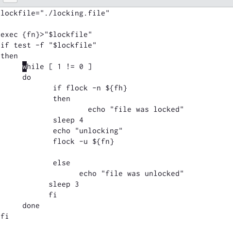
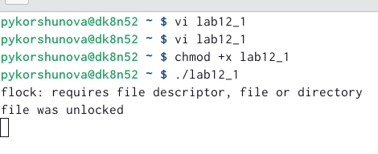
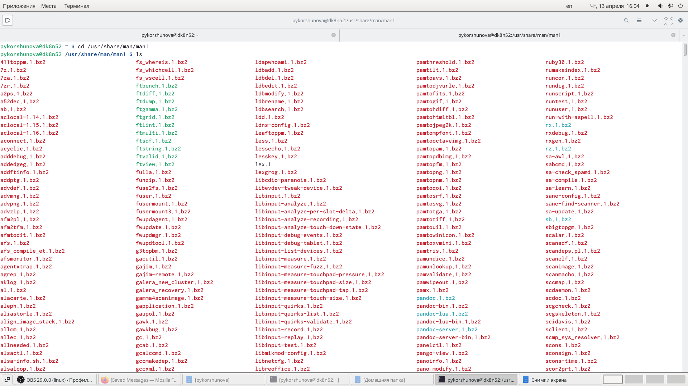
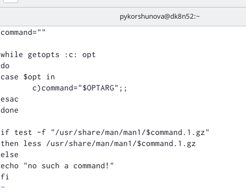
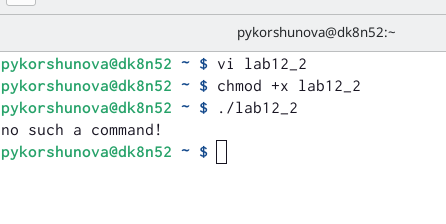
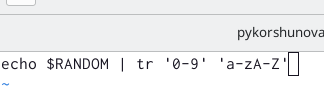
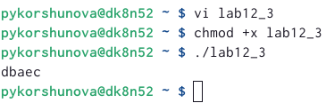

---
# Front matter
lang: ru-RU
title: "Лабораторная работа 12"
subtitle: "Программирование в командном процессоре ОС UNIX. Расширенное программирование"
author: "Коршунова Полина"

# Formatting
toc-title: "Содержание"
toc: true # Table of contents
toc_depth: 2
fontsize: 12pt
linestretch: 1.5
papersize: a4paper
documentclass: scrreprt
polyglossia-lang: russian
polyglossia-otherlangs: english
mainfont: PT Serif
romanfont: PT Serif
sansfont: PT Sans
monofont: PT Mono
mainfontoptions: Ligatures=TeX
romanfontoptions: Ligatures=TeX
sansfontoptions: Ligatures=TeX,Scale=MatchLowercase
monofontoptions: Scale=MatchLowercase
indent: true
pdf-engine: lualatex
header-includes:
  - \linepenalty=10 # the penalty added to the badness of each line within a paragraph (no associated penalty node) Increasing the value makes tex try to have fewer lines in the paragraph.
  - \interlinepenalty=0 # value of the penalty (node) added after each line of a paragraph.
  - \hyphenpenalty=50 # the penalty for line breaking at an automatically inserted hyphen
  - \exhyphenpenalty=50 # the penalty for line breaking at an explicit hyphen
  - \binoppenalty=700 # the penalty for breaking a line at a binary operator
  - \relpenalty=500 # the penalty for breaking a line at a relation
  - \clubpenalty=150 # extra penalty for breaking after first line of a paragraph
  - \widowpenalty=150 # extra penalty for breaking before last line of a paragraph
  - \displaywidowpenalty=50 # extra penalty for breaking before last line before a display math
  - \brokenpenalty=100 # extra penalty for page breaking after a hyphenated line
  - \predisplaypenalty=10000 # penalty for breaking before a display
  - \postdisplaypenalty=0 # penalty for breaking after a display
  - \floatingpenalty = 20000 # penalty for splitting an insertion (can only be split footnote in standard LaTeX)
  - \raggedbottom # or \flushbottom
  - \usepackage{float} # keep figures where there are in the text
  - \floatplacement{figure}{H} # keep figures where there are in the text
---

# Цель работы

Изучить основы программирования в оболочке ОС UNIX. Научиться писать более
сложные командные файлы с использованием логических управляющих конструкций
и циклов.

# Задание

1. Написать командный файл, реализующий упрощённый механизм семафоров. Командный файл должен в течение некоторого времени t1 дожидаться освобождения ресурса, выдавая об этом сообщение, а дождавшись его освобождения, использовать его в течение некоторого времени t2<>t1, также выдавая информацию о том, что ресурс используется соответствующим командным файлом (процессом). Запустить командный файл в одном виртуальном терминале в фоновом режиме, перенаправив его вывод в другой, в котором также запущен этот файл, но не фоновом, а в привилегированном режиме. Доработать программу так, чтобы имелась возможность взаимодействия трёх и более процессов.

2. Реализовать команду man с помощью командного файла. Изучите содержимое каталога /usr/share/man/man1. В нем находятся архивы текстовых файлов, содержащих справку по большинству установленных в системе программ и команд. Каждый архив можно открыть командой less сразу же просмотрев содержимое справки. Командный файл должен получать в виде аргумента командной строки название команды и в виде результата выдавать справку об этой команде или сообщение об отсутствии справки, если соответствующего файла нет в каталоге man1.

3. Используя встроенную переменную $RANDOM, напишите командный файл, генерирующий случайную последовательность букв латинского алфавита. Учтите, что $RANDOM выдаёт псевдослучайные числа в диапазоне от 0 до 32767.

# Теоретическое введение

Преимущества и недостатки Bash:

Многие языки программирования намного удобнее и понятнее для пользователя. Например, Python более быстр, так как компилируется байтами. Однако главное преимущество Bash – его повсеместное распространение. Более того, Bash позволяет очень легко работать с файловой системой без лишних конструкций (в отличие от других языков программирования). Но относительно таких bash очень сжат. То есть, например, C имеет гораздо более широкие возможности для разработчика.

# Выполнение лабораторной работы

1. Я написала командный файл, реализующий упрощенный механизм семафоров. 

{ #fig:001 width=70% }

Затем я добавила право на исполнение файла и выполнила его.

{ #fig:002 width=70% }

2. Я просмотрела содержимое каталога /usr/share/man/man1.

{ #fig:003 width=70% }

Я написала командный файл, позволяющий реализовать команду man с помощью команды less, которая выдает содержимое справки по команде.

{ #fig:004 width=70% }

Затем я добавила право на исполнение файла и выполнила его.

{ #fig:005 width=70% }

3. Я написала командный файл, который генерировал случайную последовательность букв латинского алфавита, для этого я использовала встроенную переменную $RANDOM.

{ #fig:006 width=70% }

Затем я добавила право на исполнение файла и выполнила его.

{ #fig:007 width=70% }

# Вывод

В ходе выполнения лабораторной работы я изучила основы программирования в оболочке ОС UNIX, а также научилась писать более сложные командные файлы с использованием логических управляющих конструкций и циклов. 

# Контрольные вопросы

1.	Найдите синтаксическую ошибку в следующей строке: 1 while [$1 != "exit"]

Между скобками должны быть пробелы, иначе символы в скобках и сами скобки буду восприняты как один элемент.

2.	Как объединить (конкатенация) несколько строк в одну?

cat file.txt | xargs 

3.	Найдите информацию об утилите seq. Какими иными способами можно реализовать её функционал при программировании на bash?

Команда seq выводит последовательность целых или действительных чисел, подходящую для передачи в другие программы. Реализовать ее функционал можно командой for n in {1..5} do <КОМАНДА> done

4.	Какой результат даст вычисление выражения $((10/3))?
Вычисление этого выражения даст результат 3
5.	Укажите кратко основные отличия командной оболочки zsh от bash.

Zsh очень сильно упрощает работу. Но существуют различия. Например, в zsh после for обязательно вставлять пробел, нумерация массивов в zsh начинается с 1. Если вы собираетесь писать скрипт, который будет запускать множество разработчиков, то рекомендуется Bash. Если скрипты вам не нужны - Zsh.

6.	Проверьте, верен ли синтаксис данной конструкции 1 for ((a=1; a <= LIMIT; a++))

Да, этот синтаксис верен.

7.	Сравните язык bash с какими-либо языками программирования. Какие преимущества у bash по сравнению с ними? Какие недостатки?

Многие языки программирования намного удобнее и понятнее для пользователя. Например, Python более быстр, так как компилируется байтами. Однако главное преимущество Bash – его повсеместное распространение. Более того, Bash позволяет очень легко работать с файловой системой без лишних конструкций (в отличие от других языков программирования). Но относительно таких bash очень сжат. То есть, например, C имеет гораздо более широкие возможности для разработчика.

