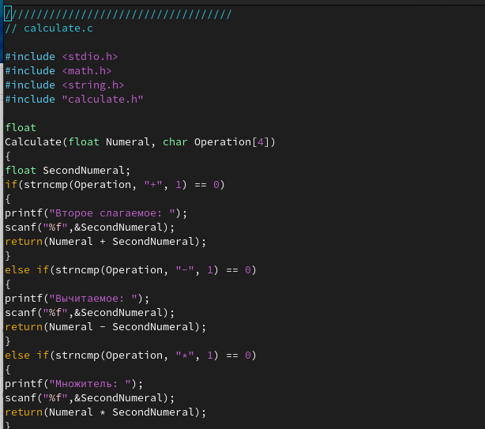
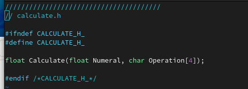
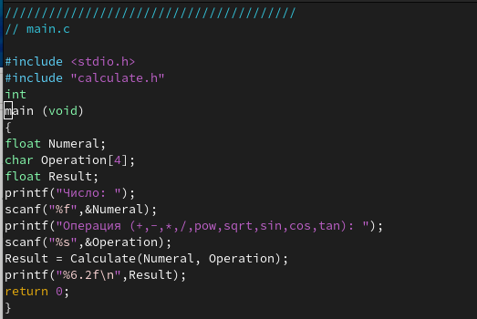
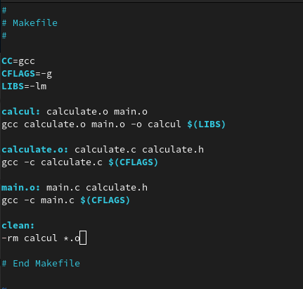
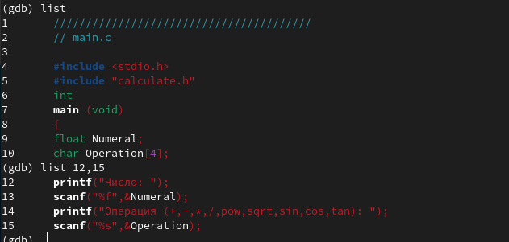
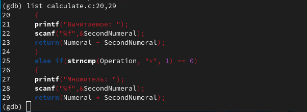
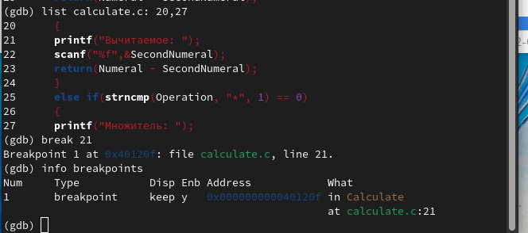
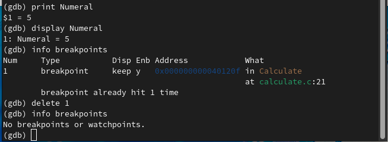

---
## Front matter
lang: ru-RU
title: Лабораторная работа 13
subtitle: Средства, применяемые при разработке программного обеспечения в ОС типа UNIX/Linux 
author: Korshunova Polina
institute: |
	RUDN University, Moscow, Russian Federation
date: 2023.17 апреля

## Formatting
toc: false
slide_level: 2
theme: metropolis
header-includes: 
 - \metroset{progressbar=frametitle,sectionpage=progressbar,numbering=fraction}
 - '\makeatletter'
 - '\beamer@ignorenonframefalse'
 - '\makeatother'
aspectratio: 43
section-titles: true
---

## Цель работы

Приобрести простейшие навыки разработки, анализа, тестирования и отладки приложений в ОС типа UNIX/Linux на примере создания на языке программирования
С калькулятора с простейшими функциями.

## Задание

1. В домашнем каталоге создайте подкаталог ~/work/os/lab_prog.

2. Создайте в нём файлы: calculate.h, calculate.c, main.c.
Это будет примитивнейший калькулятор, способный складывать, вычитать, умножать и делить, возводить число в степень, брать квадратный корень, вычислять sin, cos, tan. При запуске он будет запрашивать первое число, операцию, второе число. После этого программа выведет результат и остановится.

3. Выполните компиляцию программы посредством gcc.

4. При необходимости исправьте синтаксические ошибки.

5. Создайте Makefile со заданным содержанием. Поясните в отчёте его содержание.

## Задание

6. С помощью gdb выполните отладку программы calcul (перед использованием gdb исправьте Makefile):

– Запустите отладчик GDB, загрузив в него программу для отладки:

– Для запуска программы внутри отладчика введите команду run.

– Для постраничного (по 9 строк) просмотра исходного код используйте команду list.

– Для просмотра строк с 12 по 15 основного файла используйте list с параметрами.

## Задание

- Для просмотра определённых строк не основного файла используйте list с параметрами.

– Установите точку останова в файле calculate.c на строке номер 21.

– Выведите информацию об имеющихся в проекте точка останова. 

– Запустите программу внутри отладчика и убедитесь, что программа остановится в момент прохождения точки останова.

## Задание

– Посмотрите, чему равно на этом этапе значение переменной Numeral, введя print Numeral.

– Сравните с результатом вывода на экран после использования команды: display Numeral.

– Уберите точки останова.

7. С помощью утилиты splint попробуйте проанализировать коды файлов calculate.c и main.c.

## Теоретическое введение

Процесс разработки программного обеспечения обычно разделяется на следующие этапы:

– планирование, включающее сбор и анализ требований к функционалу и другим характеристикам разрабатываемого приложения;

– проектирование, включающее в себя разработку базовых алгоритмов и спецификаций,
определение языка программирования;

– непосредственная разработка приложения:

– кодирование — по сути создание исходного текста программы (возможно
в нескольких вариантах);

## Теоретическое введение

– анализ разработанного кода;

– сборка, компиляция и разработка исполняемого модуля;

– тестирование и отладка, сохранение произведённых изменений;

– документирование.

Для создания исходного текста программы разработчик может воспользоваться любым удобным для него редактором текста: vi, vim, mceditor, emacs, geany и др.

После завершения написания исходного кода программы (возможно состоящей из нескольких файлов), необходимо её скомпилировать и получить исполняемый модуль.

## Теоретическое введение

Отладка — этап разработки компьютерной программы, на котором обнаруживают, локализуют и устраняют ошибки. Чтобы понять, где возникла ошибка, приходится:

       - узнавать текущие значения переменных;

       - выяснять, по какому пути выполнялась программа. 

## Выполнение лабораторной работы

1. Создаю поддиректорию ~/work/os/lab_prog: 

## Выполнение лабораторной работы

2. Создаю файлы calculate.h, calculate.c, main.c и заполняю их, согласно описанию лабораторной работы:

## Выполнение лабораторной работы

Это будет примитивнейший калькулятор, способный складывать, вычитать, умножать и делить, возводить число в степень, брать квадратный корень, вычислять sin, cos, tan. При запуске он будет запрашивать первое число, операцию, второе число. После этого программа выведет результат и остановится. 

## Выполнение лабораторной работы

{ #fig:001 width=70% }

## Выполнение лабораторной работы

{ #fig:002 width=70% }

## Выполнение лабораторной работы

{ #fig:003 width=70% }

## Выполнение лабораторной работы

3. Выполняю компиляцию программы посредством gcc:

## Выполнение лабораторной работы

4. Создаю. Makefile с содержанием, согласно описанию лабораторной работы, при этом немного изменяю его:

{ #fig:004 width=55% }

## Выполнение лабораторной работы

В Makefile указываю компилятор gcc, флаг –g и дополнительные библиотеки –lm. Описываю, какие команды необходимо запустить, чтобы получить файлы calcul, calculate.o и main.o, подключив дополнительные библиотеки и флаги. А в поле clean описывается удаление файлов calcul и файлов, оканчивающихся на “.o”. 

## Выполнение лабораторной работы

5. С помощью gdb выполняю отладку программы calcul:

Запускаю отладчик GDB, загрузив в него программу для отладки.

Запускаю программу внутри отладчика, введя команду run:

## Выполнение лабораторной работы

Постранично просматриваю исходный код с помощью команды list.

Просматриваю строки с 12 по 15 основного файла с помощью команды list с параметрами:

{ #fig:005 width=70% }

## Выполнение лабораторной работы

Просматриваю определённые строки не основного файла с помощью команды list с параметрами:

{ #fig:006 width=70% }

## Выполнение лабораторной работы

Устанавливаю точку останова в файле calculate.c на строке номер 21 и вывожу информацию об имеющихся в проекте точках останова:

{ #fig:007 width=70% }

## Выполнение лабораторной работы

Запускаю программу внутри отладчика и убеждаюсь, что программа остановилась в момент прохождения точки останова, затем с помощью команды backtrace просматриваю весь стек вызываемых функций от начала программы до текущего места:

## Выполнение лабораторной работы

Просматриваю, чему равно значение переменной Numeral, введя сначала print Numeral, она равна 5, а затем сравниваю с выводом команды display Numeral. Можем заметить, что выводы разные, но значение одно - 5. Затем удаляю точку останова: 

{ #fig:008 width=70% }

## Выполнение лабораторной работы

6. С помощью заранее установленной утилиты splint анализирую коды файла calculate.c (вижу 15 предупреждений) и файла main.c (вижу 4 предупреждения)

## Выполнение лабораторной работы

