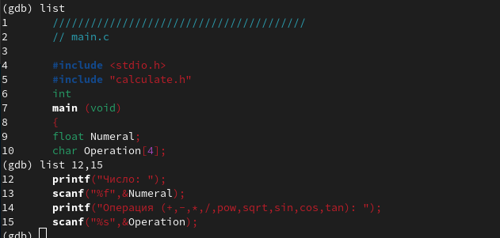
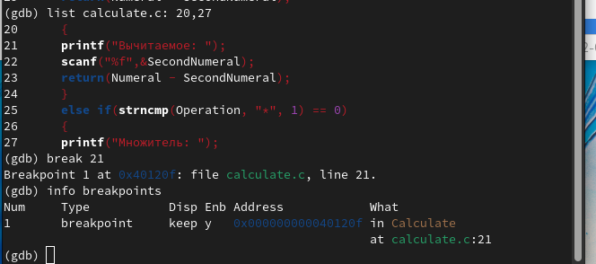

---
# Front matter
lang: ru-RU
title: "Лабораторная работа 13"
subtitle: " Средства, применяемые при разработке программного обеспечения в ОС типа UNIX/Linux "
author: "ПК"

# Formatting
toc-title: "Содержание"
toc: true # Table of contents
toc_depth: 2
fontsize: 12pt
linestretch: 1.5
papersize: a4paper
documentclass: scrreprt
polyglossia-lang: russian
polyglossia-otherlangs: english
mainfont: PT Serif
romanfont: PT Serif
sansfont: PT Sans
monofont: PT Mono
mainfontoptions: Ligatures=TeX
romanfontoptions: Ligatures=TeX
sansfontoptions: Ligatures=TeX,Scale=MatchLowercase
monofontoptions: Scale=MatchLowercase
indent: true
pdf-engine: lualatex
header-includes:
  - \linepenalty=10 # the penalty added to the badness of each line within a paragraph (no associated penalty node) Increasing the value makes tex try to have fewer lines in the paragraph.
  - \interlinepenalty=0 # value of the penalty (node) added after each line of a paragraph.
  - \hyphenpenalty=50 # the penalty for line breaking at an automatically inserted hyphen
  - \exhyphenpenalty=50 # the penalty for line breaking at an explicit hyphen
  - \binoppenalty=700 # the penalty for breaking a line at a binary operator
  - \relpenalty=500 # the penalty for breaking a line at a relation
  - \clubpenalty=150 # extra penalty for breaking after first line of a paragraph
  - \widowpenalty=150 # extra penalty for breaking before last line of a paragraph
  - \displaywidowpenalty=50 # extra penalty for breaking before last line before a display math
  - \brokenpenalty=100 # extra penalty for page breaking after a hyphenated line
  - \predisplaypenalty=10000 # penalty for breaking before a display
  - \postdisplaypenalty=0 # penalty for breaking after a display
  - \floatingpenalty = 20000 # penalty for splitting an insertion (can only be split footnote in standard LaTeX)
  - \raggedbottom # or \flushbottom
  - \usepackage{float} # keep figures where there are in the text
  - \floatplacement{figure}{H} # keep figures where there are in the text
---

# Цель работы

Приобрести простейшие навыки разработки, анализа, тестирования и отладки приложений в ОС типа UNIX/Linux на примере создания на языке программирования
С калькулятора с простейшими функциями.

# Задание

1. В домашнем каталоге создайте подкаталог ~/work/os/lab_prog.

2. Создайте в нём файлы: calculate.h, calculate.c, main.c.
Это будет примитивнейший калькулятор, способный складывать, вычитать, умножать и делить, возводить число в степень, брать квадратный корень, вычислять sin, cos, tan. При запуске он будет запрашивать первое число, операцию, второе число. После этого программа выведет результат и остановится.

3. Выполните компиляцию программы посредством gcc.

4. При необходимости исправьте синтаксические ошибки.

5. Создайте Makefile со заданным содержанием. Поясните в отчёте его содержание.

6. С помощью gdb выполните отладку программы calcul (перед использованием gdb исправьте Makefile):

– Запустите отладчик GDB, загрузив в него программу для отладки:

– Для запуска программы внутри отладчика введите команду run.

– Для постраничного (по 9 строк) просмотра исходного код используйте команду list.

– Для просмотра строк с 12 по 15 основного файла используйте list с параметрами.

- Для просмотра определённых строк не основного файла используйте list с параметрами.

– Установите точку останова в файле calculate.c на строке номер 21.

– Выведите информацию об имеющихся в проекте точка останова. 

– Запустите программу внутри отладчика и убедитесь, что программа остановится в момент прохождения точки останова.

– Посмотрите, чему равно на этом этапе значение переменной Numeral, введя print Numeral.

– Сравните с результатом вывода на экран после использования команды: display Numeral.

– Уберите точки останова.

7. С помощью утилиты splint попробуйте проанализировать коды файлов calculate.c и main.c.

# Теоретическое введение

Процесс разработки программного обеспечения обычно разделяется на следующие этапы:

– планирование, включающее сбор и анализ требований к функционалу и другим характеристикам разрабатываемого приложения;

– проектирование, включающее в себя разработку базовых алгоритмов и спецификаций,
определение языка программирования;

– непосредственная разработка приложения:

– кодирование — по сути создание исходного текста программы (возможно
в нескольких вариантах);

– анализ разработанного кода;

– сборка, компиляция и разработка исполняемого модуля;

– тестирование и отладка, сохранение произведённых изменений;

– документирование.

Для создания исходного текста программы разработчик может воспользоваться любым удобным для него редактором текста: vi, vim, mceditor, emacs, geany и др.

После завершения написания исходного кода программы (возможно состоящей из нескольких файлов), необходимо её скомпилировать и получить исполняемый модуль.

Отладка — этап разработки компьютерной программы, на котором обнаруживают, локализуют и устраняют ошибки. Чтобы понять, где возникла ошибка, приходится:

       - узнавать текущие значения переменных;

       - выяснять, по какому пути выполнялась программа. 

# Выполнение лабораторной работы

1. Создаю поддиректорию ~/work/os/lab_prog 

2. Создаю файлы calculate.h, calculate.c, main.c и заполняю их, согласно описанию лабораторной работы

Это будет примитивнейший калькулятор, способный складывать, вычитать, умножать и делить, возводить число в степень, брать квадратный корень, вычислять sin, cos, tan. При запуске он будет запрашивать первое число, операцию, второе число. После этого программа выведет результат и остановится. 

{ #fig:001 width=70% }

{ #fig:002 width=70% }

{ #fig:003 width=70% }

3. Выполняю компиляцию программы посредством gcc:

4. Создаю. Makefile с содержанием, согласно описанию лабораторной работы, при этом немного изменяю его:

{ #fig:004 width=70% }

В Makefile указываю компилятор gcc, флаг –g и дополнительные библиотеки –lm. Описываю, какие команды необходимо запустить, чтобы получить файлы calcul, calculate.o и main.o, подключив дополнительные библиотеки и флаги. А в поле clean описывается удаление файлов calcul и файлов, оканчивающихся на “.o”. 

5. С помощью gdb выполняю отладку программы calcul:

Запускаю отладчик GDB, загрузив в него программу для отладки.

Запускаю программу внутри отладчика, введя команду run:

Постранично просматриваю исходный код с помощью команды list.

Просматриваю строки с 12 по 15 основного файла с помощью команды list с параметрами:

{ #fig:005 width=70% }

Просматриваю определённые строки не основного файла с помощью команды list с параметрами:

{ #fig:006 width=70% }

Устанавливаю точку останова в файле calculate.c на строке номер 21 и вывожу информацию об имеющихся в проекте точках останова:

{ #fig:007 width=70% }

Запускаю программу внутри отладчика и убеждаюсь, что программа остановилась в момент прохождения точки останова, затем с помощью команды backtrace просматриваю весь стек вызываемых функций от начала программы до текущего места:

Просматриваю, чему равно значение переменной Numeral, введя сначала print Numeral, она равна 5, а затем сравниваю с выводом команды display Numeral. Можем заметить, что выводы разные, но значение одно - 5. Затем удаляю точку останова: 

{ #fig:008 width=70% }

6. С помощью заранее установленной утилиты splint анализирую коды файла calculate.c (вижу 15 предупреждений) и файла main.c (вижу 4 предупреждения)

# Вывод
В ходе выполнения лабораторной работы я приобрела простейшие навыки разработки, анализа, тестирования и отладки приложений в ОС типа UNIX/Linux на примере создания на языке программирования С калькулятора с простейшими функциями.

# Ответы на контрольные вопросы

1.Как получить более полную информацию о программах: gcc, make, gdb и др.?

Дополнительную информацию о этих программах можно получить с помощью функций info и man.

2.Назовите и дайте краткую характеристику основным этапам разработки приложений в UNIX? 

Unix поддерживает следующие основные этапы разработки приложений:

создание исходного кода программы;

представляется в виде файла;

сохранение различных вариантов исходного текста;

анализ исходного текста; Необходимо отслеживать изменения исходного кода, а также при работе более двух программистов над проектом программы нужно, чтобы они не делали изменений кода в одно время.

компиляция исходного текста и построение исполняемого модуля;

тестирование и отладка;

проверка кода на наличие ошибок

сохранение всех изменений, выполняемых при тестировании и отладке.

3.Что такое суффиксы и префиксы? Основное их назначение. Приведите примеры их использования.

Суффиксы и префиксы указывают тип объекта.
Использование суффикса ".с" для имени файла с программой на языке Си отражает удобное и полезное соглашение, принятое в ОС UNIX. Для любого имени входного файла суффикс определяет какая компиляция требуется. 

Одно из полезных свойств компилятора Си — его способность по суффиксам определять типы файлов. 

По суффиксу .c компилятор распознает, что файл abcd.c должен компилироваться, а по суффиксу .o, что файл abcd.о является объектным модулем и для получения исполняемой программы необходимо выполнить редактирование связей. Простейший пример командной строки для компиляции программы abcd.c и построения исполняемого модуля abcd имеет вид: gcc -o abcd abcd.c. 

Некоторые проекты предпочитают показывать префиксы в начале текста изменений для старых (old) и новых (new) файлов.  Опция – prefix может быть использована для установки такого префикса. Плюс к этому команда bzr diff -p1 выводит префиксы в форме которая подходит для команды patch -p1.

4.Основное назначение компилятора с языка Си в UNIX?

Основное назначение компилятора с языка Си заключается в компиляции всей программы в целом и получении исполняемого модуля.

5.Для чего предназначена утилита make.

При разработке большой программы, состоящей из нескольких исходных файлов заголовков, приходится постоянно следить за файлами, которые требуют перекомпиляции после внесения изменений. Программа make освобождает пользователя от такой рутинной работы и служит для документирования взаимосвязей между файлами. Описание взаимосвязей и соответствующих действий хранится в так называемом make-файле, который по умолчанию имеет имя makefile или Makefile.

6.Приведите структуру make-файла. Дайте характеристику основным элементам этого файла.

makefile может иметь следующий вид:

 #

 #

Makefile

 #

CC = gcc

CFLAGS =

LIBS = -lm

calcul: 	calculate.o main.o 

gcc calculate.o main.o -o calcul $(LIBS) 

calculate.o: 	calculate.c calculate.h 

gcc -c calculate.c $(CFLAGS) 

main.o: main.c calculate.h

gcc -c main.c $(CFLAGS) 

clean: -rm calcul *.o *~

 # End Makefile 

В общем случае make-файл содержит последовательность записей (строк), определяющих зависимости между файлами.

Первая строка записи представляет собой список целевых (зависимых) файлов, разделенных пробелами, за которыми следует двоеточие и список файлов, от которых зависят целевые. Текст, следующий за точкой с запятой, и все последующие строки, начинающиеся с литеры табуляции, являются командами OC UNIX, которые необходимо выполнить для обновления целевого файла. Таким образом, спецификация взаимосвязей имеет формат: target1 [ target2...]: [:] [dependment1...] [(tab)commands] [#commentary] [(tab)commands] [#commentary], где # — специфицирует начало комментария, так как содержимое строки, начиная с # и до конца строки, не будет обрабатываться командой make; : — последовательность команд ОС UNIX должна содержаться в одной строке make-файла (файла описаний), есть возможность переноса команд (), но она считается как одна строка; :: — последовательность команд ОС UNIX может содержаться в нескольких последовательных строках файла описаний. 

Приведённый выше make-файл включает два способа компиляции и построения исполняемого модуля. 

Первый способ предусматривает обычную компиляцию с построением исполняемого модуля с именем abcd. 

Второй способ позволяет включать в исполняемый модуль testabcd возможность выполнить процесс отладки на уровне исходного текста.

7.Назовите основное свойство, присущее всем программам отладки. Что необходимо сделать, чтобы его можно было использовать?

Пошаговая отладка программ заключается в том, что выполняется один оператор программы и, затем контролируются те переменные, на которые должен был воздействовать данный оператор. Если в программе имеются уже отлаженные подпрограммы, то подпрограмму можно рассматривать, как один оператор программы и воспользоваться вторым способом отладки программ. Если в программе существует достаточно большой участок программы, уже отлаженный ранее, то его можно выполнить, не контролируя переменные, на которые он воздействует. Использование точек останова позволяет пропускать уже отлаженную часть программы. Точка останова устанавливается в местах, где необходимо проверить содержимое переменных или просто проконтролировать, передаётся ли управление данному оператору. 
Практически во всех отладчиках поддерживается это свойство (а также выполнение программы до курсора и выход из подпрограммы). Затем отладка программы продолжается в пошаговом режиме с контролем локальных и глобальных переменных, а также внутренних регистров микроконтроллера и напряжений на выводах этой микросхемы. 

8. Назовите и дайте основную характеристику основным командам отладчика gdb. 

backtrace – выводит весь путь к текущей точке останова, то есть названия всех функций, начиная от main(); иными словами, выводит весь стек функций;

break – устанавливает точку останова; параметром может быть номер строки или название функции;

clear – удаляет все точки останова на текущем уровне стека (то есть в текущей функции);

continue – продолжает выполнение программы от текущей точки до конца;

delete – удаляет точку останова или контрольное выражение;

display – добавляет выражение в список выражений, значения которых отображаются каждый раз при остановке программы;

finish – выполняет программу до выхода из текущей функции; отображает возвращаемое значение, если такое имеется;

info breakpoints – выводит список всех имеющихся точек останова; – info watchpoints – выводит список всех имеющихся контрольных выражений;

splist – выводит исходный код; в качестве параметра передаются название файла исходного кода, затем, через двоеточие, номер начальной и конечной строки;
next – пошаговое выполнение программы, но, в отличие от команды step, не выполняет пошагово вызываемые функции;

print – выводит значение какого-либо выражения (выражение передаётся в качестве параметра);

run – запускает программу на выполнение;

set – устанавливает новое значение переменной

step – пошаговое выполнение программы;

watch – устанавливает контрольное выражение, программа остановится, как только значение контрольного выражения изменится;

9.Опишите по шагам схему отладки программы которую вы использовали при выполнении лабораторной работы.

1. Я скомпилировала программу 

2. Выполнила ее 

3. Затем я воспользовалась командами list, list 12,15, list calculate.c:20,29 и другими

4. Поставила точку останова на некоторой строке 

5. Вновь запустила программу 

6. Удалила точку останова.

10.Прокомментируйте реакцию компилятора на синтаксические ошибки в программе при его первом запуске.

У меня не было никаких синтаксических ошибок при первом запуске.

11.Назовите основные средства, повышающие понимание исходного кода программы.

Если вы работаете с исходным кодом, который не вами разрабатывался, то назначение различных конструкций может быть не совсем понятным. Система разработки приложений UNIX предоставляет различные средства, повышающие понимание исходного кода. К ним относятся: – cscope - исследование функций, содержащихся в программе; – splint — критическая проверка программ, написанных на языке Си.

12.Каковы основные задачи, решаемые программой slint?

Проверка корректности задания аргументов всех использованных в программе функций, а также типов возвращаемых ими значений;

Поиск фрагментов исходного текста, корректных с точки зрения синтаксиса языка Си, но малоэффективных с точки зрения их реализации или содержащих в себе семантические ошибки;

Общая оценка мобильности пользовательской программы.
