---
## Front matter
lang: ru-RU
title: Отчет по выполнению индивидуального проекта
subtitle: Первый этап
author:
  - Коршунова Полина Юрьевна
institute:
  - Российский университет дружбы народов, Москва, Россия
 

## i18n babel
babel-lang: russian
babel-otherlangs: english

## Formatting pdf
toc: false
toc-title: Содержание
slide_level: 2
aspectratio: 169
section-titles: true
theme: metropolis
header-includes:
 - \metroset{progressbar=frametitle,sectionpage=progressbar,numbering=fraction}
 - '\makeatletter'
 - '\beamer@ignorenonframefalse'
 - '\makeatother'
---

# Вводная часть

## Цель работы

- Получить практические навыки создания собственного сайта

#Основная часть

##Скачиваю файл hugo, распаковываю его, создаю папку bin, добавляю hugo туда

- Скачиваю файл hugo, распаковываю его, создаю папку bin, добавляю hugo туда

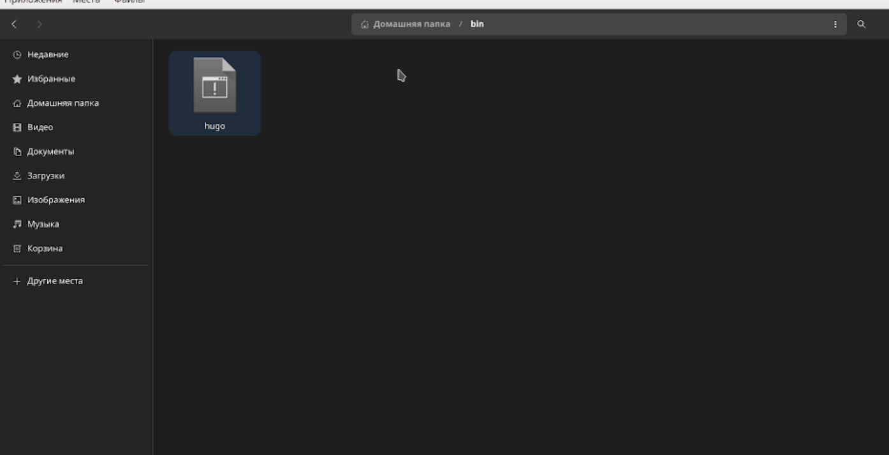

##Создаю новый репозиторий blog

- Создаю новый репозиторий blog

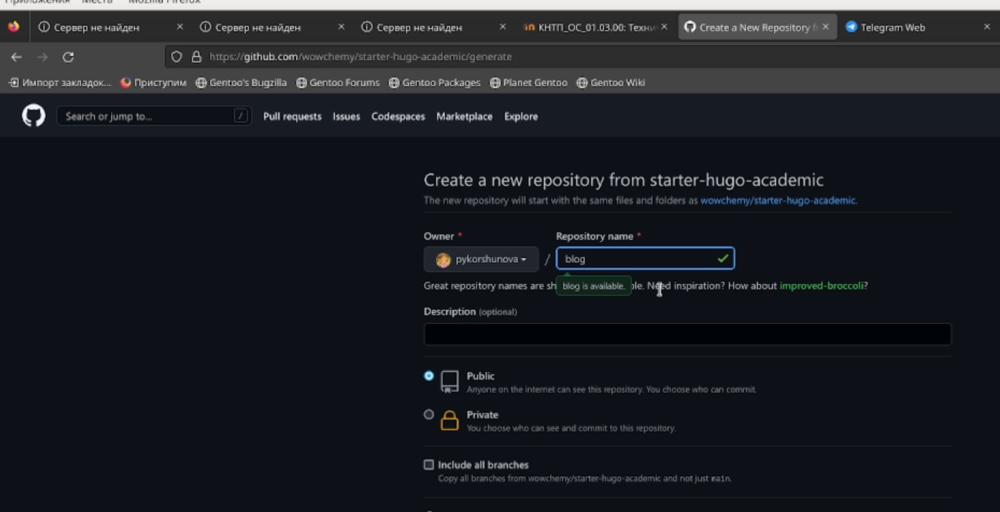

##  Клонирую созданный репозиторий

-  Клонирую созданный репозиторий

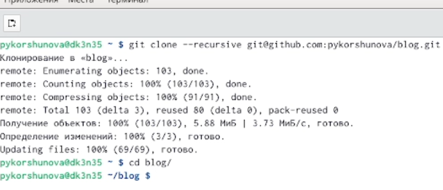

## Перехожу в blog и скачиваю файлы hugo

- Перехожу в blog и скачиваю файлы hugo

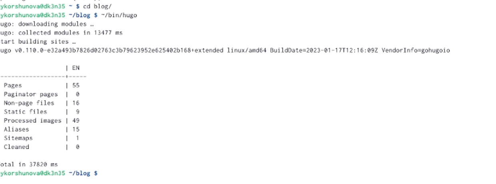

##Удаляю файл public и генерирую ссылку на сайт

- Удаляю файл public и генерирую ссылку на сайт

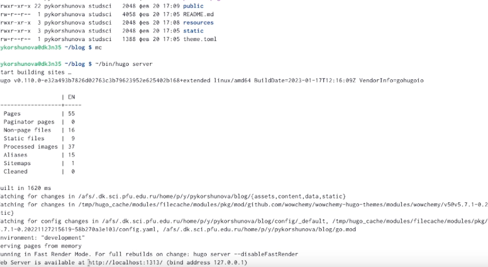

##Перехожу по созданной ссылке

- Перехожу по созданной ссылке

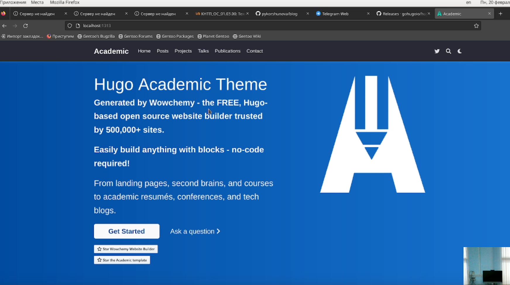

##Создаю новый репозиторий

- Создаю новый репозиторий

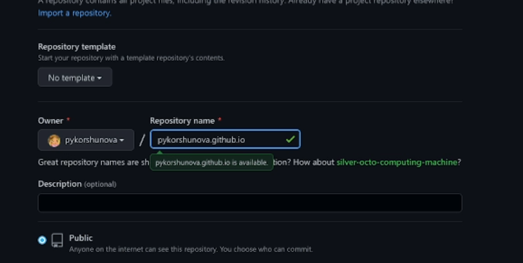

##Переключаюсь на ветку main, создаю файл README.md, добавляю его на github, вывожу текущую рабочую директорию

- Переключаюсь на ветку main, создаю файл README.md, добавляю его на github, вывожу текущую рабочую директорию

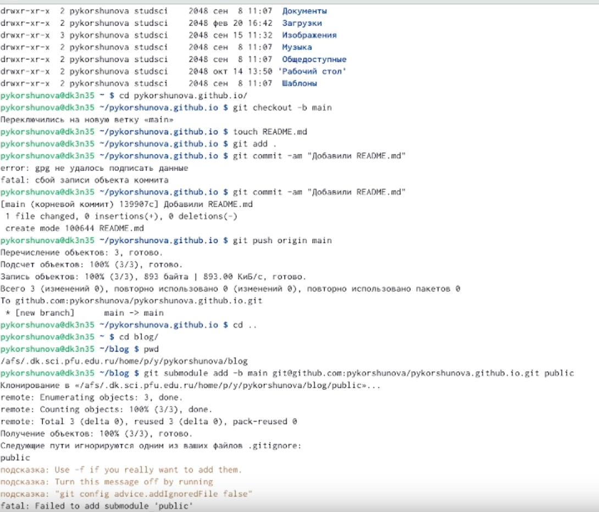

##Добавляю # к public, чтобы было возможно копирование

- Добавляю # к public, чтобы было возможно копирование

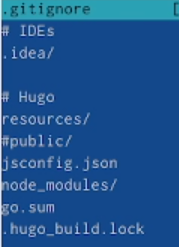

##Добавляю сайт на github

- Добавляю сайт на github

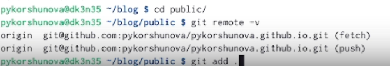

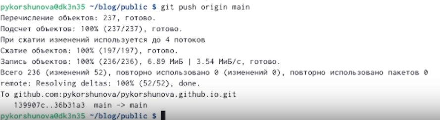

# Заключение

## Вовод

В ходе данного этапа проекта я приобрела практические навыки создания сайта

