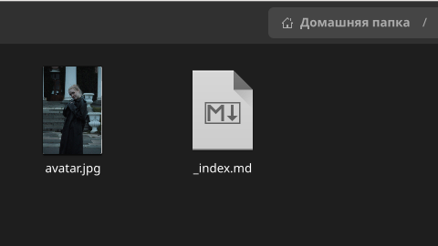
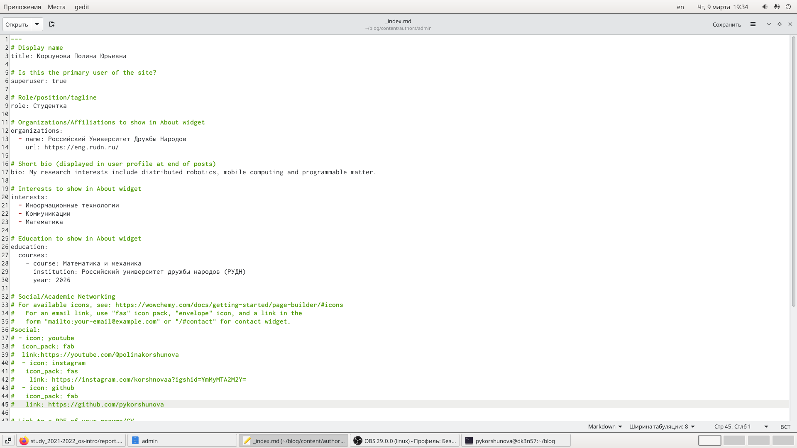
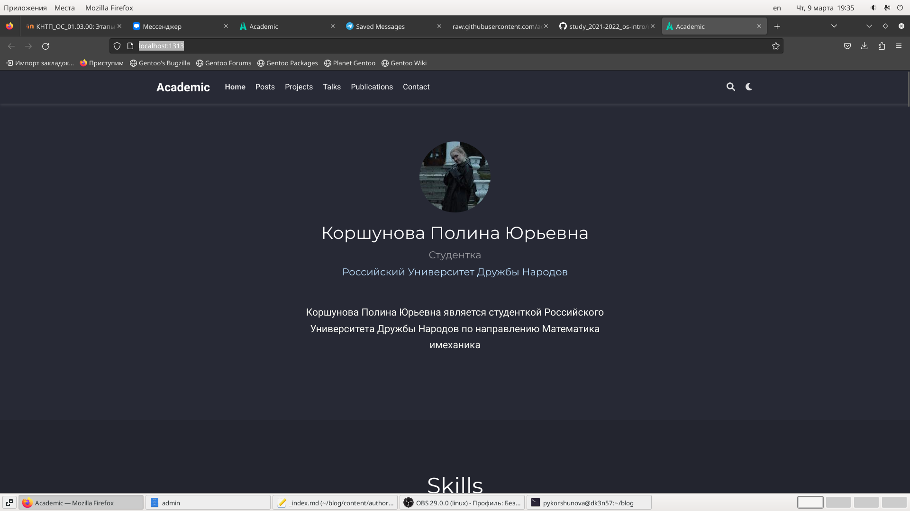
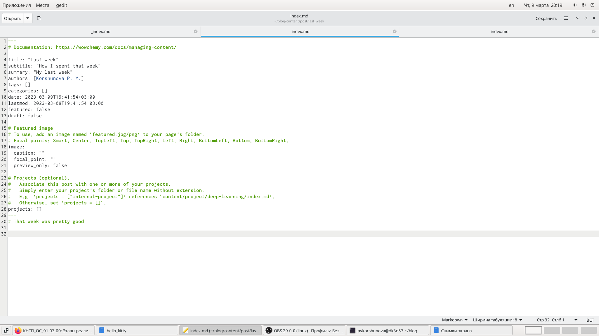
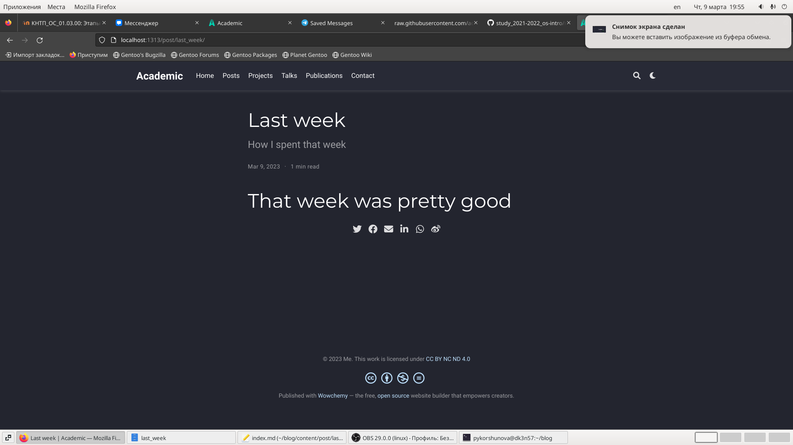
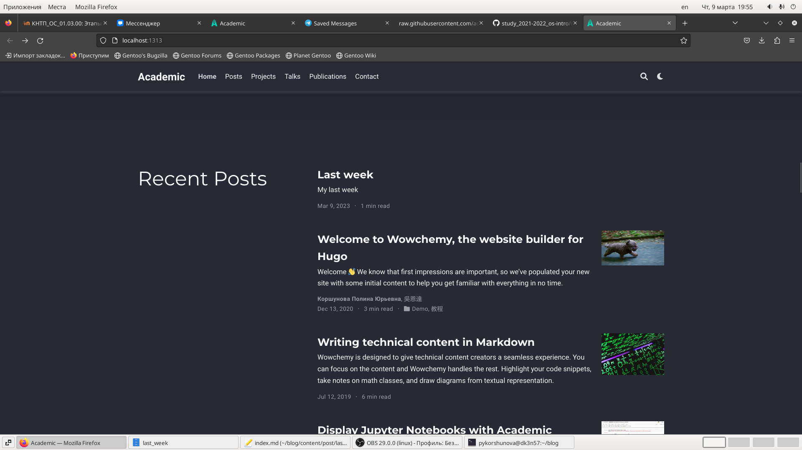
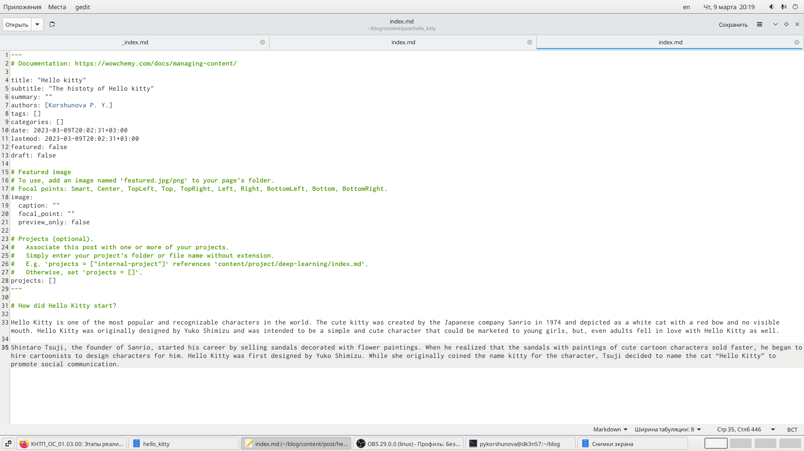
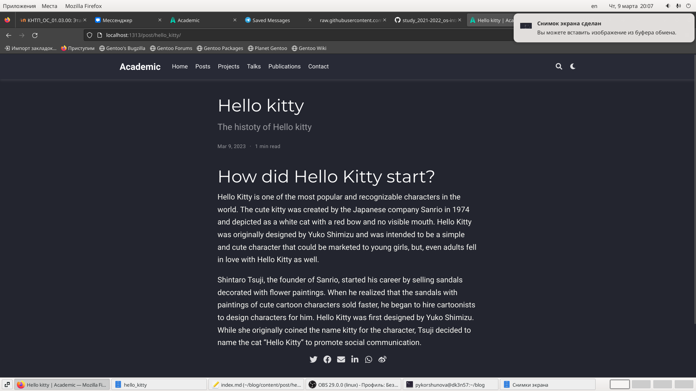
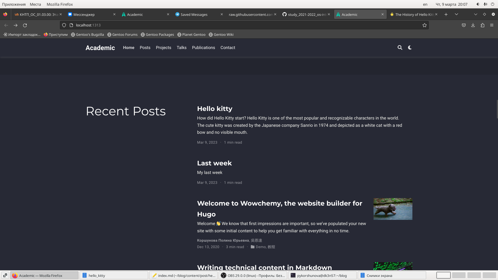

---
## Front matter
lang: ru-RU
title: Индивидуальный проект
subtitle: Stage 2
author:
  - КОРШУНОВА ПОЛИНА
institute:
  - Российский университет дружбы народов, Москва, Россия
date: 9 марта 2023

## i18n babel
babel-lang: russian
babel-otherlangs: english

## Formatting pdf
toc: false
toc-title: Содержание
slide_level: 2
aspectratio: 169
section-titles: true
theme: metropolis
header-includes:
 - \metroset{progressbar=frametitle,sectionpage=progressbar,numbering=fraction}
 - '\makeatletter'
 - '\beamer@ignorenonframefalse'
 - '\makeatother'
---

# Вводная часть

## Цель работы

- Приобретение практических навыков создания сайта

# Основная часть

##  Размещаю фотографию владельца сайта

## Размещаю краткое описание владельца сайта, информацию об интересах, информацию об образовании

## Делаю пост по прошедшей неделе

##  Добавляю пост на тему по выбору

# Заключение

## Вовод

В ходе выполнения данной лабораторной работы я постигла основы создания сайта

