---
# Front matter
lang: ru-RU
title: "Индивидуальный проект"
subtitle: "Этап 3"
author: "Коршунова Полина"

# Formatting
toc-title: "Содержание"
toc: true # Table of contents
toc_depth: 2
fontsize: 12pt
linestretch: 1.5
papersize: a4paper
documentclass: scrreprt
polyglossia-lang: russian
polyglossia-otherlangs: english
mainfont: PT Serif
romanfont: PT Serif
sansfont: PT Sans
monofont: PT Mono
mainfontoptions: Ligatures=TeX
romanfontoptions: Ligatures=TeX
sansfontoptions: Ligatures=TeX,Scale=MatchLowercase
monofontoptions: Scale=MatchLowercase
indent: true
pdf-engine: lualatex
header-includes:
  - \linepenalty=10 # the penalty added to the badness of each line within a paragraph (no associated penalty node) Increasing the value makes tex try to have fewer lines in the paragraph.
  - \interlinepenalty=0 # value of the penalty (node) added after each line of a paragraph.
  - \hyphenpenalty=50 # the penalty for line breaking at an automatically inserted hyphen
  - \exhyphenpenalty=50 # the penalty for line breaking at an explicit hyphen
  - \binoppenalty=700 # the penalty for breaking a line at a binary operator
  - \relpenalty=500 # the penalty for breaking a line at a relation
  - \clubpenalty=150 # extra penalty for breaking after first line of a paragraph
  - \widowpenalty=150 # extra penalty for breaking before last line of a paragraph
  - \displaywidowpenalty=50 # extra penalty for breaking before last line before a display math
  - \brokenpenalty=100 # extra penalty for page breaking after a hyphenated line
  - \predisplaypenalty=10000 # penalty for breaking before a display
  - \postdisplaypenalty=0 # penalty for breaking after a display
  - \floatingpenalty = 20000 # penalty for splitting an insertion (can only be split footnote in standard LaTeX)
  - \raggedbottom # or \flushbottom
  - \usepackage{float} # keep figures where there are in the text
  - \floatplacement{figure}{H} # keep figures where there are in the text
---

# Цель работы

Добавить к сайту информацию о навыках, опыте и достижениях, а также разместить несколько постов.

# Задание

Добавить к сайту достижения:

       Список достижений.
       
       Добавить информацию о навыках (Skills).
       
       Добавить информацию об опыте (Experience).
       
       Добавить информацию о достижениях (Accomplishments).
       
       Сделать пост по прошедшей неделе.
       
       Добавить пост на тему по выбору:
       
       Легковесные языки разметки.
       
       Языки разметки. LaTeX.
       
       Язык разметки Markdown.

# Выполнение

Введя команду ~/bin/hugo server, получаю ссылку на локальный сайт, на котором буду промежуточно отслеживать все изменения. 

Изменяю информацию о навыках, меняю навыки из шаблона на свои:

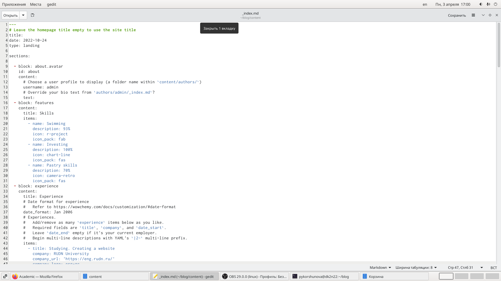{ #fig:001 width=70% }

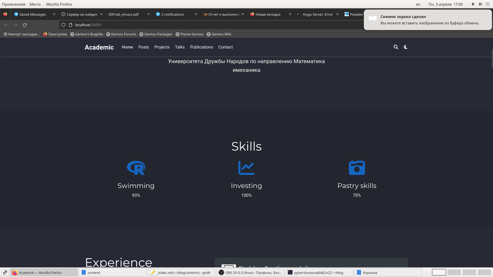{ #fig:002 width=70% }

Изменяю информацию об опыте, меняю опыт из шаблона на свой:

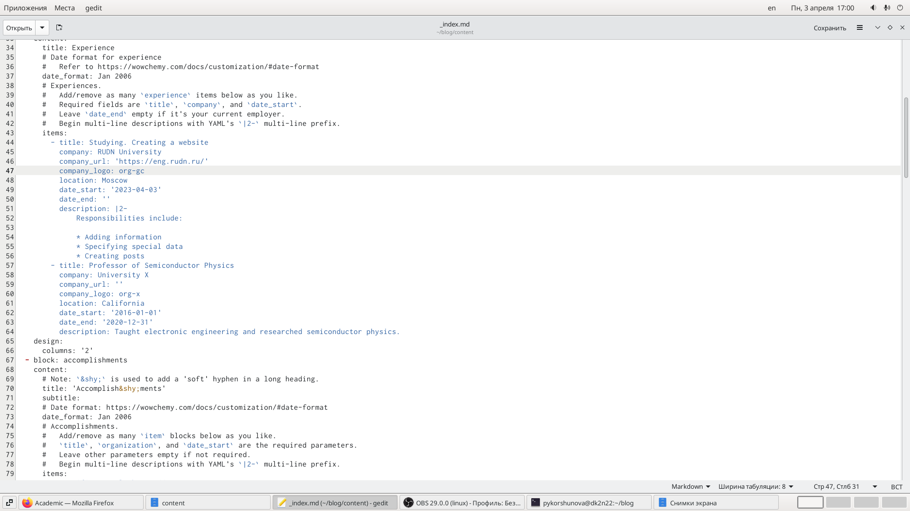{ #fig:003 width=70% }

Изменяю информацию о достижениях, меняю достижения из шаблона на свои:

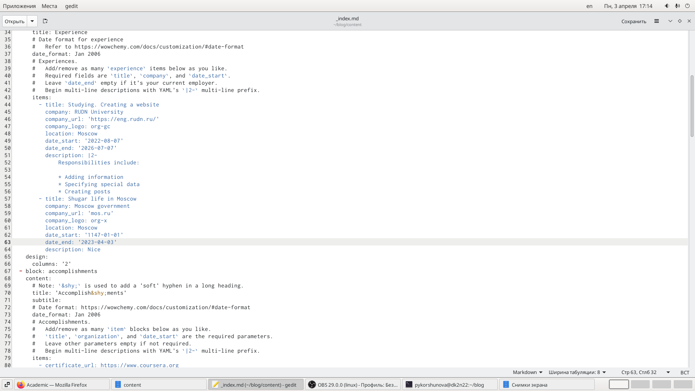{ #fig:004 width=70% }

Введя команду ~/bin/hugo new post/last_week1, создаю новый пост на тему о прошедшей неделе:

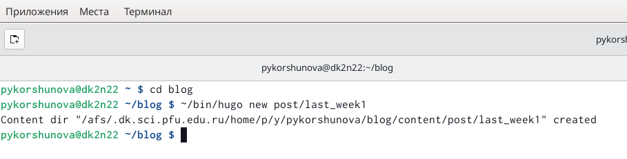{ #fig:005 width=70% }

Затем заполняю созданный пост информацией о прошедшей неделе:

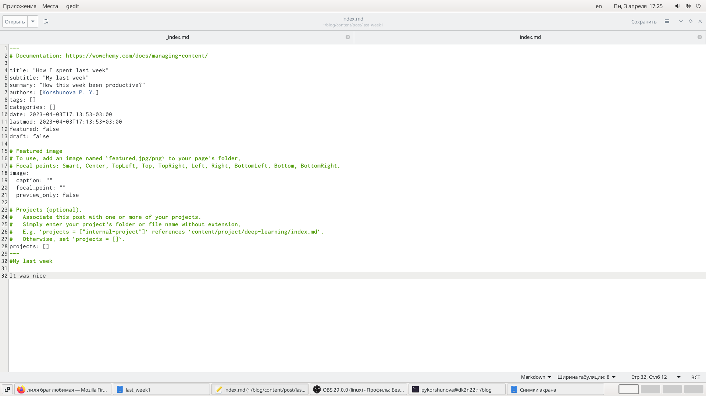{ #fig:006 width=70% }

Далее проверяю изменения на локальном сайте, ссылку на который я получила в начале с помощью команды ~/bin/hugo server.

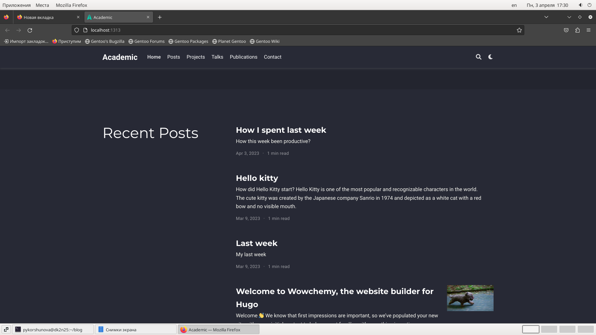{ #fig:007 width=70% }

Создаю второй пост markdown, вновь используя команду ~/bin/hugo new post/markdown.

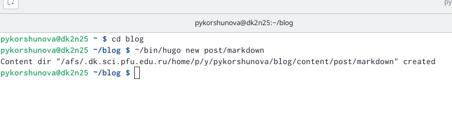{ #fig:008 width=70% }

Далее заполняю пост необходимой информацией и добавляю картинку.

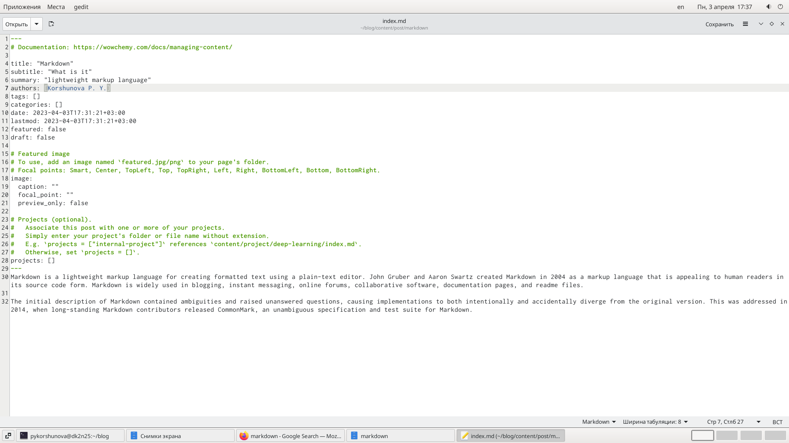{ #fig:009 width=70% }

Проверяю изменения на локальном сайте, ссылку на который я получила в начале с помощью команды ~/bin/hugo server.

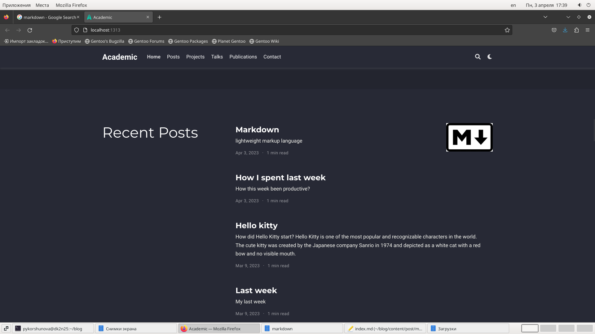{ #fig:010 width=70% }

Затем в каталоге blog выполняю ~/bin/hugo. 

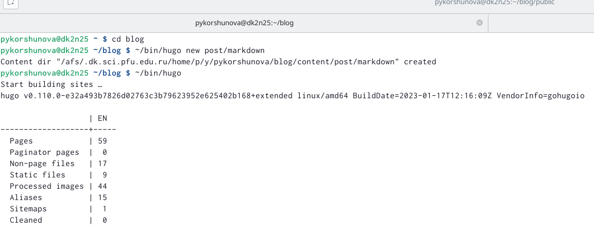{ #fig:011 width=70% }

Затем отправляю изменения на сервер. 

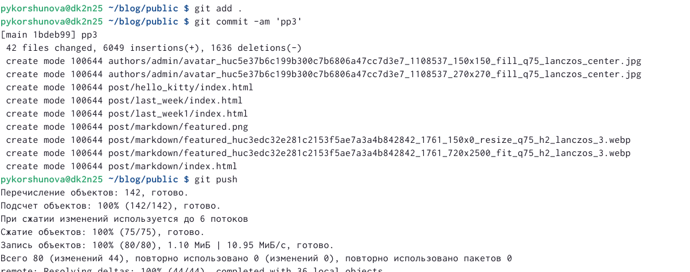{ #fig:012 width=70% }

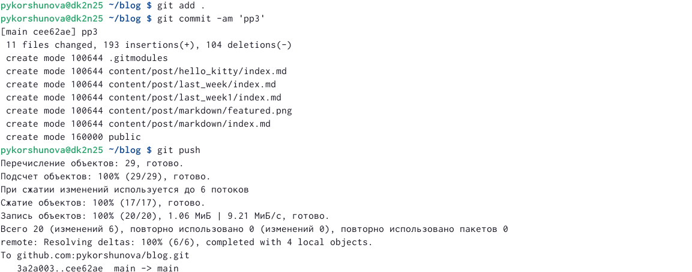{ #fig:013 width=70% }

Затем проверяю изменения на публичном сайте и убеждаюсь что выполненные действия корректны.

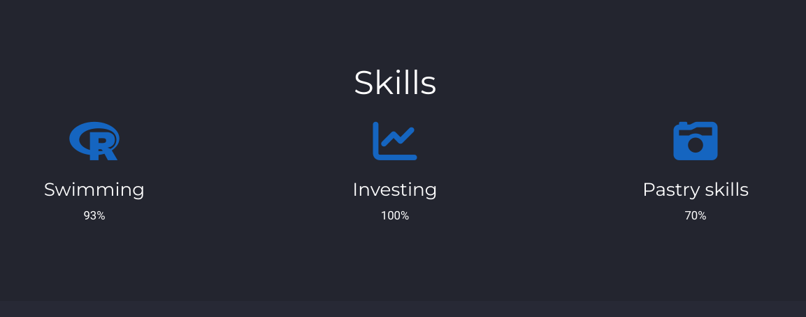{ #fig:014 width=70% }

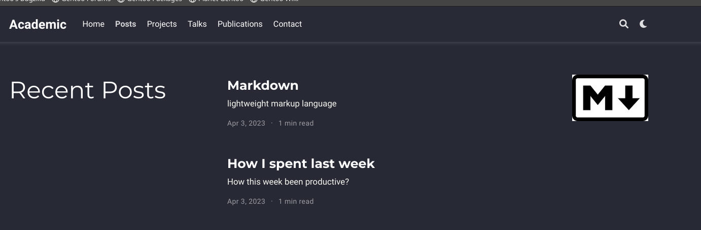{ #fig:015 width=70% }

# Вовод

В ходе выполнения третьего этапа индивидуального проекта я добавила к сайту информацию о навыках, достижениях и опыте, а также разместила несколько постов.
