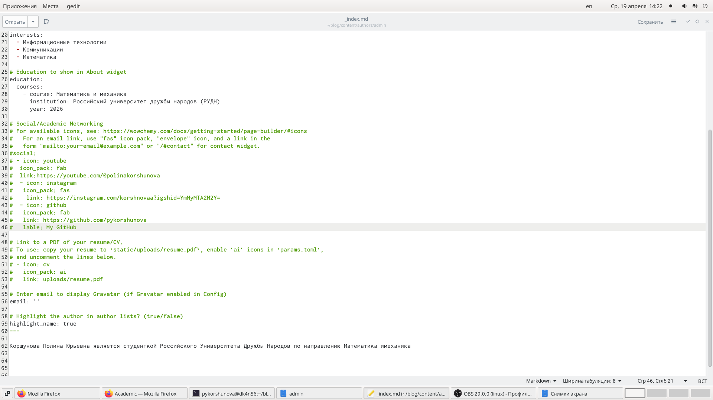
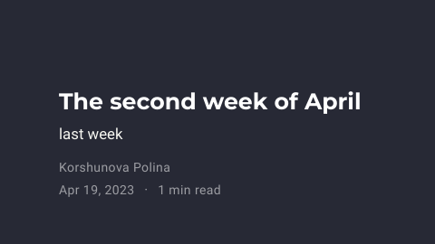
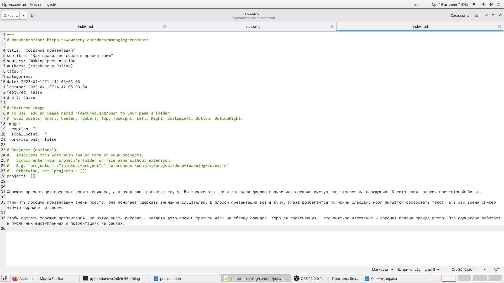
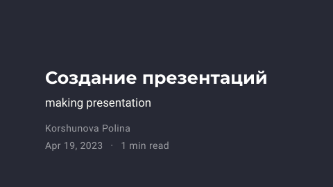

---
## Front matter
title: "Отчёт по 4 этпу индивидуального проекта"
subtitle: "Операционные системы"
author: "Коршунова Полина"

## Generic otions
lang: ru-RU
toc-title: "Содержание"

## Bibliography
bibliography: bib/cite.bib
csl: pandoc/csl/gost-r-7-0-5-2008-numeric.csl

## Pdf output format
toc: true # Table of contents
toc-depth: 2
lof: true # List of figures
lot: false # List of tables
fontsize: 12pt
linestretch: 1.5
papersize: a4
documentclass: scrreprt
## I18n polyglossia
polyglossia-lang:
  name: russian
  options:
	- spelling=modern
	- babelshorthands=true
polyglossia-otherlangs:
  name: english
## I18n babel
babel-lang: russian
babel-otherlangs: english
## Fonts
mainfont: PT Serif
romanfont: PT Serif
sansfont: PT Sans
monofont: PT Mono
mainfontoptions: Ligatures=TeX
romanfontoptions: Ligatures=TeX
sansfontoptions: Ligatures=TeX,Scale=MatchLowercase
monofontoptions: Scale=MatchLowercase,Scale=0.9
## Biblatex
biblatex: true
biblio-style: "gost-numeric"
biblatexoptions:
  - parentracker=true
  - backend=biber
  - hyperref=auto
  - language=auto
  - autolang=other*
  - citestyle=gost-numeric
## Pandoc-crossref LaTeX customization
figureTitle: "Рис."
tableTitle: "Таблица"
listingTitle: "Листинг"
lofTitle: "Список иллюстраций"
lotTitle: "Список таблиц"
lolTitle: "Листинги"
## Misc options
indent: true
header-includes:
  - \usepackage{indentfirst}
  - \usepackage{float} # keep figures where there are in the text
  - \floatplacement{figure}{H} # keep figures where there are in the text
---

# Цель работы

Выполнить новый этап проекта. Получить новые навыки по созданию сайта.

# Задание
- Добавить к сайту ссылки на научные и библиометрические ресурсы.
- Зарегистрироваться на соответствующих ресурсах и разместить на них ссылки на сайте:

      eLibrary : https://elibrary.ru/;
      
      Google Scholar : https://scholar.google.com/;
      
      ORCID : https://orcid.org/;
      
      Mendeley : https://www.mendeley.com/;
      
      ResearchGate : https://www.researchgate.net/;
      
      Academia.edu : https://www.academia.edu/;
      
      arXiv : https://arxiv.org/;
      
      github : https://github.com/.
      
- Сделать пост по прошедшей неделе.
- Добавить пост на тему по выбору:

       Оформление отчёта.
       
       Создание презентаций.
       
       Работа с библиографией
        
# Выполнение лабораторной работы

1. Вместо данных ресурсов я добавила ссылки на свою почту, Вк, телеграмм и гитхаб. Для этого переходим в папку "content" -> "authors" -> "admin" и в файле изменяем информацию. (рис. @fig:001),(рис. @fig:002).

{#fig:001 width=80%}

{#fig:002 width=80%}

2. Далее делаем пост по прошедшей неделе(рис. @fig:003).(рис. @fig:004).

{#fig:003 width=80%}

{#fig:004 width=80%}

3. После добавим пост по теме. (рис. @fig:005).(рис. @fig:006).

{#fig:005 width=80%}

{#fig:006 width=80%}

4. Строим сайт с помощью команды "hugo" и не забываем выгрузить всё на github через "public" и нашу папку.

# Выводы

В процессе выполнения данной работы я приобрела практические навыки по созданию сайта, получила новые знания. 
