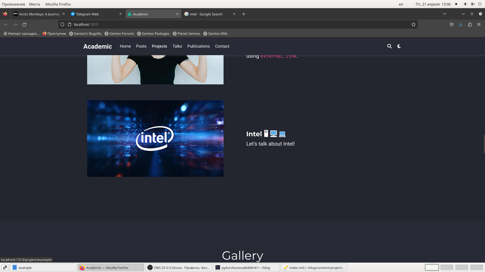
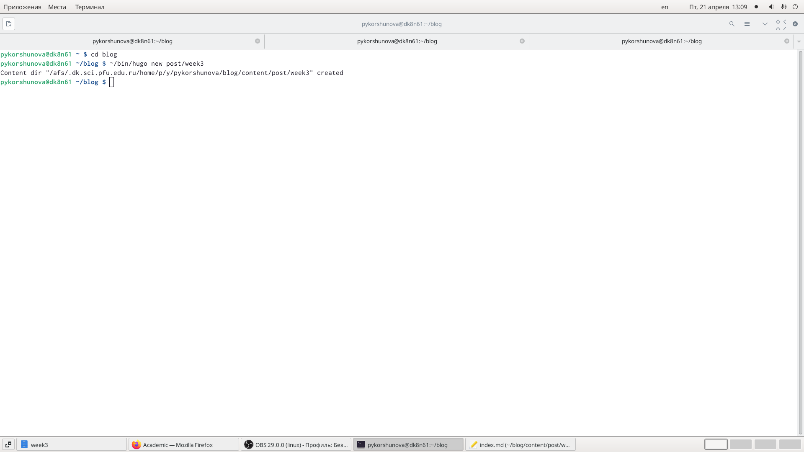
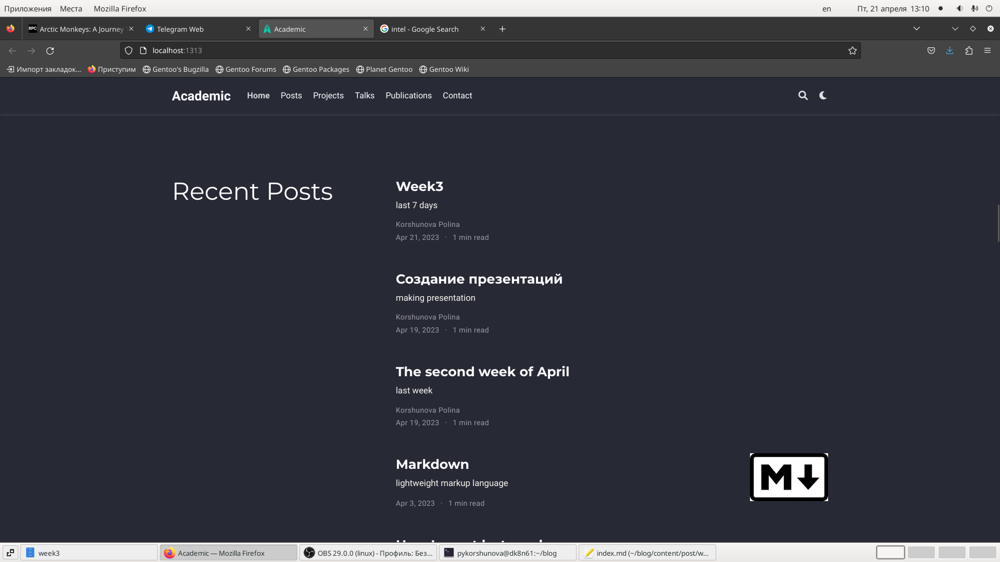
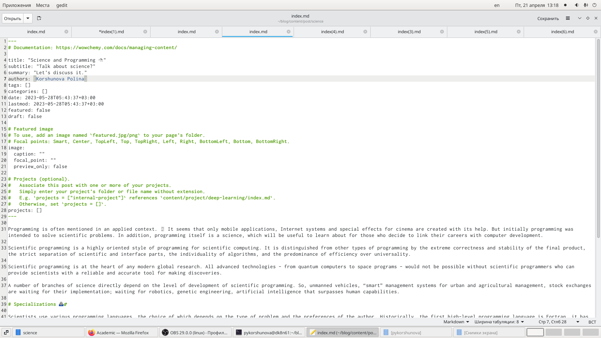

---
## Front matter
lang: ru-RU
title: Индивидуальный проект
subtitle: Этап 5
author: |
	Korshunova Polina
institute: |
	RUDN University, Moscow, Russian Federation
	
date: 2022,28 May
## Formatting
toc: false
slide_level: 2
theme: metropolis
header-includes: 
 - \metroset{progressbar=frametitle,sectionpage=progressbar,numbering=fraction}
 - '\makeatletter'
 - '\beamer@ignorenonframefalse'
 - '\makeatother'
aspectratio: 43
section-titles: true
---

## Цель работы

Добавить к сайту остальные элементы: сделать запись персонального проекта, а также разместить два поста.

## Задание

Добавить к сайту все остальные элементы:

	Сделать записи для персональных проектов.

	Сделать пост по прошедшей неделе.

	Добавить пост на тему по выбору.

		Языки научного программирования.

## Выполнение работы

Сначала я выполнила команду ~/bin/hugo server, чтобы получить ссылку на локальный сайт и просматривать там изменения. Затем я добавила свой проект и проверила его на локальном сайте.

{ #fig:001 width=70% }

## Выполнение работы

Далее я создала два поста с помощью команды ~/bin/hugo new post/название_поста. Мои посты были на тему прошлой недели и о языках научного программирования.

{ #fig:002 width=70% }

## Выполнение работы

Я заполнила пост о прошедшей неделе необходимой информацией, сохранила его и проверила на локальном сайте.

{ #fig:003 width=70% }

## Выполнение работы

Далее заполнила второй пост о науке и программировании, затем сохранила и проверила изменения на локальном сайте.

{ #fig:004 width=70% }

## Выполнение работы

Затем я выполнила исполняемый файл ~/bin/hugo в каталоге blog, и проверила изменения в public с помощью команды git status. 

## Выполнение работы

После того, как я убедилась, что в public произошли необходимые изменения, я запушила(отправила) изменения на сервер.

## Выполнение работы

Далее я также запушила(отправила) изменения в blog на сервер, предварительно выполнив команду git status для проверки изменений.

## Выполнение работы

После того, как все изменения отправились на сервер, я открыла мой публичный сайт и проверила все изменения. Убедилась в корректности выполнения всех действий.

## Вjвод

В ходе выполнения данного этапа я добавила к сайту остальные данные, разместила проект и создала два поста.

