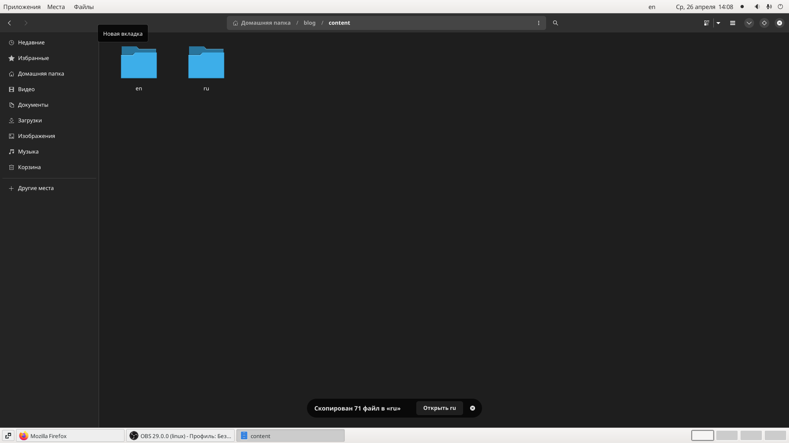
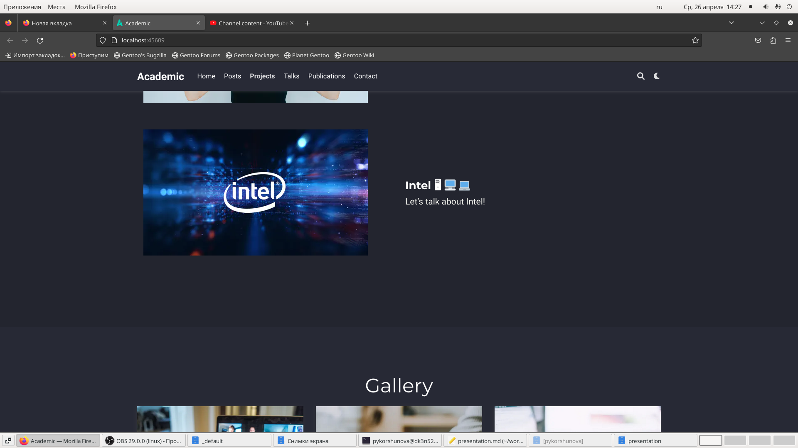
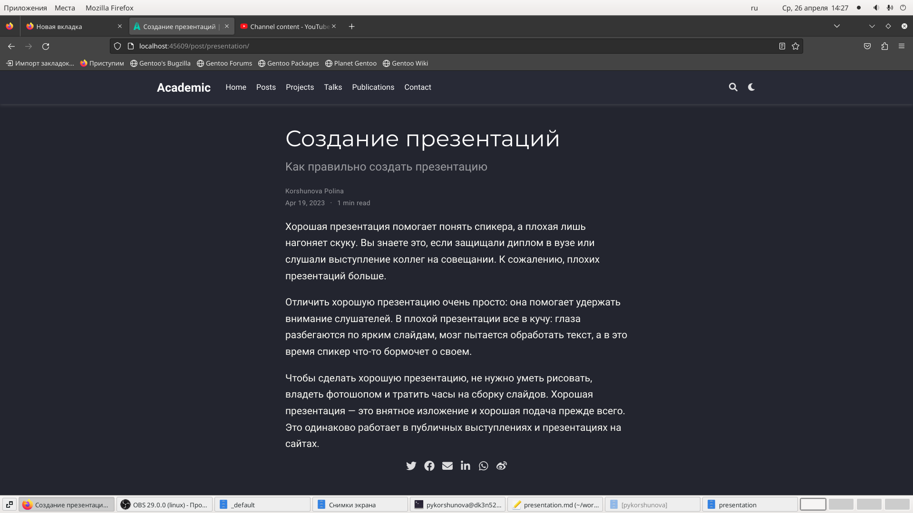
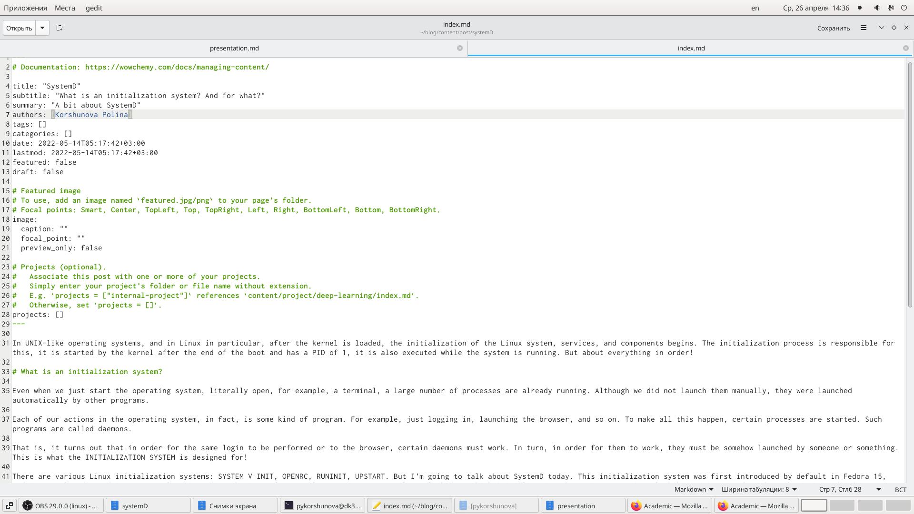
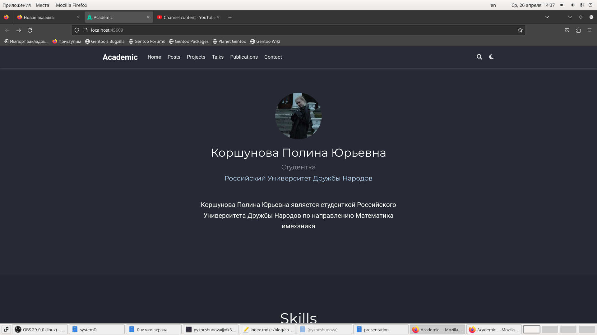

---
## Front matter
lang: ru-RU
title: Индивидуальный проект
subtitle: Этап 6
author: |
	Korshunova Polina
institute: |
	RUDN University, Moscow, Russian Federation
	
date: 2023, 26 April
## Formatting
toc: false
slide_level: 2
theme: metropolis
header-includes: 
 - \metroset{progressbar=frametitle,sectionpage=progressbar,numbering=fraction}
 - '\makeatletter'
 - '\beamer@ignorenonframefalse'
 - '\makeatother'
aspectratio: 43
section-titles: true
---

## Цель работы

Сделать поддержу английского и русского языков, разместить элементы на обоих языках, написать два поста. 

## Задание

Размещение двуязычного сайта на Github.

       Сделать поддержку английского и русского языков.
       
       Разместить элементы сайта на обоих языках.

       Разместить контент на обоих языках.

       Сделать пост по прошедшей неделе.

       Добавить пост на тему по выбору (на двух языках).

## Выполнение работы

Сначала я выполнила команду ~/bin/hugo server, чтобы получить ссылку на локальный сайт и просматривать там изменения. Затем в директории создаю директории для двух языков:

{ #fig:001 width=70% }

## Выполнение работы

В файле config.yamlдобавляю поддержание русского языка. И приступаю к добавлению на русском языке той информации, которую мы постепенно добавляли на сайт в течение всего выполнения проекта: биография, интересы, навыки, информацию о достижениях, образовании и другое, проверяя изменения на локальном сайте: 

## Выполнение работы

{ #fig:002 width=70% }

## Выполнение работы

Также добавляю русскоязычную версию проекта:

{ #fig:003 width=70% }

## Выполнение работы

Затем добавляю русскоязычные версии старых постов, проверяю изменения на локальном сайте:

{ #fig:004 width=70% }
## Выполнение работы

Второй пост на тему «Система инициализации SystemD.»:

{ #fig:005 width=70% }

## Выполнение работы

Затем я выполняю исполняемых файл ~/bin/hugo и отправляю изменения на сервер. Затем, немного подождав, проверяю изменения уже на публичном, а не на локальном, сайте:

## Выполнение работы

{ #fig:006 width=70% }

## Вовод

В ходе выполнения данного этапа индивидуального проекта я сделала поддержку русского и английского языков на сайте, разместила элементы сайта и контент на обоих языках, а также сделала два поста о прошедшей неделе и о системе инициализации SystemD на двух языках.

