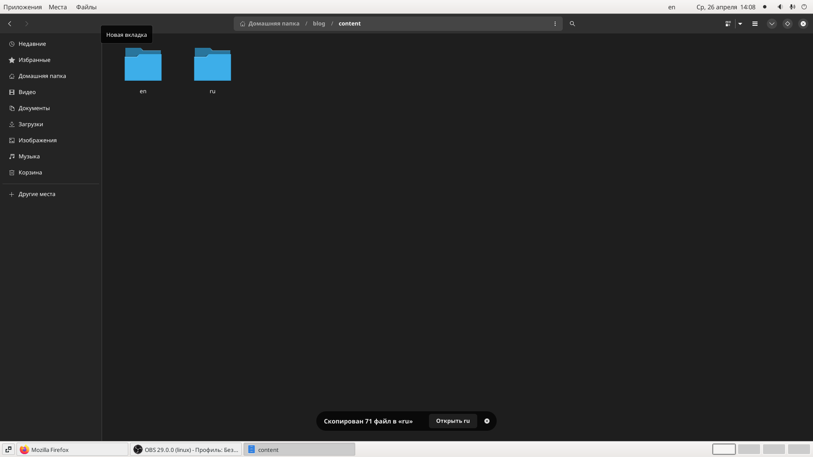
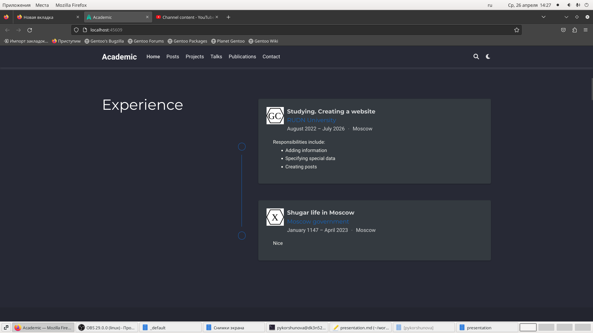
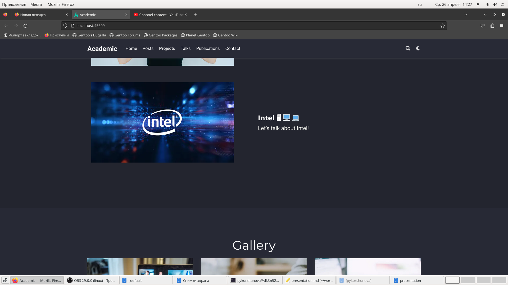
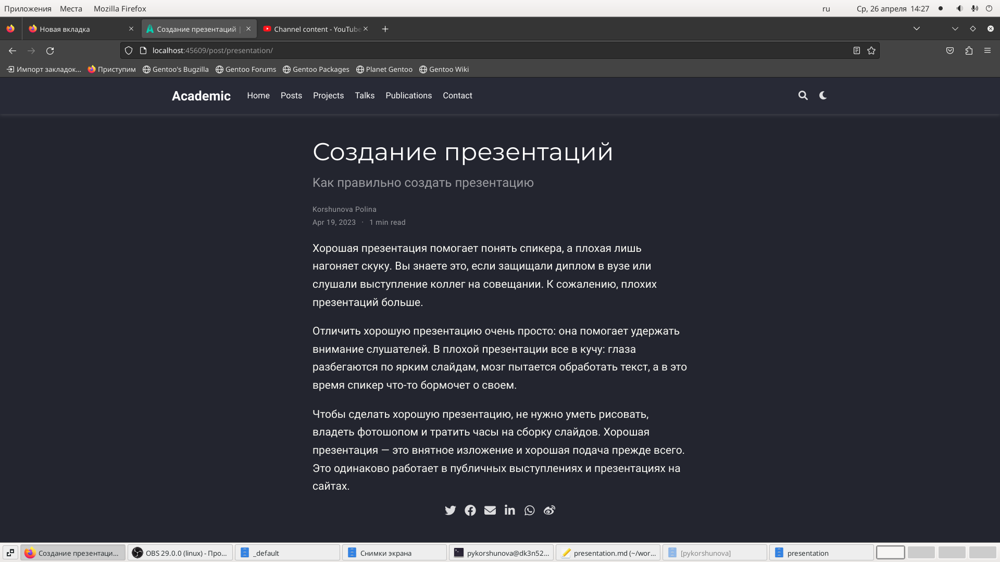
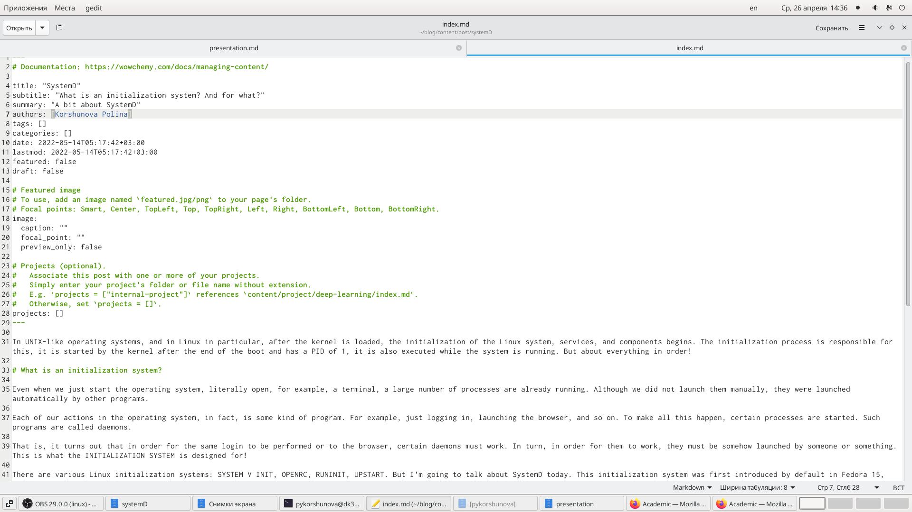
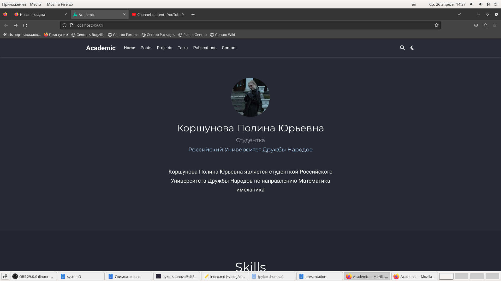

---
# Front matter
lang: ru-RU
title: "Индивидуальный проект"
subtitle: "Этап 6"
author: "Коршунова Полина"

# Formatting
toc-title: "Содержание"
toc: true # Table of contents
toc_depth: 2
fontsize: 12pt
linestretch: 1.5
papersize: a4paper
documentclass: scrreprt
polyglossia-lang: russian
polyglossia-otherlangs: english
mainfont: PT Serif
romanfont: PT Serif
sansfont: PT Sans
monofont: PT Mono
mainfontoptions: Ligatures=TeX
romanfontoptions: Ligatures=TeX
sansfontoptions: Ligatures=TeX,Scale=MatchLowercase
monofontoptions: Scale=MatchLowercase
indent: true
pdf-engine: lualatex
header-includes:
  - \linepenalty=10 # the penalty added to the badness of each line within a paragraph (no associated penalty node) Increasing the value makes tex try to have fewer lines in the paragraph.
  - \interlinepenalty=0 # value of the penalty (node) added after each line of a paragraph.
  - \hyphenpenalty=50 # the penalty for line breaking at an automatically inserted hyphen
  - \exhyphenpenalty=50 # the penalty for line breaking at an explicit hyphen
  - \binoppenalty=700 # the penalty for breaking a line at a binary operator
  - \relpenalty=500 # the penalty for breaking a line at a relation
  - \clubpenalty=150 # extra penalty for breaking after first line of a paragraph
  - \widowpenalty=150 # extra penalty for breaking before last line of a paragraph
  - \displaywidowpenalty=50 # extra penalty for breaking before last line before a display math
  - \brokenpenalty=100 # extra penalty for page breaking after a hyphenated line
  - \predisplaypenalty=10000 # penalty for breaking before a display
  - \postdisplaypenalty=0 # penalty for breaking after a display
  - \floatingpenalty = 20000 # penalty for splitting an insertion (can only be split footnote in standard LaTeX)
  - \raggedbottom # or \flushbottom
  - \usepackage{float} # keep figures where there are in the text
  - \floatplacement{figure}{H} # keep figures where there are in the text
---

# Цель работы

Сделать поддержу английского и русского языков, разместить элементы на обоих языках, написать два поста. 

# Задание

Размещение двуязычного сайта на Github.

       Сделать поддержку английского и русского языков.
       
       Разместить элементы сайта на обоих языках.

       Разместить контент на обоих языках.

       Сделать пост по прошедшей неделе.

       Добавить пост на тему по выбору (на двух языках).

# Выполнение работы

Сначала я выполнила команду ~/bin/hugo server, чтобы получить ссылку на локальный сайт и просматривать там изменения. Затем в директории /home/pykorshunova/work/blog/content создаю директории для двух языков:

{ #fig:001 width=70% }

В файле config.yaml расположенном в /home/pykorshunova/work/blog/config/_default добавляю поддержание русского языка. И приступаю к добавлению на русском языке той информации, которую мы постепенно добавляли на сайт в течение всего выполнения проекта: биография, интересы, навыки, информацию о достижениях, образовании и другое, проверяя изменения на локальном сайте: 

{ #fig:002 width=70% }

Также добавляю русскоязычную версию проекта:

{ #fig:003 width=70% }

Затем добавляю русскоязычные версии старых постов, проверяю изменения на локальном сайте:

{ #fig:004 width=70% }

Пишу два поста на двух языках:

Первый пост о прошедшей неделе:

{ #fig:005 width=70% }

Второй пост на тему «Система инициализации SystemD.»:

{ #fig:006 width=70% }

Затем я выполняю исполняемых файл ~/bin/hugo и отправляю изменения на сервер. Затем, немного подождав, проверяю изменения уже на публичном, а не на локальном, сайте:

{ #fig:007 width=70% }

# Вывод

В ходе выполнения данного этапа индивидуального проекта я сделала поддержку русского и английского языков на сайте, разместила элементы сайта и контент на обоих языках, а также сделала два поста о прошедшей неделе и о системе инициализации SystemD на двух языках.

